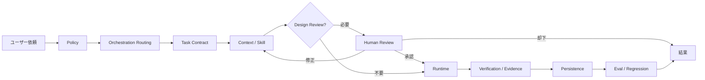
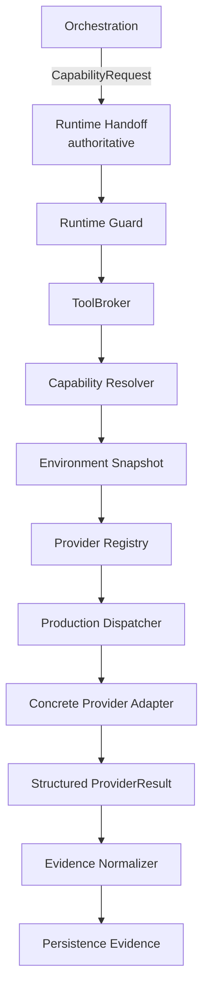
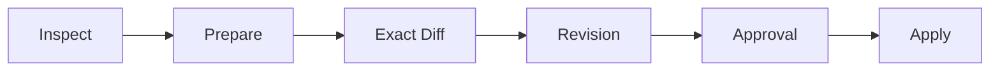
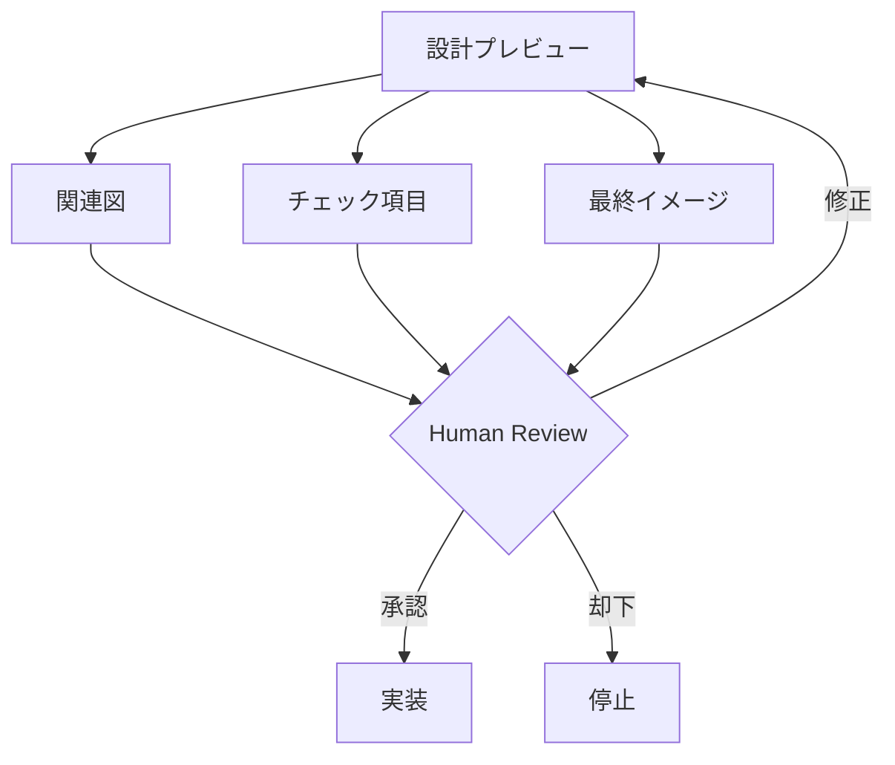

# UnityAgent

UnityAgentは、**個人のUnity開発に特化したAI開発エージェント基盤**です。

Coding Rule集ではなく、ユーザー依頼を受けてからPolicy確認、Task分類、Context選択、設計確認、実行、検証、Evidence保存、品質評価までを責務分離して扱います。

主な目的は次です。

- ユーザー固有の開発方針を最優先する
- 必要なContextだけを選ぶ
- 設計が重要なTaskでは実装前にArchitectureを確認できるようにする
- Taskごとに許可された範囲だけを変更する
- 実際に観測したEvidenceだけを根拠にする
- Unity / C# / Rendering / Performance等の専門判断をSkillへ委譲する
- Unity環境やTool構成が違ってもCapability単位で安全に適応する
- Behavior RegressionをBaselineと比較できるようにする

---

## 1. 全体像



責務の基本原則は次です。

```text
Policy defines
Orchestration decides
Context materializes
Runtime executes
Persistence remembers
Operations observes / controls
Eval measures / proposes
```

詳細は [UnityAgent Architecture](docs/architecture/architecture.md) を参照してください。

---

## 2. Production Tool Runtime

Production Cutover後のUnity Tool実行は、**Provider製品名ではなくCapabilityを起点**にします。

```text
Skill      = どう作業するか
Capability = 何を実現したいか
Provider   = 誰が実行できるか
Transport  = どう接続するか
Evidence   = 実際に何を観測したか
```

Orchestrationは通常、次のような要求をRuntimeへ渡します。

```yaml
capability: scene.inspect
project_root: D:/Projects/MyGame/Project
operation_kind: read
required_evidence:
  - editor_observation
preferred_surface: live_editor
```

`MyUnityMCPを使う`、`Unity CLIを使う`のようなProvider製品指定をSemantic Graphの正本にしません。

### 実行経路



Production Dispatcherは、Resolverが選んだProviderにConcrete executorが無い場合も成功扱いしません。`backend_not_implemented`として扱い、安全性とEvidence強度を維持できる**同一Capability**だけをFallback候補にします。

詳細は [Production Tool Runtime](docs/architecture/production-tool-runtime.md) を参照してください。

---

## 3. Canonical Capability

現在のCapability語彙は次の15個です。

| Capability | 目的 |
| --- | --- |
| `project.inspect` | Project Fact観測 |
| `source.read` | Source read |
| `source.patch` | Source mutation |
| `static.review` | Static review |
| `git.diff` | Git diff観測 |
| `compile.observe` | Compile観測 |
| `project.test` | Unity Test |
| `project.build` | Unity Build |
| `scene.inspect` | Scene / Editor観測 |
| `scene.mutate` | Approval付きEditor mutation |
| `profiler.observe` | Profiler観測 |
| `visual.capture` | Visual evidence取得 |
| `domain.workflow` | Domain-specific workflow |
| `player.observe` | Player観測 |
| `player.mutate` | Approval付きPlayer control |

旧資料で見られた次の名称はCanonical Capabilityではありません。

```text
source.inspect       -> source.read
project.compile      -> compile.observe
editor.capture       -> visual.capture
performance.capture  -> profiler.observe 等へTaskごとに分解
player.control       -> player.mutate
```

---

## 4. ProviderはOptional

UnityAgentはUnity CLIやMCPを必須依存にしません。

代表Provider:

- File Provider
- Native Unity Editor Provider
- Unity CLI Provider
- MyUnityMCP Provider
- Coplay MCP candidate / bridge
- Player Runtime Provider

RuntimeはTask開始時またはCapability実行前にEnvironment Snapshotを確認します。

```text
Unity CLIあり / なし
MCPあり / なし
Unity Editorあり / なし
Safe Mode
Player接続あり / なし
Test Frameworkあり / なし
Build Moduleあり / なし
```

はすべてEnvironment Factです。

どれか1つが無いだけでUnityAgent全体を停止しません。一方で、利用不能な検証をPASS扱いしません。

詳しくは [Unity環境への適応](docs/unity-environment-adaptation.md) を参照してください。

---

## 5. Safety Contract

Provider unavailableはSafety Contractを弱める理由になりません。

```text
Provider unavailable
!= Mutation Scopeを広げてよい
!= Approvalを省略してよい
!= Required Evidenceを弱めてよい
```

禁止例:

```text
scene.mutate
MyUnityMCP unavailable
        ↓
× raw .unity YAML edit
× arbitrary eval
```

許可できるFallback例:

```text
project.test
Unity CLI unavailable
        ↓
Native Unity Editorが同じtest_execution Evidenceを満たす
        ↓
同一CapabilityとしてFallback
```

MyUnityMCP Mutationでは既存Safety Contractを維持します。



---

## 6. Project Root / Mutation Scope

UnityAgent本体とTarget Unity Projectは別Repository / 別Directoryを推奨します。

```text
D:\
├─ UnityAgent\
└─ Projects\
   └─ MyGame\
      └─ Project\
         ├─ Assets\
         ├─ Packages\
         └─ ProjectSettings\
```

標準:

```text
Read Scope
= Target Unity Project Root

Mutation Scope
= Taskに必要な最小範囲
```

`Assets/`だけではUnity Version、Packages、ProjectSettings等のProject Factが不足するため、原則Project Rootを読み取り対象にします。

詳細は [ローカルUnity Project開発ガイド](docs/local-project-development.md) を参照してください。

---

## 7. Design Review

新Feature、Architecture、MCP、Portable Tool、Visual Direction等の設計が重要なTaskではDesign Reviewを使います。

主なOutput:

1. **関連図** — Route / Component / Runtime boundaryをMermaidで表示
2. **設計チェック** — Responsibility / Source of Truth / Scope / Approval / Evidence / Non-goalを確認
3. **最終イメージ仕様** — 完成後のBehaviorとAcceptance Criteriaを固定



Design Reviewが必須なら、承認前にImplementation Mutationへ進みません。

---

## 8. Graph / Loop

小さなTaskはFast Pathを優先します。

```text
Policy
  ↓
Routing
  ↓
Context
  ↓
Runtime
  ↓
Verification
  ↓
Result
```

複数判断や再計画が必要なTaskだけParentGraph / SubGraphを使用します。

```text
Parent Graph
  -> SubGraph
      -> Node / Edge / Gate
          -> 必要な場所だけLocal Loop
```

LoopはGraphと並ぶ別Control Planeではありません。

---

## 9. Evidence

Evidence stateを混同しません。

```text
Compile PASS
!= Editor PASS
!= Player PASS
!= Target Device PASS
!= Performance PASS
!= Visual PASS
```

Runtimeが取得したProviderResultはcanonical Evidenceへ正規化され、`Persistence/Evidence/`へappendされて初めてdurable Evidenceになります。

代表Completion:

- `verified`
- `partial_verified`
- `implemented_unverified`
- `blocked_by_environment`
- `not_applicable`

`unavailable`や`not_observed`を成功として補完しません。

---

## 10. Regression / DefinitionFingerprint

Production BehaviorはFrozen Baselineと比較できます。

```text
Production Smoke
    ↓
Behavior Eval
    ↓
Candidate Summary
    ↓
Baseline Comparator
    ↓
PASS / BLOCK_REGRESSION / BLOCK_INCONCLUSIVE / REBASELINE_REQUIRED
```

Production Tool Runtime CutoverのようにRuntime / Tool / Evidence定義が変わる場合、DefinitionFingerprint driftによって `REBASELINE_REQUIRED` になるのが正常です。

BaselineをCandidate PASSだけで自動更新しません。

ローカルRegression Gate:

```powershell
python .\Tools\run_regression_gate.py
```

Repository全体Validation:

```powershell
python .\Tools\validate_all.py
```

Production Tool Runtime専用Validation:

```powershell
python .\Tools\ProductionToolRuntime\validate_production_tool_runtime.py
```

---

## 11. Repository構成

| Area | Responsibility |
| --- | --- |
| `Policy/` | User Policy / Risk / Security / Approval / Evidence requirement |
| `Orchestration/` | Task Routing / Graph / Gate / Semantic Replan |
| `Context/` | Context selection / Retrieval / Budget / Materialization |
| `Runtime/` | Tool resolution / dispatch / timeout / cancellation / mutation guard / harness |
| `Persistence/` | State / Checkpoint / Memory / durable Evidence |
| `Operations/` | Observability / Incident / Runtime Control / Change Management |
| `Eval/` | Behavior Eval / Regression / Attribution / Rebaseline |
| `.agents/skills/` | Domain-specific work procedures |
| `SkillReferences/` | Coding / Architecture / Rendering standards |
| `Specs/` | Supporting specification。Production Authorityの代替ではない |
| `Tools/` | Validation / Visualization / Regression entrypoints |

---

## 12. 主要Entry Point

| File / Directory | 用途 |
| --- | --- |
| `AGENTS.md` | Bootstrap Map |
| `Policy/User/user-policy.yaml` | User Policy |
| `Orchestration/Routing/task-routes.yaml` | Primary Route |
| `Orchestration/ToolRouting/capability-routing.yaml` | Semantic Capability requirement |
| `Context/Selection/context-catalog.yaml` | Context selection |
| `Context/Selection/tool-capability-catalog.yaml` | Capability description |
| `Runtime/Contracts/` | Capability / Environment contracts |
| `Runtime/Tooling/provider_registry.yaml` | Runtime Provider Registry |
| `Runtime/Tooling/capability_resolver.py` | Provider resolution |
| `Runtime/Tooling/tool_broker.py` | Runtime Tool Broker |
| `Runtime/Dispatcher/tool_runtime_dispatcher.py` | Production capability dispatch |
| `Runtime/Guardrails/tool_runtime_guard.py` | Last-mile safety guard |
| `Runtime/Tooling/fallback_policy.py` | Infrastructure-only fallback |
| `Runtime/Tooling/Providers/` | Concrete Provider adapters |
| `Runtime/EvidenceCapture/provider_evidence.py` | Provider Evidence normalization |
| `docs/architecture/production-tool-runtime.md` | Production Tool Runtimeの人間向け解説 |
| `docs/local-project-development.md` | Local Unity Project運用 |
| `Templates/DevelopmentRequest.md` | 開発依頼Template |
| `Tools/validate_all.py` | Canonical local validation |

---

## 13. Migration文書について

`docs/migration/`は**過去のArchitecture移行・監査証跡**です。

そこに旧Path、旧Phase名、削除済みContractが書かれていても、current Production Authorityとして解決しません。

現在仕様を確認するときは次を優先してください。

1. `AGENTS.md`
2. Canonical `Policy / Orchestration / Context / Runtime / Persistence / Operations / Eval`
3. `docs/architecture/architecture.md`
4. `docs/architecture/production-tool-runtime.md`
5. Supporting `Specs/`

---

## 14. READMEの役割

このREADMEはUnityAgentの**目的、現在Architecture、主要Runtime境界、利用入口**を説明する文書です。

一時的なPR番号、Run ID、特定CI結果、Model Version等はREADMEに固定せず、Git履歴 / PR / Eval Artifact / Migration記録で管理します。
