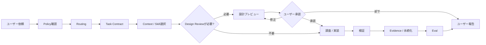
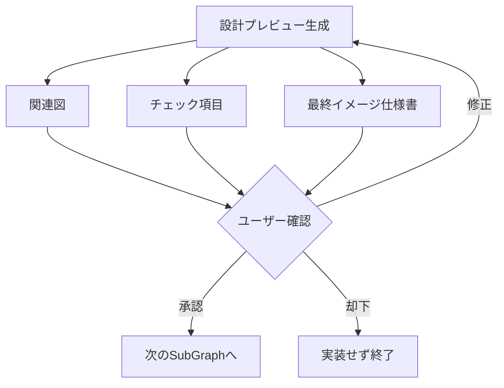
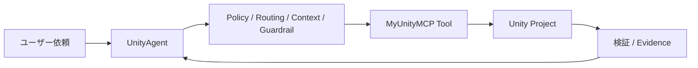

# UnityAgent

UnityAgentは、**個人のUnity開発に特化したAI開発エージェント基盤**です。

単なるCoding Rule集ではなく、ユーザーの依頼を受け取ってから、Policy確認、Task分類、Context選択、設計確認、実行、検証、Evidence保存、品質評価までを一貫した責務分離で扱います。

このRepositoryの目的は、AIに「何でもそれっぽくやらせる」ことではありません。

- ユーザー固有の開発方針を最優先する
- 必要なContextだけを選ぶ
- 作るものが大きい場合は、実装前に設計とGraphを確認できるようにする
- Taskごとに許可された範囲だけを変更する
- 実際に確認できたEvidenceだけを根拠にする
- Unity / C# / Rendering / Performanceなどの専門判断を適切なSkillへ委譲する
- 実行結果を評価し、品質低下を検出できるようにする

ことを目的としています。

---

## UnityAgentがどのように動くか

UnityAgentは、ユーザーの依頼をそのまま直接実行するのではなく、依頼の意味、設計、実行範囲、検証方法を順番に整理してから処理します。



詳細な関連図は [UnityAgent Flow](docs/architecture/unityagent-flow.mmd) で確認できます。GitHubではMermaidとしてそのまま描画されます。

この順序によって、設計判断、Context取得、実際の変更、検証、品質評価を同じ責務へ混ぜません。

---

## 基本原則

### 1. ユーザーの方針を最優先する

UnityAgentは汎用的なUnity Best Practiceよりも、ユーザーが明示した要件と `Policy/User/user-policy.yaml` を優先します。

```text
今回のユーザー明示指示
    ↓
User Policy（ユーザー方針）
    ↓
検証済みProject Fact / Project固有条件
    ↓
UnityAgent Domain Standard / Skill
    ↓
外部Reference
    ↓
一般的なBest Practice
```

一般論だけを理由に、ユーザーが決めた設計方針や命名、作業方法を勝手に置き換えません。

### 2. Project Factを推測しない

Unity Version、Render Pipeline、Package Version、namespace、Scene構成、Asset状態などは可能な限り対象Projectから確認します。

確認できない情報を固定値で補完せず、必要な場合だけFallback情報を使用します。

### 3. 最小の凝集した解決から始める

局所的な修正に不要なManager、Controller、Interface、Profile、Watcherなどを追加しません。

まず既存Component、Unity Lifecycle、既存Callback、既存Source of Truthで解決できるかを確認します。

### 4. Evidenceを推測で補わない

Compile成功はRuntime成功ではありません。
Editor成功はPlayer成功ではありません。
静的解析だけでPerformance改善済みとも扱いません。

確認できた範囲と未確認の範囲を分けて報告します。

### 5. 設計が必要なTaskは、実装前に確認できるようにする

新しいFeature、Architecture、MCP、Portable Tool、Visual Directionなど、設計自体が重要なTaskではDesign Reviewを使用します。

小さなC#修正や、すでにArchitectureが決まっている局所変更まで毎回止めることはしません。

---

## 全体構成

UnityAgentは責務ごとに次の領域へ分かれています。

| 領域 | 責務 |
| --- | --- |
| `Policy/` | ユーザー方針、安全、Approval、Risk、Evidence境界 |
| `Orchestration/` | Task分類、Routing、Graph、Gate、Semantic Replan |
| `Context/` | 必要なContextの選択、Retrieval、Budget、Materialization |
| `Runtime/` | 実Process / Tool実行、Permission、Mutation制御、Harness |
| `Persistence/` | State、Checkpoint、Memory、Evidence、Sessionの永続化 |
| `Operations/` | Observability、Incident、Runbook、Runtime Control |
| `Eval/` | Golden / Behavior Eval、Regression、Attribution、品質判定 |
| `.agents/skills/` | Unity分野ごとの専門手順 |
| `SkillReferences/` | Coding、Architecture、Rendering等の共通規約 |
| `Specs/` | Project / Feature向け補助仕様 |
| `Tools/` | Validation、可視化、Regression Gate等の実行入口 |

基本的な責務関係は次です。

```text
Policy        : 判断基準と許可境界を定義する
Orchestration : Taskの進め方を決定する
Context       : 必要な情報を構成する
Runtime       : 実際の処理を実行する
Persistence   : State / Memory / Evidenceを保持する
Operations    : 実行状態を観測・制御する
Eval          : Behaviorと品質を測定する
```

---

## Taskが処理される順番

### 1. Policy

最初に、ユーザー固有Policy、安全境界、変更許可、Approval要件を確認します。

Policyは「どう判断してよいか」を定義しますが、実際のProcess実行は行いません。

### 2. Routing

依頼内容からTaskの種類を判断し、Primary Routeを一つ選びます。

Routingの正本は次です。

`Orchestration/Routing/task-routes.yaml`

Technology Keywordだけではなく、依頼の目的、対象、Risk、必要Evidence、Mutation範囲を使って分類します。

Routeは、Design Reviewを `required / conditional / not_required` のどれとして扱うかも定義します。

### 3. Task Contract

選択されたRouteに対して、実行条件をTask Contractで固定します。

`Orchestration/Contracts/TaskContracts/`

Task Contractは主に次を定義します。

- 必須Input
- 許可するMutation
- 禁止するMutation
- 必須Gate
- 完了条件
- 停止条件

### 4. Context Materialization

Taskに必要なPolicy、Context Pack、Primary Skill、Source、Referenceだけを選びます。

```text
選択されたRoute
    ↓
Context Catalog
    ↓
Context Pack
    + Primary Skill
    + Task Contract
    + 必須Policy
    + 必須Source / Reference
    ↓
Budget確認
    ↓
Materialized Context
```

Context Selectionの入口は次です。

`Context/Selection/context-catalog.yaml`

Contextを大量に読み込むこと自体を品質とはみなしません。必要な情報を欠かさず、不要な情報を増やさないことを重視します。

### 5. Design Review

設計確認が必要なTaskでは、Mutationへ進む前に設計プレビューをユーザーへ提示します。

主なOutputは次の3つです。

1. **関連図** — 実際に選択されたRoute / SubGraph / Gate / Runtime境界をMermaidで可視化
2. **チェック項目** — Scope、責務、Mutation範囲、必要Context、Validation、Stop条件などを確認
3. **最終イメージ仕様書** — 完成後に何がどう動くか、主要Component、Control Flow、Acceptance Criteria、Non-goalを自然言語で固定

表示形式の基本Templateは `Templates/DesignReview.md`、構造化Output Contractは `Orchestration/Contracts/design-review-artifact.schema.yaml` です。



Design Reviewが必須のTaskでは、承認されるまで実装Mutationへ進みません。

### 6. Investigation

既存Projectの事実確認や原因特定が必要なTaskでは、Runtimeを使って必要なEvidenceだけを調べます。

調査結果によって設計が変わる場合は、Design Reviewへ戻して更新した関連図・チェック項目・最終イメージを再提示できます。

### 7. Runtime / Implementation

Runtimeが実際の処理を実行します。

主な責務は次です。

- Codex / Tool / subprocessの実行
- Timeout / Cancellation
- Permission Enforcement
- Workspace / Mutation Scope Enforcement
- Unity Harness
- Test Harness
- Performance Harness
- SCM Harness
- Current-run Evidence Capture

RuntimeはTaskの意味を勝手に変更したり、新しいPrimary Routeを決めたりしません。

### 8. Verification / Evidence

変更した内容を可能な範囲で検証します。

```text
静的Review
    ↓
Compile
    ↓
Editor / Test
    ↓
Player / Runtime
    ↓
Target Device / Performance / Visual Evidence
```

Taskに不要な上位検証を常に要求するわけではありませんが、未実施のGateを成功扱いにはしません。

### 9. Persistence

実行中のStateと永続Evidenceを分離します。

```text
Checkpoint != Memory != Evidence
```

- Checkpoint: 実行状態を再開するためのSnapshot
- Memory: 後続Taskで再利用可能な情報
- Evidence: 実際の実行結果を示す永続記録

### 10. Eval

Evalは、実行結果が期待するBehavior Contractを満たしているかを測定します。

Agent自身の品質低下と、Runtime / Tool / Environment / Evaluator側のFailureを同一視しません。

---

## GraphとLoopの扱い

すべてのTaskを巨大なGraphへ通すわけではありません。

小さいTaskは短い経路を使います。

```text
Policy
  ↓
Routing
  ↓
Context
  ↓
Runtime
  ↓
Verification
  ↓
結果
```

複数の判断、分岐、設計確認、検証、再計画が必要なTaskだけOrchestration Graphを使用します。

```text
Parent Graph
    ↓
SubGraph
    ↓
Node / Edge / Gate
    ↓
必要な場所だけLocal Loop
```

Design Reviewも独立した別Systemではなく、Parent Graph内のSubGraphです。

LoopはGraphとは別の独立Control Planeではなく、限定された処理を条件付きで再試行・再評価するための構造です。

---

## Skillの扱い

Skillは巨大な知識Fileではなく、特定の専門作業を安定して実行するための手順です。

`.agents/skills/`

TaskごとにPrimary Skillを一つ選び、Primary Skillが持たない専門判断だけSecondary Skillへ委譲します。

例えば、原因不明のRendering障害ではIncident系Skillが調査を所有し、原因確定後にRendering / Shader系Skillへ修正を渡します。

---

## Unity Projectとの関係

UnityAgent自身はUnity Projectではありません。

実際のScene、Prefab、Material、Shader、C#、Package等は対象Unity Projectが所有します。

UnityAgentはそれらを変更する際の判断、Context、設計確認、実行制御、Evidence、品質評価を提供します。

Project固有Factは可能な限り実Projectから取得し、`Specs/ProjectProfile.md` は未解決FactのFallbackとしてのみ使用します。

---

## MyUnityMCPとの関係

`DarumaPPAP/MyUnityMCP` はUnity操作やDomain Capabilityを提供する外部MCP Repositoryです。

UnityAgentはMyUnityMCPを直接のAuthorityにはせず、自身のPolicy、Routing、Context、Task Contract、Runtime Guardrailを通して利用します。



MCP Toolが利用可能だからという理由だけで、許可されていない変更を実行しません。

---

## 品質Regressionの確認

UnityAgentには、現在のProduction BehaviorをReviewed Baselineと比較するRegression Gateがあります。

通常の流れは次です。

```text
Production Smoke
    ↓
Behavior Eval
    ↓
Candidate Summary
    ↓
Baseline Comparator
    ↓
PASS
または
BLOCK_REGRESSION
または
BLOCK_INCONCLUSIVE
または
REBASELINE_REQUIRED
```

BaselineはCandidateがPASSしただけでは自動更新しません。

ローカルでRegression Gateを実行する場合は、安定したEntry Pointを使用します。

```powershell
python .\Tools\run_regression_gate.py
```

---

## Repository全体のValidation

UnityAgent自身のContract、Context、Skill、Eval、Documentation、Regression Boundaryをまとめて確認する場合は次を実行します。

```powershell
python .\Tools\validate_all.py
```

UnityAgentのText ArtifactはUTF-8です。

PowerShellで内容を確認する場合はEncodingを明示します。

```powershell
Get-Content ".\README.md" -Raw -Encoding UTF8
```

---

## 入口となるファイル

| File / Directory | 用途 |
| --- | --- |
| `AGENTS.md` | Agentが最初に読むBootstrap Map |
| `Policy/User/user-policy.yaml` | ユーザー固有Policy |
| `Orchestration/Routing/task-routes.yaml` | Task Routing / Design Review Requirement |
| `Orchestration/Definitions/development-parent-graph.yaml` | Parent Graph / Design Review SubGraph |
| `Orchestration/Contracts/TaskContracts/` | Taskごとの実行契約 |
| `Orchestration/Contracts/design-review-artifact.schema.yaml` | Design Reviewの構造化Output Contract |
| `Templates/DesignReview.md` | 人間が確認するDesign Review表示Template |
| `Context/Selection/context-catalog.yaml` | Context選択 |
| `Context/Packs/` | Domain Context Pack |
| `Runtime/Profiles/runtime-profiles.yaml` | Runtime実行Profile |
| `.agents/skills/` | 専門Skill |
| `SkillReferences/` | Domain共通規約 |
| `docs/architecture/unityagent-flow.mmd` | GitHubで描画できる全体関連図 |
| `Tools/validate_all.py` | Repository全体Validation |
| `Tools/run_regression_gate.py` | Production Regression Gate |

---

## READMEの役割

このREADMEは、UnityAgentの**目的、構造、利用方法、処理順序、責務境界**を説明するための文書です。

開発進捗、移行履歴、一時的な実行結果、特定Run ID、特定Baseline ID、Model Versionなどの変動情報はREADMEの責務ではありません。

そのような情報は、それぞれのMigration / Eval / Artifact / Git履歴で管理します。
