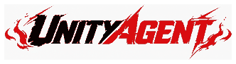

<p align="center">
  
</p>

<h1 align="center">UnityAgent</h1>

<p align="center"><strong>Unity開発の要求を Policy → Capability → Provider → Evidence の一貫した経路で扱う Control Plane。</strong></p>

<p align="center">
  <a href="VERSION"></a>
  <a href="https://unity.com/"></a>
  <a href="https://github.com/openai/codex"></a>
  <a href="https://github.com/DarumaPPAP/UnityAgent/actions/workflows/validate-agent-contracts.yml"></a>
  <a href="LICENSE"></a>
</p>

<p align="center">
  <a href="#quick-start">Quick Start</a> ·
  <a href="#architecture">Architecture</a> ·
  <a href="#install">Install</a> ·
  <a href="#validation">Validation</a> ·
  <a href="docs/architecture/architecture.md">Architecture Docs</a> ·
  <a href="docs/references/unity-cli-reference.md">Unity CLI Reference</a> ·
  <a href="https://darumappap.github.io/UnityAgent/">Context Explorer</a> ·
  <a href="https://github.com/DarumaPPAP/UnityAgent/releases">Releases</a>
</p>

> [!IMPORTANT]
> **UnityAgentが唯一のControl Planeです。** Unity UI、Codex Plugin、Optional SubAgent、Providerは独自のPolicy Authorityや第二のControl Planeを持たず、実行要求はUnityAgentへ集約します。

## What is UnityAgent?

UnityAgentは、Unity Editor、Codex Plugin、CLIを別々の実行主体として扱うのではなく、要求の解釈、Policy、Approval、環境確認、Capability解決、Provider実行、Evidence化を一つのControl Planeへ集約するための基盤です。

「どのToolを直接呼ぶか」ではなく、**何を実現したいか（Capability）**を基準に、現在のProject・Environment・Policy・Evidence条件を満たすProviderを解決します。

## Core Principles

| Principle | Contract |
|---|---|
| Single Control Plane | Entry、SubAgent、Providerは独自のPolicy / Orchestration authorityを持たない |
| Capability before Provider | OrchestrationはProvider名ではなくCapabilityを要求する |
| Fail-Closed | 必須条件がfalse / unknownなら候補から除外し、成功扱いしない |
| Explicit Approval | 変更は対象・Scope・Revisionに結び付いたApprovalを要求する |
| Evidence before Completion | Compile / Editor / Player / Target Device / Performance / Visualを別々に扱う |
| No Silent Downgrade | Provider unavailableを理由にSafety Contractを弱めない |

## Architecture

UnityAgentの正式な製品境界は5層です。機械可読な正本は `Specs/unityagent-layer-contract.yaml` です。

```text
Unity UI / Codex Plugin
        │
        ▼
┌──────────────────────────────┐
│      UnityAgent Control Plane │
└──────────────────────────────┘
        │
        ▼
Capability & Orchestration
        │
        ├─ Optional SubAgent resolution
        ▼
Provider Layer
        │
        ▼
Evidence & State
```

| Layer | Owns |
|---|---|
| Entry | Unity UI / Codex Pluginから要求、表示、明示承認を受け付ける |
| Control Plane | Task、Policy、Approval、Environment、Project Binding、Run lifecycleを管理する |
| Capability & Orchestration | 意味解決、Graph / Loop、Capability routing、必要時のOptional SubAgent候補解決を行う |
| Provider | 許可された具体的な操作だけを実行する |
| Evidence & State | 実行結果、観測値、Run state、履歴を保存する |

EntryからProviderを直接呼び出したり、ProviderがPolicyやdurable stateを所有したりする構成にはしません。

詳細: [UnityAgent Architecture](docs/architecture/architecture.md) · [Production Tool Runtime](docs/architecture/production-tool-runtime.md)

## Responsibility Boundaries

### UnitySubAgentHub

[UnitySubAgentHub](https://github.com/DarumaPPAP/UnitySubAgentHub) は、Optional Specialist SubAgentのRegistry / Catalog / Manifest / Schema / Validationを管理する別Repositoryです。

| UnityAgent owns | UnitySubAgentHub owns |
|---|---|
| Request interpretation / Policy / Approval | Registry index |
| Environment / Project Binding | Canonical SubAgent manifests |
| Eligibility / Capability resolution | Shared schemas |
| Runtime execution / Retry / Fallback | Fail-Closed validation |
| Evidence normalization | Data-only catalog snapshot generation |

- Specialist identity: **`artist_subagent`**
- Current backend/provider ID: **`unity_artist_cli`**
- Registry登録だけではinstalled / compatible / project-bound / available / eligibleを意味しません。
- Missing SubAgentをCapability解決のために自動Installしません。

<details>
<summary><strong>Current Hub snapshot integration</strong></summary>

Hub CIはActive Manifestから `UnityAgent-SubAgent-Catalog-Snapshot` Artifactを生成します。現行Exporterは `artist_subagent` をProfile ID、`unity_artist_cli` をProvider IDとして出力し、Activation Gateも含めます。

UnityAgentのReferenceImplementationは、現在もRepository内の `Runtime/ReferenceImplementation/subagent-catalog.yaml` を `SubAgentProfileCatalog` で読み込みます。Hub CI Artifactを自動取得・同期する経路は現行コードにはありません。

そのため、**HubでSnapshotが公開されたことと、UnityAgent Runtimeへ同期済みであることは別です。**

Offline Snapshotを反映候補として確認するときは、`python Tools/import_subagent_catalog.py` へSnapshotの取得元と完全なSHA-256を渡します。Import Planは `Added` / `Removed` / `Changed` / `No-op`、protected Field、Riskを出力しますが、Catalogへ書き込みません。RuntimeのEligibilityは反映後も現在のEnvironment Factで再判定され、Catalog更新は通常のGit Pull Requestとしてレビューします。

</details>

### Provider model

`Capability` は「実現したいこと」、`Provider` は「具体的に実行する実体」です。

代表的なProviderにはFile、Native Unity Editor、Official Unity CLI、`unity_artist_cli` Backend、Installer、Player Runtimeがあります。これはProvider種別の一覧であり、すべてのProjectやReleaseで常に利用可能という意味ではありません。

## Request Lifecycle

変更系処理は原則として次の順序で進みます。

```text
Inspect → Plan / Exact Scope → Approval → Apply → Evidence
```

Evidenceは一つの成功フラグへ潰しません。

```text
Compile PASS
!= Editor PASS
!= Player PASS
!= Target Device PASS
!= Performance PASS
!= Visual PASS
```

Providerが利用できない場合は制約を弱めたり別Backendへ無条件に切り替えたりせず、`unavailable` または環境阻害として報告します。

## Install

### Requirements

- Windows PowerShell 5.1以上（Windows Bootstrapを使う場合）
- Python 3.10以上（Control Planeのローカル導入に使用）
- Unity 2022.3以上（Unity Packageを利用する場合）
- Codex CLI（Codex Pluginを利用する場合）

### Unity Package Manager

Unity EditorでPackage Managerを開き、Git URLからUnityAgent UPM Packageを追加します。

```text
https://github.com/DarumaPPAP/UnityAgent.git?path=/Packages/com.darumappap.unity-agent#v0.0.7-beta
```

追加後、`UnityAgent > Setup` を開いてControl PlaneとCodex CLIの状態を確認します。Setup画面からControl Planeの導入、検出、Codex Pluginの導入・修復を行えます。

### Control Plane bootstrap

```powershell
irm https://raw.githubusercontent.com/DarumaPPAP/UnityAgent/main/scripts/install.ps1 | iex
```

BootstrapはRelease artifactをSHA-256検証してControl Planeを導入します。詳細なSetup Plan、Approval、Repair手順は [Setup Guide](.agents/plugins/unity-agent/skills/unity-agent-setup/SKILL.md) を参照してください。

<details>
<summary><strong>Manual Codex Plugin install</strong></summary>

```powershell
codex plugin marketplace add DarumaPPAP/UnityAgent --ref v0.0.7-beta --json
codex plugin add unity-agent@unity-agent --json
```

Plugin追加後は新しいCodex Threadで開始してください。Unity UIとCodex Pluginは同じUnityAgent Control Planeを入口として使用します。

</details>

## Quick Start

Unity Project Rootを明示してEnvironmentを確認し、まず変更を伴わないSetup Planを生成します。

```powershell
$Project = "D:\Projects\MyGame"
unity-agent doctor --project-path "$Project" --format json --non-interactive
unity-agent setup --operation plan --project-path "$Project" --format json --non-interactive
```

Setup PlanのApplyは別操作です。承認済みPlanとApproval Referenceを指定し、Planで示されたScopeだけを適用します。

## Local Reference Navigator

UnityAgentのLocal Reference Navigatorは、取得済みReference Snapshotをローカル検索する仕組みです。通常の質問で外部Driveや検索サービスへ常時接続したり、ベクトルDBへ同期したりする機能ではありません。

詳細: [Local Reference Navigator](docs/architecture/local-reference-navigator.md)

## Validation

Repositoryの基本検証:

```powershell
python .\Tools\validate_all.py
python .\Tools\SkillValidator\validate_skills.py --strict
python .\Tools\ProductionToolRuntime\validate_production_tool_runtime.py
python .\Tools\run_regression_gate.py
```

Local Regression Gateの一部はローカルCodex CLIや認証済み環境を必要とします。GitHub-hosted Release Workflowの検証結果と混同しないでください。

## Canonical Sources

| Concern | Source |
|---|---|
| Layer boundary | `Specs/unityagent-layer-contract.yaml` |
| Policy / Approval | `Policy/` |
| Routing / Orchestration | `Orchestration/` |
| Runtime / Provider Registry / Resolution | `Runtime/` |
| Durable Evidence | `Persistence/` |
| Regression / Eval | `Eval/` |
| Optional SubAgent metadata | [UnitySubAgentHub](https://github.com/DarumaPPAP/UnitySubAgentHub) |

詳細は [Architecture](docs/architecture/architecture.md) と [Production Tool Runtime](docs/architecture/production-tool-runtime.md) を参照してください。

## Status & License

UnityAgentは **Beta** です。

Release Workflowは `main/VERSION` をSource of Truthとしてcanonical tagを生成し、UPM Package、Codex Plugin、Python wheel / source distribution、`SHA256SUMS.txt` を公開します。手動入力したTagをRelease Source of Truthにはしません。

UnityAgentは [MIT License](LICENSE) で提供されます。
