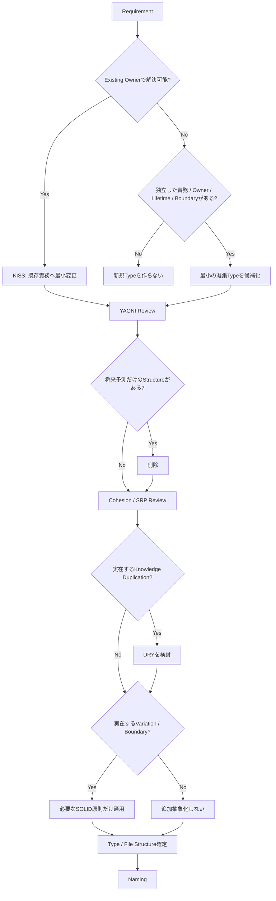

# UnityAgent Engineering Design Principles

## 1. Purpose

UnityAgentが新規実装またはArchitecture判断を行う際、命名やPattern名から設計を開始せず、現在の要求を満たす最も単純で凝集した構造から判断するためのCanonical Referenceである。

この文書はKISS / YAGNI / DRY / SOLIDの適用順と意味を定義する。詳細なUnity構造選定は`ARCHITECTURE_DECISION_POLICY.md`、実装規約は`CODING_STANDARDS.md`へ委譲する。

## 2. Principle Priority

設計原則が衝突した場合は次の順序を使用する。

```text
1. User Explicit Requirement
2. UnityAgent User Policy
3. Correctness / Compatibility
4. KISS
5. YAGNI
6. Cohesion / SRP
7. Proven DRY
8. Conditional OCP / LSP / ISP / DIP
9. Naming
10. Generic Best Practice
```

SOLIDという名称だけでKISS / YAGNIを上書きしない。

## 3. Core Decision Order

```text
Requirement
↓
Existing Owner / Requirement Surface
↓
KISS
↓
YAGNI
↓
Cohesion / SRP
↓
Proven Knowledge Duplication / Change Axis
↓
DRY / Conditional SOLID
↓
Type / File Structure
↓
Naming
```

Goalは、現在の要求を満たす最も単純で凝集した構造を最初に選び、実在する重複・変更軸・境界が確認された場合だけ抽象化し、その設計結果に対して名前を付けることである。

## 4. KISS — Simplest Cohesive Solution

### Definition

現在確認されている要求を満たす、最も単純で明確な凝集した解決を優先する。

KISSは「最小ファイル数」や「全部1Class」を意味しない。独立したOwner、Lifetime、Boundary、Execution Modelがある場合は分離を許可する。

### Rule

巧妙さ、拡張性、Pattern適合性より、現在要求に対する理解可能性と直接性を優先する。

### Before adding structure

1. 既存Typeの責務へ自然に含められるか。
2. Unity Lifecycle / Callback / APIで直接解決できるか。
3. 既存Source of Truthを利用できるか。
4. 1 Primary Typeで凝集したまま成立するか。
5. 新規Type / Layer / Stateが本当に必要か。

`minimum_cohesive_solution_first`とLocal Behavior Fast PathはKISSのUnity実装規則として維持する。

## 5. YAGNI — No Speculative Structure

### Definition

現在確認されていない将来要求のために構造を先回りして追加しない。

### Rule

「将来必要になるかもしれない」は、Type / Interface / Layer / Setting / Extension Pointを追加する根拠にならない。

### Do not add for speculation alone

- Interface
- Abstract Base Class
- Manager
- Controller
- Service
- Registry
- Factory
- Strategy
- Profile
- ScriptableObject
- Event Bus
- Cache
- Watcher
- Generic Target
- Platform abstraction
- Dependency Injection layer

実装Variationは予測せず、Variationが実際に確認された時点で再評価する。

## 6. DRY — Abstract Proven Knowledge Duplication

### Definition

DRYの対象は似た構文ではなく、同じKnowledge、同じRule、同じChange Reasonの重複である。

### Rule

重複が実際に確認され、その重複が同じ理由で変更される場合にのみ共通化を検討する。

### Do not abstract only because

- Methodの見た目が似ている。
- 同じAPIを呼んでいる。
- 同じ`Mathf.Clamp`等を使っている。
- 将来3箇所に増えそう。
- Helperへ移せそう。
- Generic化できそう。

### DRY trigger

共通化前に次を確認する。

- 同じKnowledgeか。
- 同じChange Reasonか。
- 実際のDuplicationか。
- 共通化後の名前と責務が明確か。
- 共通化が依存関係を悪化させないか。

## 7. SOLID — Conditional Architecture Toolset

SOLIDを「すべてのClassが満たすべきChecklist」として扱わない。

実在する設計問題に応じて選択的に使うArchitecture Toolsetとして扱う。

### 7.1 SRP — Cohesive Responsibility

SRPを「1 Class = 1 Property / 1 Method / 1 Operation」と解釈しない。

1 Typeは、凝集した一つの責務または一つのChange Reasonを持つ。

同じ責務に属するFar Clip、Near Clip、FOV、Depth、Culling Mask等をProperty単位で別Typeへ機械的に分割しない。

### 7.2 OCP — Confirmed Variation Only

確認されたVariation Axisに対してのみExtension Boundaryを作る。

OCP trigger:

- 複数実装が実在する。
- Backend切替がRequirementである。
- Platform差分が確認されている。
- 外部SDK境界がある。
- 変更頻度の異なる実装を分離する必要がある。

### 7.3 LSP — Validate After Abstraction

Inheritance / Interfaceを採用した場合にSubtypeがBase Contractを壊さず置換可能か検証する。

LSPを満たすためにInheritanceを導入しない。

### 7.4 ISP — Only After Interface Need Exists

Interfaceが必要と判断された場合にのみ、Consumerが不要なMemberへ依存していないか確認する。

ISPを理由に細粒度Interfaceを先回りして大量生成しない。

### 7.5 DIP — Real Dependency Boundary Only

Project Infrastructure、外部SDK、Backend、I/O等、依存方向を制御する実在理由がある場合に適用する。

代表的な有効Boundary:

- Save backend
- Network backend
- Platform SDK
- Store / Payment SDK
- External API
- File I/O
- Test replacementが必要な外部Boundary

Local BehaviorへDI ContainerやInterface Layerを追加しない。

## 8. Architecture Decision Flow



## 9. Abstraction Triggers

抽象化は次のいずれかが確認された場合に検討する。

- Proven Knowledge Duplication
- Confirmed Variation Axis
- External / Package / SDK Boundary
- Distinct Owner or Lifetime
- Independent Execution Model
- Replaceable Backend
- Explicit testing boundary for external I/O

抽象化できること自体はTriggerではない。

## 10. Anti-patterns

次をPattern名や将来性だけで追加しない。

- PropertyごとのWatcher / Tracker / Controller
- 1実装しかないInterface + Base + Default implementation
- Thin Manager / Controller / Service forwarding layer
- Generic Helper for syntax-only duplication
- One Profile ScriptableObject with no variation
- DI Container for Local Behavior
- Patternを完成させるためのClass
- 長いType名を短縮するためだけの別Type

## 11. Naming is Downstream

命名は設計の入口ではなく設計判断の結果である。

長いType名が生成された場合、最初に名前を短縮しない。先に次を確認する。

1. そのTypeは本当に必要か。
2. 既存Ownerへ置けないか。
3. Property単位で過剰分割していないか。
4. 複数責務を名前へ詰め込んでいないか。
5. Speculative abstractionではないか。
6. Role suffixが設計不足を隠していないか。

Type / Responsibility / File Structureが確定した後にNaming Contractまたは現行命名規則を適用する。

## 12. Checklist

- [ ] User Explicit RequirementとUser Policyを先に確認した。
- [ ] Existing Owner / Requirement Surfaceを確認した。
- [ ] Simplest Cohesive Solutionを最初に検討した。
- [ ] Speculative Structureを削除した。
- [ ] SRPをProperty単位分割として扱っていない。
- [ ] DRY対象がProven Knowledge Duplicationである。
- [ ] Interface / Base / Strategy等に実在するVariationまたはBoundaryがある。
- [ ] SOLIDを機械的Layering Ruleとして使用していない。
- [ ] 新規Type / Fileに実在する責務またはBoundary理由がある。
- [ ] NamingをArchitecture確定後に適用した。

## 13. Common Mistakes

- KISSを「全部1Class」にする。
- YAGNIを理由に実在するBoundaryまで否定する。
- DRYをSyntax Duplicationの排除として使う。
- SRPでPropertyごとにClassを分ける。
- OCPで将来用Extension Pointを先に作る。
- LSPを抽象化作成理由として使う。
- ISPでInterfaceを細分化してから必要性を考える。
- DIPでLocal BehaviorへDIを導入する。
- Naming Ruleで設計不足を隠す。

## 14. Final Rule

> Naming is the result of design, not the starting point of design.
