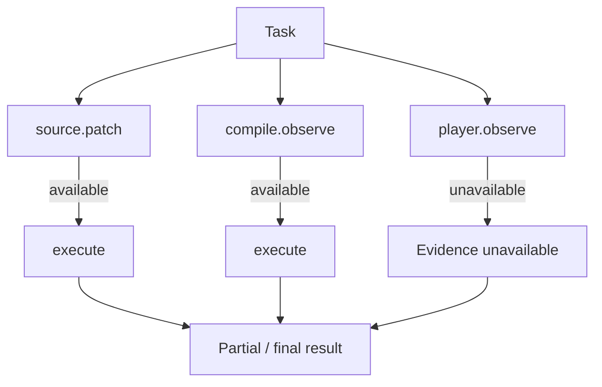
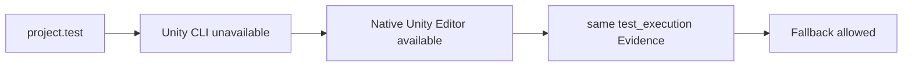

# Platform and Environment Fallback Policy

この文書は、UnityAgentが生成するSpec / Plan / Task / Validation Contractで、Platform条件や不足Environmentをどう扱うかを説明するsupporting policyです。

Production Runtimeの実行Authorityは `Runtime/`、Risk / Approval Authorityは `Policy/` にあります。

---

## 1. Runtime Architecture Default

ユーザーがPlatform固有統合を明示しない限り、Runtime実装はPlatform-independentを既定とします。

暗黙に追加しないもの:

- Platform SDK
- Platform固有API
- Platform専用Package
- Platform専用asmdef / define
- Platform Build Support Module
- 特定実機

例:

```text
Nintendo Switchでも動く程度に軽くする
```

は通常:

```text
Performance Class: Low-spec console class
Runtime Architecture: Platform-independent
Platform Dependency: None
```

として扱います。

---

## 2. Platform TargetとPerformance Classを分離する

必要に応じて次を別項目として記録します。

```text
Runtime Platform Policy
Explicit Platform Integration
Performance Class
Measurement Environment
```

`Target Platform`を常時必須入力にしません。

Platform名が必須になる代表例:

- Platform SDK / APIを使用する
- Platform固有Buildを現在の成果物として要求する
- Platform固有互換性を保証する
- Platform固有性能を保証する

Performance ReferenceとしてPlatform名を使う場合、非拘束の参考であることを明示します。

---

## 3. Missing EnvironmentはCapability単位で扱う

Build Module、実機、License、Profiler、Capture Tool、Player Runtime等が無いことだけで、独立して実行可能なTask全体を停止しません。

Production Tool RuntimeはEnvironment SnapshotからCapability単位で解決します。



ただし**TaskのCore Capabilityそのものが実行不能**なら `blocked_by_environment` になり得ます。

つまり:

```text
Environment不足
!= 常にTask全体BLOCK
!= 常に継続可能
```

Task Contract / Required Evidence / Acceptance Criteriaで判定します。

---

## 4. Production Completion語彙を使う

この文書独自のCompletion stateを作りません。

Canonical completion:

```text
verified
partial_verified
implemented_unverified
blocked_by_environment
not_applicable
```

### verified

Taskが要求するEvidenceを満たした。

### partial_verified

一部の要求Evidenceを観測したが、Environment制約等で全ては満たしていない。

### implemented_unverified

実装は行えたが、必要な実行Evidenceを取得できていない。

### blocked_by_environment

TaskのCore CapabilityがEnvironment上実行不能。

### not_applicable

そのEvidence / OperationがTaskに適用されない。

---

## 5. Evidence LadderはTask Contractに従う

利用可能な検証を安全に進めます。

代表例:

1. Static Review
2. Compile Observation
3. EditMode / PlayMode Test
4. Editor Observation
5. Player Observation
6. Target Device Observation
7. Profiler / Performance Observation
8. Visual Capture

ただしこれは「常に上から全部実行する固定Gate」ではありません。

Task Contractが要求したEvidenceだけがDone Criteriaです。

```text
Compile PASS
!= Player PASS
!= Target Device PASS
```

---

## 6. Valid Block Conditions

`blocked_by_environment`またはsemantic blockを許可する代表条件:

- Core Capabilityが利用不能
- 必須Platform SDK/APIへの依存があり代替が無い
- ユーザーがNamed Platform Build / 実機結果そのものを必須成果物として指定
- 継続するとRepository / Asset / Save Data / public contractを破壊する危険がある
- 必須仕様判断が衝突し、Agentに決定Authorityが無い

Optional Evidenceが無いだけでTask全体をBLOCKしません。

---

## 7. Provider Fallbackとの関係

Environment不足を検出した場合、Runtimeは同一Capabilityの安全なProvider候補を再評価できます。



Fallback条件:

- same Capability
- same Project Root
- Policy / Approval維持
- Mutation Scope維持
- Required Evidence維持
- Safety strength equal or stronger
- Evidence strength equal or stronger

禁止:

```text
scene.mutate provider unavailable
-> raw Scene YAML edit
-> arbitrary eval
```

---

## 8. Prohibited Loop Behavior

禁止:

- 同じEnvironment不足を無制限に再確認する
- 実機が無いことだけを何度も報告する
- Optional Evidence一つのために独立Task全体を止める
- Performance ReferenceをBuild Targetへ自動変換する
- Optional EvidenceをDone Criteriaへ昇格する
- Editor Evidenceしか無いのにPlayer EvidenceまでPASS扱いする
- Provider不足でSafety Contractを弱める

Runtimeのretryはbounded infrastructure retryです。Semantic replanはOrchestration Authorityです。

---

## 9. 推奨Specification Wording

```text
Runtime Architecture: Platform-independent
Performance Class: Low-spec console class
Performance Reference: Nintendo Switch-equivalent constraints (non-binding)
Platform-specific dependencies: None
Named-device validation: Optional additional evidence
```

禁止例:

```text
Primary Platform: Nintendo Switch
Switch Module required
Switch Build unavailable, therefore every task is blocked
PC IL2CPP Module unavailable, retry forever
```

---

## 10. Related Sources

- `Policy/Security/tool-capability-policy.yaml`
- `Runtime/Contracts/environment-snapshot.schema.yaml`
- `Runtime/Tooling/capability_resolver.py`
- `Runtime/Tooling/fallback_policy.py`
- `Runtime/EvidenceCapture/provider_evidence.py`
- `docs/unity-environment-adaptation.md`
- `docs/architecture/production-tool-runtime.md`
