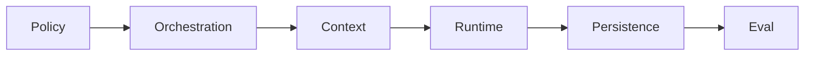

# Project Profile

このProfileは、対象Unity Projectへ接続できない場合や必要なProject Factを直接確認できない場合に使用する**Fallback**です。常時読み込む正本ではありません。

対象Unity ProjectからFactを観測できる場合、Unity Version、Pipeline、Rendering Path、Build Target、namespace等の検出済み事実をこのProfileより優先します。

```text
Observed Project Fact
> User-confirmed Project Fact
> Project-specific Context
> Project Profile fallback
> generic preference
```

Project ProfileはEnvironment SnapshotやProvider bindingの代替にはなりません。

---

## Identity

- ProjectName: CHANGE_ME
- RootNamespace: NONE

`RootNamespace`には実際に使用するRoot Namespaceか`NONE`を設定します。

Namespace規則:

- `RootNamespace`が実名: `<RootNamespace>.<FeatureName>`
- `RootNamespace: NONE`: `<FeatureName>`
- 既存コード変更: 既存namespaceを保持
- `.Runtime` / `.Editor` / `.Rendering`等は実在するAssembly / ownership boundaryがある場合だけ導入

`Namespace`、`RootNamespace`、`<RootNamespace>`、`CHANGE_ME`を実際のnamespaceやasmdef名として出力しません。

---

## Unity Environment Fallback

以下はProjectへ直接接続できない場合の補助値です。

- UnityVersion: 6000.3
- RenderPipeline: URP 17+
- RenderGraph: Enabled
- RenderingPath: Forward
- RuntimePlatformPolicy: Platform-independent
- PlatformDependencies: None by default
- ExplicitPlatformIntegrations: None
- PerformanceClass: Low-spec console class
- PerformanceReferenceExample: Nintendo Switch-equivalent constraints
- XR: Not targeted

`PerformanceReferenceExample`はPerformance budgetの参考であり、対応Platform、Build Target、SDK、Build Module、define、完了条件を自動的には意味しません。

特定Platformを`ExplicitPlatformIntegrations`へ追加するのは次の場合だけです。

- Platform SDK / APIを使う
- 専用Package / defineを使う
- Platform固有Buildを成果物にする
- Platform固有互換性または性能を保証する

「Nintendo Switchでも動く程度に軽くする」は通常、Platform IntegrationではなくPerformance Classです。

---

## Environment情報の優先順位

1. Target Unity Projectから観測したFact
2. 今回ユーザーが確認したProject Fact / 明示制約
3. Project固有Context
4. このProject Profile
5. UnityAgent generic preference

検出済みFactとProfileが競合した場合は検出済みFactを採用します。

ProfileをRuntime Environment Snapshotの代わりに使ってProvider availabilityやEditor bindingを推測しません。

---

## Workspace / Repository Boundary

- UnityAgentRepository: `DarumaPPAP/UnityAgent`
- McpRepository: `DarumaPPAP/MyUnityMCP`
- McpSpecificationRoot: `DarumaPPAP/MyUnityMCP/Specs/`
- McpPackageRoot: `DarumaPPAP/MyUnityMCP/Packages/`
- McpCatalogRoot: `DarumaPPAP/MyUnityMCP/Catalog/`
- GeneratedProductRepository: `DarumaPPAP/UnityAIGC-Archive`
- ImplementationRoot: `DarumaPPAP/UnityAIGC-Archive/Implementation/`
- GeneratedSpecRoot: `DarumaPPAP/UnityAIGC-Archive/Specs/`
- GovernanceSpecRoot: `Specs/`
- UnityProjectPath: user-managed
- AutomaticFileSync: Disabled
- AutomaticCodeScan: Disabled

MCP本体、Creator Workflow、Domain MCP、Capability Module、Manifest、Tool Schema、MCP固有仕様は`McpRepository`が所有します。

MCPが生成・変更したScene、Prefab、Material、Timeline、Volume Profile等はTarget Unity Projectが所有します。

---

## UnityAgent Canonical Authority



現在の主なcanonical surface:

- `Policy/` — User / Risk / Security / Approval / Evidence rules
- `Orchestration/` — Route / Graph / Task Contract / provider-independent CapabilityRequest
- `Context/` — Context Pack / Retrieval / Budget / Materialization / Capability description
- `Runtime/` — Environment Discovery / Tool Broker / Provider Resolution / Dispatcher / Guardrails / Harness / Telemetry
- `Persistence/` — durable State / Checkpoint / Resume / Memory / Evidence
- `Operations/` — Observability / Detection / Incident / approved control / Change Management
- `Eval/` — Golden / Behavior / Replay / Rebaseline / Regression
- `.agents/skills/` / `SkillReferences/` — selected domain procedure / supporting rule

### Provider selectionの境界

```text
Context
= Capabilityに必要な説明をmaterialize

Runtime
= Environment FactからProviderをresolve / dispatch
```

ContextへMCP / CLI Provider selection Authorityを戻しません。

MCP PackageやMCP製品仕様そのものをUnityAgentへ複製しません。

---

## Project-specific Preferences

- Inspector / Editor Windowは日本語を優先する。
- Editor UIは黒基調、文字は白を基本とする。
- staticの乱用を避ける。
- Scene上のControllerや外部Profileは要件がある場合だけ導入する。
- Shader名に`Hidden/`を安易に使用しない。
- Camera Stackを前提にしない。

このPreferenceは対象Projectから観測したFactやユーザーの今回明示指示を上書きしません。
