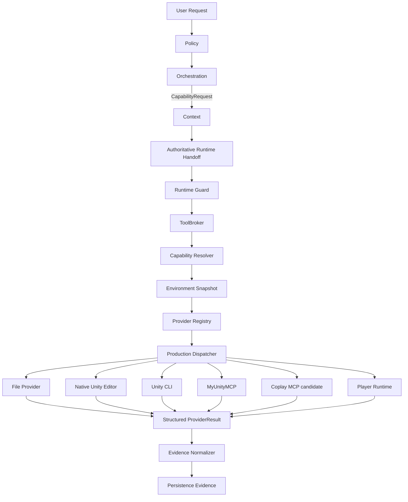
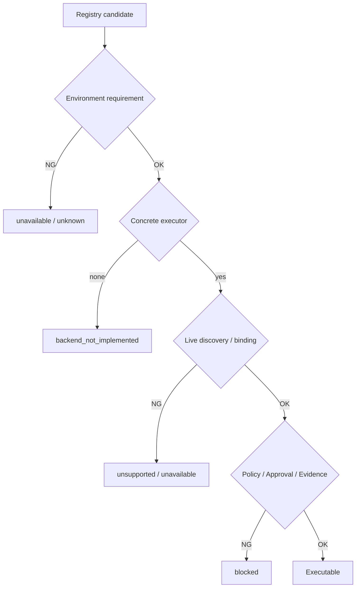
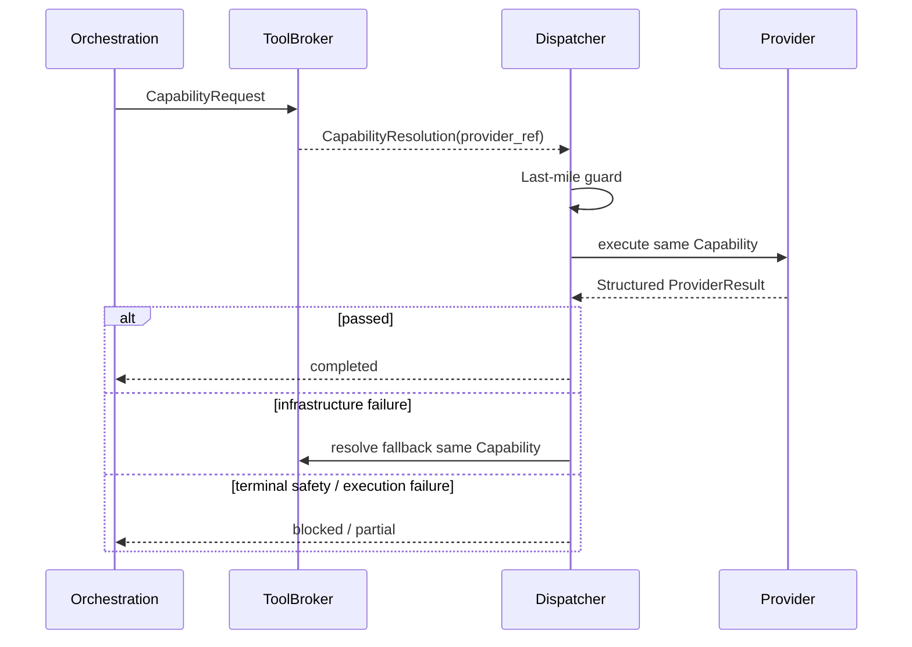
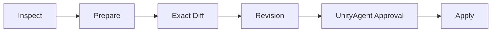
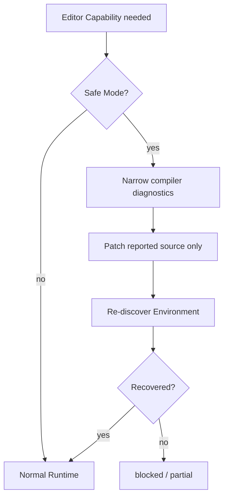

# Unity Tool Runtime

Status: **Active Production supporting specification**

> この文書はProduction Tool Runtimeの設計意図と責務境界を説明するsupporting specです。
>
> **Production execution authorityはこの文書ではありません。** Canonical sourceは `Policy/`、`Orchestration/`、`Context/`、`Runtime/`、`Persistence/`、`Eval/` にあります。

人間向けの現在Architectureは `docs/architecture/production-tool-runtime.md` を先に読むと理解しやすくなります。

---

## 1. Goal

UnityAgentから:

- local Unity Project
- Unity Editor
- Build / Test
- MCP Tool
- Player Runtime
- Target Device Evidence

へ、安全かつProvider非依存で到達するRuntimeを定義します。

最重要の分離:

```text
Skill      = どう作業するか
Capability = 何を実現したいか
Provider   = 誰が実行できるか
Transport  = どう接続するか
Evidence   = 実際に何を観測したか
```

Orchestrationは`MyUnityMCPを使う`、`Unity CLIを使う`ではなく、必要なCapabilityを要求します。

---

## 2. Production Architecture



Provider / TransportはPolicyやOrchestrationのAuthorityではありません。

---

## 3. Responsibility Boundary

### Policy

定義:

- operation kind
- risk
- permission
- approval requirement
- Mutation Scope requirement
- minimum Evidence

Providerを選びません。

### Orchestration

定義:

- Task Route
- semantic Graph
- Task Contract
- Capability requirement
- semantic replan
- Human Gate placement

Provider製品名をsemantic goalへ固定しません。

### Context

選択されたCapabilityやTaskに必要な説明だけをmaterializeします。

全Provider schemaを常時Contextへ投入しません。

### Runtime

所有:

- Environment discovery
- Provider resolution
- Project / Instance binding
- Production dispatch
- timeout / cancellation
- infrastructure retry / fallback
- Mutation Scope enforcement
- structured result validation
- current-run Evidence normalization

### Persistence

Canonical Evidenceをdurable appendします。

### Eval

Provider availability failureとAgent behavior regressionを区別します。

---

## 4. Canonical Capability Catalog

| Capability | Operation | Minimum intent |
| --- | --- | --- |
| `project.inspect` | read | Project Fact観測 |
| `source.read` | read | Source read |
| `source.patch` | source mutation | Source変更 |
| `static.review` | read | 静的Review |
| `git.diff` | read | Git diff観測 |
| `compile.observe` | read | Compile観測 |
| `project.test` | read | Test実行 |
| `project.build` | build | Build実行 |
| `scene.inspect` | read | Scene / Editor観測 |
| `scene.mutate` | editor mutation | Approval付きEditor mutation |
| `profiler.observe` | read | Profiler観測 |
| `visual.capture` | read | Visual Evidence |
| `domain.workflow` | editor mutation | Domain-specific guarded workflow |
| `player.observe` | player observe | Player観測 |
| `player.mutate` | player mutate | Approval付きPlayer control |

Canonical vocabularyの正本は `Runtime/Contracts/capability-request.schema.yaml` です。

---

## 5. Capability Request

例:

```yaml
schema_version: "1.0"
capability: scene.inspect
project_root: D:/Projects/MyGame/Project
operation_kind: read
required_evidence:
  - editor_observation
mutation_scope: null
approval_ref: null
preferred_surface: live_editor
```

RequestへProvider fieldを追加しません。

```text
× provider: myunitymcp
× provider_ref: unity_cli
```

---

## 6. Provider Registry

Runtime Provider Registryは**Potential Capability Surface**を宣言します。

代表Provider:

- `file`
- `native_unity_editor`
- `unity_cli`
- `myunitymcp`
- `coplay_mcp`
- `player_runtime`

重要:

```text
RegistryにCapabilityがある
!= Concrete adapterが実装済み
!= 現在接続可能
!= このProjectで実行可能
```

### 実行可能判定



この区別により、Registryを過大な実装証明として扱いません。

---

## 7. Capability Resolution

Resolverの順序:

```text
1. CapabilityRequest validation
2. Policy allow
3. Approval requirement
4. Mutation Scope
5. Project identity
6. Provider binding
7. Environment requirements
8. Provider health
9. Safety strength floor
10. Evidence strength floor
11. Required Evidence support
12. preferred surface hint
13. deterministic ranking
```

EligibilityがHard Gateです。

RankingはSafety / Evidence / Bindingを通過した候補にだけ適用します。

---

## 8. Production Dispatcher

Canonical Dispatcher:

`Runtime/Dispatcher/tool_runtime_dispatcher.py`

責務:

- Provider-independent CapabilityRequestを受け取る
- Runtime Guardを再実行する
- ToolBroker Resolutionだけをdispatch対象にする
- caller-selected Providerを受け取らない
- executor未登録を`backend_not_implemented`として扱う
- structured ProviderResultを検証する
- bounded infrastructure fallbackを実行する
- attempt ceilingを持つ



---

## 9. Provider Model

### 9.1 File Provider

Production用途:

- `project.inspect`
- `source.read`
- `source.patch`
- `static.review`
- `git.diff`

Restrictions:

- Project Root confinement
- Mutation Scope confinement
- no default raw `.unity` mutation
- no default raw `.prefab` mutation
- no default serialized `.asset` mutation

### 9.2 Native Unity Editor Provider

Production用途:

- `compile.observe`
- `project.test`
- `project.build`

使用:

```text
Unity.exe -batchmode -projectPath <root> ...
```

Restrictions:

- exact Project / Editor version
- second-Editor conflict detection
- Safe Mode guard
- allowlisted named automation only
- arbitrary generated executeMethod禁止

### 9.3 Unity CLI Provider

Unity公式CLIが現在利用可能な場合だけ使用します。

Concrete adapterの中心Capability:

- `project.inspect`
- `compile.observe`
- `project.test`
- `project.build`
- `scene.inspect`

重要:

- CLIはbeta / version driftし得る
- current command surfaceをdiscoverする
- JSON / structured outputを使う
- human output scrapingをCanonical Evidenceにしない
- `eval` / `eval_file`を通常経路にしない

RegistryのPotential SurfaceとConcrete adapterの実装範囲を混同しません。

### 9.4 MyUnityMCP Provider

Domain-aware Editor Providerです。

Concrete read surface:

- `project.inspect`
- `scene.inspect`
- `profiler.observe`
- `visual.capture`

Mutationの中心Contract:



Production adapterはPrepare-before-Approvalを維持するため、pre-approval Prepareとapproved Applyを分離します。

Save / BakeはScene Mutation Approvalへ畳みません。

`domain.workflow`はPotential SurfaceとしてRegistryに存在しても、canonical pre-approval provenanceを安全に表現できないone-shot経路はfail-closedです。

### 9.5 Coplay MCP

Coplay MCPはBridge / Provider candidateです。

参考特性:

- tool discovery
- grouped exposure
- multi-instance routing
- async job
- project scope

UnityAgentのPolicy / Orchestration Authorityにはしません。

Concrete Production executorが無い状態をRegistry記載だけで実装済み扱いしません。

### 9.6 Player Runtime Provider

Development / QA Playerだけを対象とします。

Capability:

- `player.observe`
- `player.mutate`

Restrictions:

- allowlisted command catalog
- project / artifact / instance binding
- Release command surface disabled
- no generic remote shell
- control commandはexplicit approval

---

## 10. Dynamic Discovery

Static Tool名だけを信頼しません。

### Unity CLI

Runtimeで現在のversion / command / pipeline surfaceを確認します。

### MCP

- reachable instance
- exact Project binding
- live tool list
- enabled tool group

を確認します。

### Player

- build artifact
- project root
- instance
- command catalog revision
- build kind

を確認します。

原則:

```text
Known by Registry
AND Environment matches
AND Concrete adapter exists
AND Currently discoverable where required
AND Policy permits
AND Project / instance matches
```

---

## 11. Fallback Policy

Runtime fallbackは**infrastructure-only**です。

RuntimeはTaskの意味を再設計しません。

### retry対象

- unhealthy
- timeout

### same-capability re-resolution候補

- unavailable
- unsupported
- backend_not_implemented

### terminal / safety failure

- ambiguous_binding
- blocked_by_policy
- blocked_by_approval
- scope_violation
- precondition_failed
- execution_failed
- cancelled
- observed_test_failure

### 変更禁止

Fallback中に次を変えません。

- Capability
- Project Root
- operation kind
- Required Evidence
- Mutation Scope
- Approval reference

Safety / Evidence strengthも下げません。

---

## 12. Safe Mode Recovery



禁止:

- Global Editor.logを無制限にContextへ入れる
- process nameだけで全Unityをkillする
- Safe Modeを理由にScene raw mutationを許可する

---

## 13. Multi-instance Binding

Canonical identityはProject Rootを中心に扱います。

```text
Project Root
+ Editor / MCP instance when observed
+ Player artifact / instance when observed
```

複数候補が同じProjectに一致し曖昧なら`ambiguous_binding`で停止します。

---

## 14. Evidence Normalization

Provider固有human logをQuality truthにしません。

Structured ProviderResultを:

- Capability
- Provider
- Project
- Environment binding
- Evidence type
- Mutation provenance
- Target surface
- fallback provenance

と結びつけてCanonical current-run Evidenceへ正規化します。

Persistence append後にdurable Evidenceになります。

---

## 15. Completion Classification

```text
verified
partial_verified
implemented_unverified
blocked_by_environment
not_applicable
```

### verified

Required Evidenceを満たした。

### partial_verified

一部Evidenceは観測したが、要求全体は満たしていない。

### implemented_unverified

変更は存在するが必要な実行Evidenceを観測できていない。

### blocked_by_environment

Environment / Provider制約でCore Capabilityを実行できない。

---

## 16. Environment Matrix

Production Regression Dataset:

`Eval/Datasets/Behavior/production-tool-runtime-environment-matrix.yaml`

Profile:

- `FULL`
- `CLI_ONLY`
- `MCP_ONLY`
- `NATIVE_EDITOR`
- `FILES_ONLY`
- `SAFE_MODE`
- `NO_EDITOR`
- `PLAYER_UNAVAILABLE`

Matrixの目的はProfile Routingではなく、Environmentが変化してもResolution / Safetyが壊れないことの検証です。

---

## 17. DefinitionFingerprint

Tool Runtime CutoverはRuntime definitionを変えるため、DefinitionFingerprintのblocking fieldとして管理します。

既存Frozen Baselineとblocking driftがある場合:

```text
REBASELINE_REQUIRED
```

が正常です。

Baseline自動更新は禁止します。

---

## 18. Canonical Source

| Concern | Canonical Source |
| --- | --- |
| Capability schema | `Runtime/Contracts/capability-request.schema.yaml` |
| Resolution schema | `Runtime/Contracts/capability-resolution.schema.yaml` |
| Capability Policy | `Policy/Security/tool-capability-policy.yaml` |
| Semantic routing | `Orchestration/ToolRouting/capability-routing.yaml` |
| Context descriptions | `Context/Selection/tool-capability-catalog.yaml` |
| Environment Snapshot | `Runtime/Contracts/environment-snapshot.schema.yaml` |
| Environment discovery | `Runtime/Tooling/Environment/` |
| Provider Registry | `Runtime/Tooling/provider_registry.yaml` |
| Resolution | `Runtime/Tooling/capability_resolver.py` |
| Broker | `Runtime/Tooling/tool_broker.py` |
| Production dispatch | `Runtime/Dispatcher/tool_runtime_dispatcher.py` |
| Runtime guard | `Runtime/Guardrails/tool_runtime_guard.py` |
| Fallback | `Runtime/Tooling/fallback_policy.py` |
| Providers | `Runtime/Tooling/Providers/` |
| Evidence normalizer | `Runtime/EvidenceCapture/provider_evidence.py` |
| Regression Matrix | `Eval/Datasets/Behavior/production-tool-runtime-environment-matrix.yaml` |

---

## 19. Anti-regression

禁止:

- OrchestrationへProvider製品名をsemantic authorityとして埋め込む
- `capability_contract_mode: shadow`へ戻す
- ContextからProvider selectionを復活する
- `Context/Selection/mcp-selection.yaml`をcurrent authorityとして復活する
- Root `Catalog/*.yaml`を万能正本として再導入する
- Provider unavailableでApprovalを弱める
- Provider unavailableでMutation Scopeを広げる
- Evidence requirementを弱めるFallback
- raw Scene / Prefab serialized mutationへの自動Fallback
- arbitrary evalを通常Mutationにする
- Registry記載だけで実装済みCapabilityと宣言する
- unavailable / not_observedをPASS扱いする
- Baselineを自動更新する

---

## 20. Related Documents

- `docs/architecture/architecture.md`
- `docs/architecture/production-tool-runtime.md`
- `docs/unity-environment-adaptation.md`
- `docs/local-project-development.md`
- `Specs/UnityToolRuntimeEnvironmentAdaptation.md`
- `Specs/UnityEnvironmentCapabilityMatrix.yaml`
