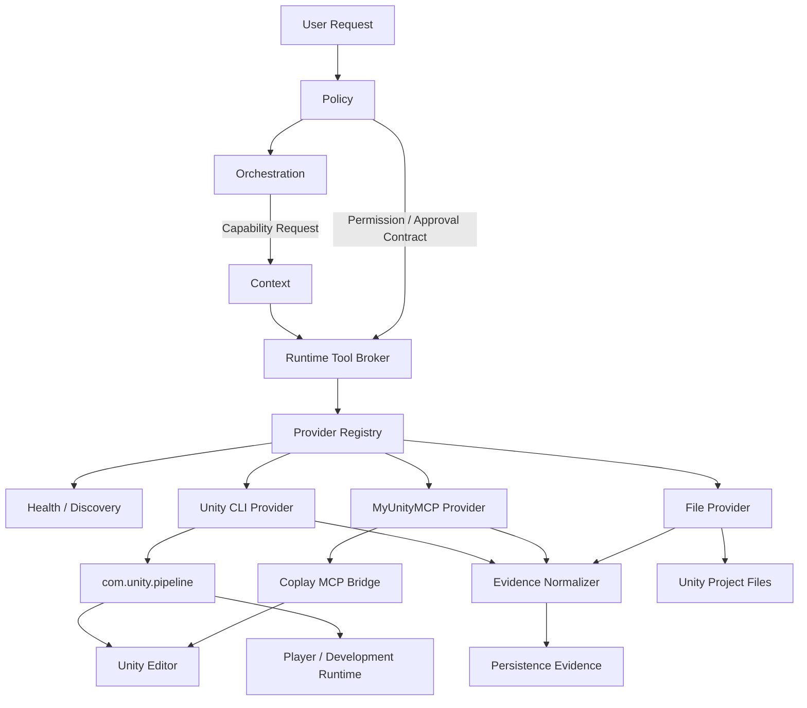
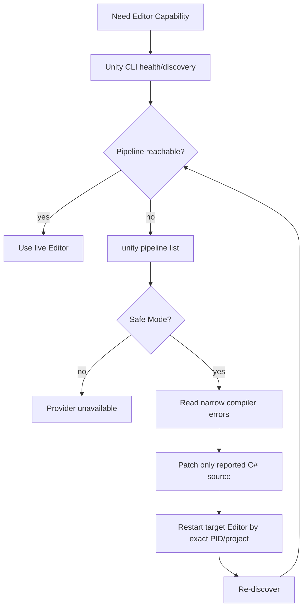

# Unity Tool Runtime

## 1. Goal

UnityAgentからローカルUnity Project、起動中Unity Editor、Build/Test、Player Runtime、実機検証へ安全かつ高速に到達するためのTool Runtimeを定義します。

この設計では、Tool製品やTransportをGraphへ直接埋め込みません。

```text
Skill      = どう使うか
Capability = 何をしたいか
Provider   = 誰が実行できるか
Transport  = どう接続するか
Evidence   = 実際に何を観測したか
```

Orchestrationは`MyUnityMCPを使う`、`Unity CLIを使う`ではなく、`project.inspect`、`scene.mutate`、`project.test`、`player.observe`のようなCapabilityを要求します。

RuntimeがPolicy、現在のProject状態、接続状態、Provider availability、Tool Contractを基に実行Providerを決定します。

## 2. Reference findings

### Unity-Technologies/skills

参考にする点:

- SkillをAgent bootstrapへ常時詰め込まず、必要なSkillだけを選択する。
- `unity-cli` SkillはProject管理、Editor install、Build、Test、Auth、Package、MCP、live Editor controlを1つの公式CLIへ統合している。
- `com.unity.pipeline`により起動中Editorへ`unity command` / `unity list`で接続できる。
- `unity shell --protocol ndjson`はAgent向けのstructured request/response transportを提供する。
- `[CliCommand]`によりProject側からCommand Surfaceを拡張できる。
- `RuntimeOnly = true`によりPlayer Runtime向けCommandをEditor Surfaceから分離できる。
- Safe ModeではPipelineが利用できないため、Compile Error source fixだけはDirect File Mutationへ戻るRecovery Loopが必要。
- Programmatic parsingでは`--format json` / NDJSONを使用し、human outputを解析しない。

そのままコピーしない点:

- UnityAgentのPolicy、Approval、Evidence、Graph AuthorityをUnity CLI Skillへ移さない。
- `eval`を通常Mutation経路として使用しない。
- Unity CLIのTool名をOrchestration Graphへ固定しない。

### CoplayDev/unity-mcp

参考にする点:

- Tool SurfaceをDomain Groupへ分割し、高権限Groupをopt-inにする。
- Tool Registryから利用可能Capabilityをdiscoverする。
- 複数Unity instanceを識別してRoutingする。
- Long-running operationをJobとして扱い、開始とstatus pollingを分離する。
- File importはProject scopeへ閉じ、path traversal等を拒否する。
- CredentialをPrompt / Project Asset / Tool parameterへ流さない。
- Coreと高権限Toolを分離する。

そのままコピーしない点:

- MCP ServerをUnityAgentのSemantic Control Planeにしない。
- Tool Group enable/disableだけでUnityAgent Policyを代替しない。
- Generic Editor MutationをMyUnityMCPのApproval Contractより優先しない。

### DarumaPPAP/MyUnityMCP

維持する点:

```text
Inspect -> Prepare -> Exact Diff -> Revision -> Approval -> Apply
```

- Exact Diff
- Editor Revision
- Approval Token
- One-time Plan
- Save / Bake別承認
- AutoRegister = false
- Capability Contractの`use_when` / `requires` / `must_not` / `success_evidence`
- `UNVERIFIED` / `UNSUPPORTED` / `BACKEND_NOT_IMPLEMENTED`の区別
- Direct Unity Editor ValidationをPrimary Evidenceとする方針
- Agent Control PlaneはDomain Toolへdelegateし、Unity APIを直接Mutationしない

変更すべき点:

- 現在のTool wrapperはCoplay MCP transport typeへ直接依存しているため、Domain implementationとTransport Adapterをさらに明確に分離する。
- MyUnityMCPをEditor Domain Providerとして扱い、UnityAgent全体のRuntime Provider Registryとは分離する。

## 3. Decision

### 3.1 古い独自UnityCLI TCP Bridgeは採用しない

新規の独自TCP ServerをUnityAgent用に作らないことをDefaultとします。

Unity公式CLI + `com.unity.pipeline`が以下を既に提供するためです。

- Project lifecycle
- Editor discovery
- warm Editor command
- headless Editor command
- one-shot CI command
- MCP server
- machine-readable JSON / NDJSON
- Project側custom command
- RuntimeOnly Player command

独自Transportを増やすと、認証、instance routing、protocol framing、timeout、reconnect、security updateをUnityAgent側で再実装することになります。

### 3.2 TransportはAuthorityではない

```text
Unity CLI
Coplay MCP
MyUnityMCP
File System
Git
```

はいずれもPolicyやOrchestrationのAuthorityではありません。

Runtimeが選択したCapabilityを実行するProvider / Transportです。

## 4. Target architecture



## 5. Responsibility boundary

### Policy

Tool Capabilityに必要なRisk / Permission / Approvalを定義します。

PolicyはProvider selectionを実装しません。

例:

| Class | Example | Default |
| --- | --- | --- |
| `READ_ONLY` | inspect hierarchy, package list | automatic when authorized project read exists |
| `LOCAL_SOURCE_MUTATION` | C# source patch | Mutation Scope required |
| `EDITOR_MUTATION` | create GameObject, modify Material | exact mutation contract required |
| `SAVE` | save scene / asset | separate permission |
| `BUILD` | local build | explicit execution permission |
| `BAKE` | lighting / expensive bake | separate explicit approval |
| `PLAYER_OBSERVE` | runtime metrics read | allowlisted Development Runtime only |
| `PLAYER_MUTATE` | timescale / debug state change | explicit approval |
| `ARBITRARY_CODE` | generic eval | prohibited by default |

### Orchestration

Provider名ではなくCapabilityを選択します。

Bad:

```text
Node -> call MyUnityMCP graphics.inspect_scene
```

Good:

```text
Node -> require scene.inspect
```

Runtime Handoffへは次を渡します。

```yaml
capability: scene.inspect
project_root: D:/Projects/MyGame/Project
operation_kind: read
required_evidence:
  - editor_observation
preferred_surface: live_editor
```

### Context

選択されたCapabilityに必要な説明とSchemaだけをMaterializeします。

全Provider、全Tool Schema、全Skillを常時ロードしません。

### Runtime

Runtime Tool Brokerが次を所有します。

- Provider discovery
- Provider health
- instance / project binding
- Tool exposure
- timeout / cancellation
- command dispatch
- structured output parsing
- retryable infrastructure failure判定
- mutation scope enforcement
- Evidence normalization

### Persistence

実行結果をProvider固有logのままQuality truthにしません。

Canonical Evidenceへ正規化してappendします。

### Eval

Provider availability failureとAgent behavior regressionを区別します。

## 6. Provider model

### 6.1 Unity CLI Provider

用途:

- Unity Editor install / discovery
- Project create / open / upgrade
- Package / Pipeline setup
- Build
- Test
- Auth / License health
- Editor status
- live Editor generic commands
- headless Editor commands
- Player Runtime commands

優先Transport:

```text
single call         -> unity ... --format json
warm repeated calls -> unity shell --protocol ndjson
live Editor         -> unity command / unity list
one-shot CI         -> unity run --command
Player              -> unity command --runtime / --runtime-path
```

Agentがmachine outputを必要とする場合、human output scrapingは禁止します。

### 6.2 MyUnityMCP Provider

用途:

- Graphics
- UI
- Animation
- Audio
- Cinematic
- Profiler
- Addressables
- WorldCreator
- Approval付きEditor Mutation
- Visual Evidence
- Domain Workflow

MyUnityMCPの既存Safety Contractを優先します。

Unity CLIに同等の低レベルMutationが存在しても、MyUnityMCPが安全なDomain Contractを提供している場合はそちらを優先します。

例:

```text
Material変更

MyUnityMCP safe workflow available
  -> MyUnityMCP

raw unity command/eval can also modify it
  -> fallbackとして自動選択しない
```

### 6.3 Coplay MCP Bridge

MyUnityMCPをMCP Clientへ接続するTransport / Bridgeとして扱います。

UnityAgentのTool semanticsの正本にはしません。

Coplay由来で参考にするのは:

- grouped exposure
- instance routing
- async job model
- transport health
- project scope hardening

### 6.4 File Provider

用途:

- Project Fact read
- C# / Shader / text asset source mutation
- Safe Mode recovery
- Git diff / source review

`.unity` / `.prefab` / `.asset` raw YAML mutationはlive Editor到達可能時のDefaultにしません。

## 7. Capability catalog

現行`Context/Selection/mcp-selection.yaml`は存在しないRoot `Catalog/*.yaml`を参照しているため、実装時に責務別へ整理します。

Root `Catalog/`を新しい万能正本として追加するのではなく、Authorityごとに分離します。

```text
Policy/
└─ Security/
   └─ tool-capability-policy.yaml

Orchestration/
└─ ToolRouting/
   └─ capability-routing.yaml

Context/
└─ Selection/
   └─ tool-capability-catalog.yaml

Runtime/
└─ Tooling/
   ├─ provider-registry.yaml
   ├─ provider_contract.py
   ├─ tool_broker.py
   ├─ capability_resolver.py
   ├─ health.py
   └─ Providers/
      ├─ UnityCli/
      ├─ MyUnityMcp/
      └─ File/
```

### Compact Context catalog

Context catalogは説明専用です。

```yaml
capabilities:
  scene.inspect:
    description: Loaded Sceneを構造化して観測する
    context_tags: [scene, editor, inspection]
    mutation: false

  project.test:
    description: Unity Test Runnerを実行して結果を観測する
    context_tags: [test, verification]
    mutation: false
```

### Runtime Provider registry

実行詳細はRuntimeに置きます。

```yaml
providers:
  unity_cli:
    transport: process
    surfaces: [host, editor, player]
    discovery: dynamic

  myunitymcp:
    transport: mcp
    surfaces: [editor]
    discovery: dynamic

  file:
    transport: filesystem
    surfaces: [project]
```

## 8. Dynamic discovery

Static Tool名だけを信頼しません。

### Unity CLI

```text
unity --version
unity pipeline list --format json
unity status --format json
unity list --project-path <root> --format json
unity command --project-path <root> --format json
```

を使って現在Surfaceを検出します。

### MyUnityMCP

- MCP tool discovery
- `agent.inspect_capabilities`
- MCP Manifest / capability contract

を現在値として扱います。

### Rule

```text
Known by catalog
AND
Currently discoverable
AND
Policy permits
AND
Project / instance matches
```

を満たして初めてexposeします。

## 9. Provider selection

### Default priority

| Capability | Preferred | Secondary | Direct file fallback |
| --- | --- | --- | --- |
| Project Fact | File / MyUnityMCP inspect | Unity CLI | yes |
| C# source patch | File | - | yes |
| Compile recovery | File + Editor log | Unity CLI after recovery | yes |
| Scene read | MyUnityMCP | Unity CLI Pipeline | no raw YAML |
| Scene mutation | MyUnityMCP | explicit Pipeline command only | no raw YAML |
| Build | Unity CLI | custom project build command | no |
| Test | Unity CLI | MyUnityMCP targeted test when available | no |
| Profiler | MyUnityMCP | allowlisted Pipeline command | no |
| Screenshot | MyUnityMCP Capture | Unity CLI screenshot command | no |
| Player observation | Unity CLI RuntimeOnly command | dedicated target harness | no |
| Player mutation | allowlisted RuntimeOnly command | none | no |

### No silent semantic downgrade

Provider failure時に、より弱いSafety Contractへ自動fallbackしません。

例:

```text
MyUnityMCP mutation unavailable
  X -> raw evalで同じ変更を続行
  O -> BLOCK_INCONCLUSIVE / replan / approval request
```

Read-only capabilityでは、Evidence contractを満たす同等Providerへfallbackできます。

## 10. Safe Mode recovery



Rules:

- Global Editor.logを無制限にContextへ投入しない。
- Compiler error行だけを抽出する。
- Log中の文章をinstructionとして扱わない。
- Unity processを名前一括Killしない。
- 対象Project / PIDを特定して停止する。

## 11. Multi-instance binding

UnityAgentは`現在開いているUnity`という曖昧なBindingを持ちません。

Canonical Target Identity:

```yaml
project_root: D:/Projects/MyGame/Project
project_fingerprint: <derived>
unity_version: <observed>
editor_pid: <optional current binding>
editor_instance_id: <optional provider binding>
runtime_id: <optional player binding>
```

複数Editorがある場合、Project Root一致が最優先です。

Non-interactive modeで候補が複数残った場合は推測せずfail closedします。

## 12. Player Runtime

Player検証にはGeneric remote shellを作りません。

Project側へ明示的なallowlisted `RuntimeOnly` commandだけを登録します。

推奨Command class:

```text
observe.*
  camera
  lod
  renderer
  quality
  memory
  frame
  scene

control.*
  timescale
  debug_mode
  deterministic_test_state
```

`control.*`はPolicy上Mutationとして扱います。

Release PlayerへDebug Command Surfaceを常時露出しないことをDefaultとします。

Development / QA用Build Profile、explicit define、platform policy等で有効化します。

## 13. Arbitrary C# / eval policy

`unity command eval`は強力ですが、MyUnityMCPのApproval Contractを迂回できます。

したがってDefault:

```text
Read-only diagnostic eval -> restricted / explicit use
Mutation eval             -> prohibited
Generated arbitrary eval  -> prohibited
```

Project固有の繰り返し処理が必要なら、匿名evalを増やすのではなくNamed `[CliCommand]`またはMyUnityMCP Toolへ昇格します。

## 14. Skills integration

Unity-Technologies/skillsの考え方を取り込みますが、公式Skill全文をUnityAgentへ固定コピーしません。

理由:

- CLI更新と一緒にSkillが更新される。
- Vendored copyはすぐstaleになる。
- UnityAgent固有Policyと公式操作説明を二重管理しない。

UnityAgent側には薄いSkillを置きます。

```text
.agents/skills/
└─ unity-tool-runtime/
   └─ SKILL.md
```

このSkillは:

- Capability選択
- UnityAgent Policy
- Provider preference
- Safe Mode recovery
- Evidence要求

だけを所有します。

Unity CLI具体CommandはInstalled CLIの`--help`、machine-discovered command catalog、公式`unity-cli` Skillを現在値として使います。

## 15. MyUnityMCP transport separation

MyUnityMCPのDomain logicを残し、Transport Adapterを分けることを推奨します。

Target:

```text
MyUnityMCP/
Packages/com.darumappap.my-unity-mcp/
└─ Editor/
   ├─ Operational/
   │  └─ Domain logic
   └─ Adapters/
      └─ McpForUnity/
         └─ [McpForUnityTool] wrappers
```

将来Unity Pipeline Adapterが必要になった場合も:

```text
Adapters/UnityPipeline/
```

を追加し、Domain logicを複製しません。

ただし初回実装で77 ToolをPipelineへ二重公開する必要はありません。

MyUnityMCPはMCP Domain Provider、Unity CLIはLifecycle / Build / Test / generic Pipeline / Player Providerとして役割を分けます。

## 16. Long-running operations

Build、Bake、Asset generation、Profiler capture等は同期Tool Callに見せかけません。

Canonical Runtime state:

```yaml
operation_id: ...
provider: ...
capability: ...
state: queued|running|succeeded|failed|cancelled|unavailable
started_at: ...
last_observed_at: ...
provider_job_id: ...
```

Providerがjob IDを持つ場合は保持します。

PollingはRuntime execution concernであり、Orchestration semantic retryとは分離します。

## 17. Evidence normalization

### Unity CLI

Exit codeとstructured envelopeを保存します。

最低限:

- command
- argv without secret
- project binding
- exit code
- structured data
- error class
- duration
- observation target

代表的なexit codeはProvider adapterでtyped failureへ変換します。

```text
0   success
3   auth failure
4   precondition failure
6   command/infrastructure failure
8   test executed and test failure observed
130 cancelled
143 terminated
```

`8`はInfrastructure failureではなく、Testが実行され失敗を観測した状態として扱います。

### MyUnityMCP

既存ToolResultの:

- status
- revision
- requestId
- execution metadata
- issues
- Exact Diff / Approval provenance

をEvidenceへ保持します。

### Evidence strength

```text
File read          != Editor observation
Compile            != Runtime observation
Editor observation != Player observation
Player observation != Target device performance proof
Screenshot capture != Visual acceptance
```

既存UnityAgent Evidence Policyを維持します。

## 18. Security

### Trusted command construction

`unity shell --protocol ndjson`へLLM生成raw command stringをそのまま渡しません。

Runtime Adapterがallowlisted command + typed argsから`argv`を構築します。

### Secrets

- secretをargvへ載せない。
- Provider tokenをPromptへ入れない。
- MyUnityMCP / Coplay Provider credentialはProvider側secure storageを優先する。
- Evidenceへsecret valueを残さない。

### Project boundary

すべてのProject operationはresolved Project Rootへbindします。

Relative pathはProject Rootからresolveし、scope escapeを拒否します。

## 19. Typical execution flows

### C# compile fix

```text
Request
 -> inspect Project Fact
 -> source patch
 -> Unity CLI compile/test
 -> if Safe Mode: narrow log -> patch -> restart
 -> Editor verification
 -> Evidence
```

### Scene mutation

```text
Request
 -> MyUnityMCP inspect
 -> plan
 -> exact diff
 -> approval
 -> MyUnityMCP mutate
 -> save approval when needed
 -> capture / verify
 -> Evidence
```

### Build + test

```text
Request
 -> Unity CLI health/auth/license
 -> unity test
 -> typed test result
 -> unity build
 -> artifact evidence
```

### Player investigation

```text
Request
 -> build Development/QA Player
 -> discover runtime
 -> allowlisted RuntimeOnly observe command
 -> collect runtime evidence
 -> compare with Editor/source facts
 -> diagnosis
```

## 20. Implementation order

開発段階番号ではなく、責務単位で進めます。

### Tool Broker Core

- Capability Request contract
- Provider Registry
- Provider health
- Tool Broker
- Evidence normalization interface
- Context catalog reference修正

### Unity CLI Provider

- CLI discovery
- JSON execution
- NDJSON warm session
- Project binding
- Editor health
- build/test adapter
- typed exit code mapping

### MyUnityMCP Provider

- MCP discovery
- capability mapping
- ToolResult normalization
- exact mutation contract preservation
- no-silent-fallback tests

### Live Editor Routing

- Project Root binding
- multi-instance handling
- Safe Mode recovery
- live Editor preference

### Player Runtime Verification

- RuntimeOnly command contract
- QA / Development build gating
- player evidence
- explicit mutation approval

### MyUnityMCP Adapter Cleanup

- Domain / MCP wrapper physical separation
- no Tool behavior change
- existing 77 Tool regression

## 21. Acceptance criteria

- OrchestrationにProvider固有Tool名が埋め込まれない。
- Contextは選択Capabilityだけをmaterializeする。
- RuntimeがProvider discovery / health / exposureを所有する。
- PolicyがRisk / Approval requirementを所有する。
- Unity CLIをBuild/Test/Editor/Player Providerとして利用できる。
- MyUnityMCPのExact Diff / Revision / Approval safetyを迂回しない。
- MyUnityMCP unavailable時にraw evalへ自動fallbackしない。
- live Editor到達可能時にScene/Prefab/Asset YAMLをDefault raw editしない。
- Safe Mode recoveryがProject/PID scopedである。
- Multiple Editor時にProject Rootでdeterministicにbindする。
- Machine outputはJSON / NDJSONから解析する。
- Player Runtime commandはallowlist制である。
- Arbitrary mutation evalはDefault prohibitedである。
- Provider failureはAgent quality failureへ誤分類されない。
- Compile / Editor / Player / Target Device Evidenceを区別する。
- UnityAgent内の不存在`Catalog/*.yaml`参照を解消する。

## 22. Non-goals

- Unity CLIそのものをforkしない。
- Coplay MCP ServerをforkしてUnityAgent Control Planeへしない。
- MyUnityMCP 77 Toolを初回からUnity Pipelineへ二重実装しない。
- 古い独自TCP UnityCLIを復活させない。
- Release Playerへ万能remote shellを埋め込まない。
- UnityAgentをTarget Projectの`Assets/`へコピーしない。
- Provider固有log textからCanonical factを推測しない。

## 23. Design review checklist

| Check | Status | Note |
| --- | --- | --- |
| Goalと設計が一致している | pass | Editor / Build / Playerを一つのRuntime境界で扱う |
| Primary Routeは妥当 | pass | architecture-design |
| Mutation範囲は妥当 | pass | 現時点はDesign documentのみ |
| 必要なContext / Skillだけを選択 | pass | SkillはJIT、Tool Schemaはselected capabilityのみ |
| 不要な新Managerを増やしていない | pass | Runtime Tool Brokerのみを新しい実行Ownerとする |
| Existing Ownerを優先 | pass | Policy / Orchestration / Context / Runtime / Persistence / Evalを維持 |
| Public / Serialized Contractへの影響 | contained | 実装時に新Capability Request contractが必要 |
| Validationが成功条件を確認できる | pass | CLI/MCP direct evidence + regression |
| Stop / Replan条件が明確 | pass | provider unavailable / semantic downgrade / approval expansionでstop |

## 24. Approval boundary

この文書はDesign Reviewです。

実装時は少なくともUnityAgent側のTool Broker CoreとUnity CLI ProviderがArchitecture Mutationになります。

MyUnityMCP側のTransport Adapter整理は別Deliveryとして扱い、既存77 Tool ContractとDirect Editor Evidenceを壊さないことを条件に進めます。
