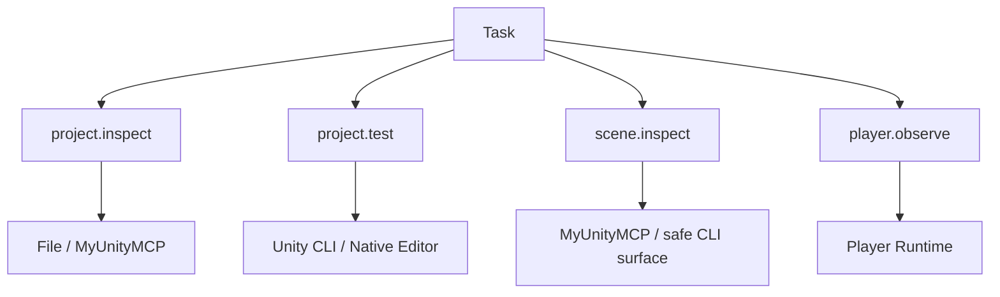
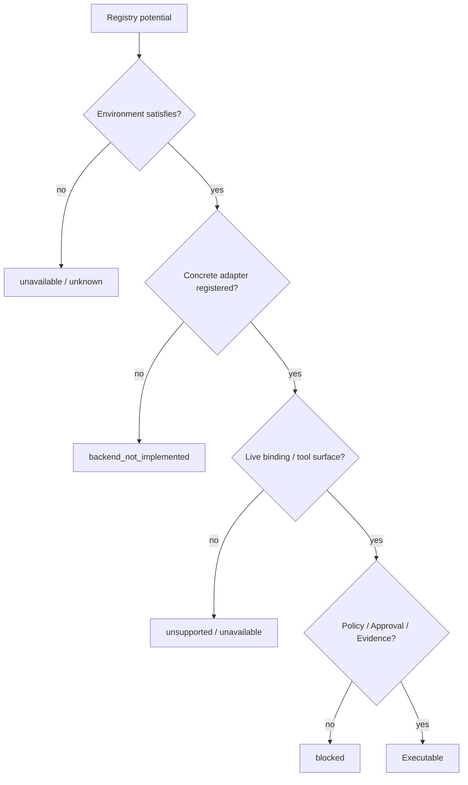
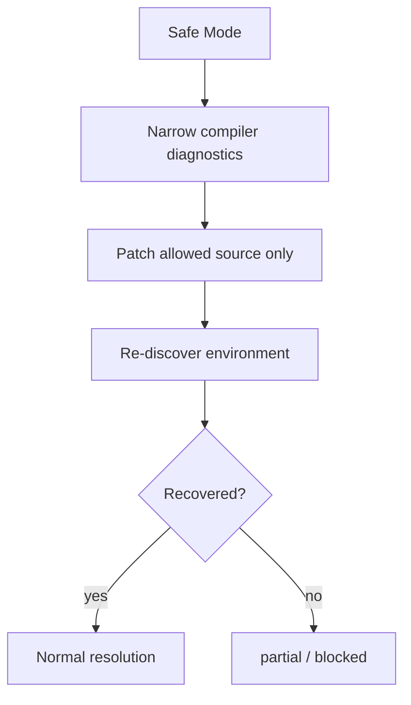

# Unity Tool Runtime Environment Adaptation

Status: **Active Production supporting specification**

この文書は、Production Tool RuntimeがUnity CLI / MCP / Unity Editor / Playerの有無にどう適応するかを説明します。

実行Authorityの正本は `Runtime/` です。人間向けの説明は `docs/unity-environment-adaptation.md` を優先してください。

---

## 1. Goal

UnityAgentが外部Provider構成に固定されず、その時点のEnvironment Factから**安全に実行可能なCapabilityだけを解決する**ことを定義します。

```text
外部Providerは必須依存ではない。
Providerの有無はEnvironment Factである。
CapabilityごとにProviderを解決する。
利用不能なVerificationを成功扱いしない。
Safety / Evidenceを弱めるFallbackをしない。
```

---

## 2. Authority

```text
Policy defines
Orchestration decides
Context materializes
Runtime executes
Persistence remembers
Operations observes / controls
Eval measures / proposes
```

Environment ProfileはRuntime / OrchestrationのRouting Authorityではありません。

---

## 3. Environment Snapshot

Canonical Schema:

`Runtime/Contracts/environment-snapshot.schema.yaml`

主なfield:

```text
project
filesystem
git
unity_editor
unity_cli
pipeline
myunitymcp
coplay_mcp
test_framework
build
player_runtime
profile_hint
binding_fingerprint
```

Project identity / instance bindingを含め、`true / false / unknown`を区別します。

---

## 4. Representative Profiles

| Profile | 概要 |
| --- | --- |
| `FULL` | 複数Providerが利用可能 |
| `CLI_ONLY` | Unity CLI中心 |
| `MCP_ONLY` | MCP中心 |
| `NATIVE_EDITOR` | Native Unity Editor executable中心 |
| `FILES_ONLY` | File / Gitだけ |
| `SAFE_MODE` | Source recovery中心 |
| `NO_EDITOR` | Unity execution unavailable |
| `PLAYER_UNAVAILABLE` | Player Evidenceのみ取得不可 |

Production Regression Matrix:

`Eval/Datasets/Behavior/production-tool-runtime-environment-matrix.yaml`

---

## 5. Per-capability Resolution



Profile全体で1 Providerへ固定しません。

---

## 6. Provider Availability

### File

可能:

- `project.inspect`
- `source.read`
- `source.patch`
- `static.review`
- `git.diff`

raw Scene / Prefab / serialized Asset mutationはDefault禁止です。

### Native Unity Editor

Concrete adapterの中心:

- `compile.observe`
- `project.test`
- `project.build`

### Unity CLI

Concrete adapterの中心:

- `project.inspect`
- `compile.observe`
- `project.test`
- `project.build`
- `scene.inspect`

current CLI surfaceをRuntime discoveryします。

### MyUnityMCP

read系:

- `project.inspect`
- `scene.inspect`
- `profiler.observe`
- `visual.capture`

Mutation:

- Prepare-before-Approval
- Exact Diff
- Revision
- Approval provenance
- Apply

`domain.workflow`はRegistry Potential SurfaceとConcrete executable stateを区別します。

### Coplay MCP

Bridge / Provider candidateです。Registry記載だけではexecutableとしません。

### Player Runtime

Development / QAのallowlisted commandだけを扱います。

- `player.observe`
- `player.mutate`

---

## 7. Potential vs Executable



この判定を飛ばして「Registryにあるから実行可能」と扱いません。

---

## 8. CLI_ONLY

代表:

```text
project.inspect -> File
compile.observe -> Unity CLI
project.test    -> Unity CLI
project.build   -> Unity CLI
scene.inspect   -> safe Pipeline commandがあればUnity CLI
player.observe  -> Player providerが無ければunavailable
```

---

## 9. MCP_ONLY

代表:

```text
source.read      -> File
scene.inspect    -> MyUnityMCP
profiler.observe -> MyUnityMCP
visual.capture   -> MyUnityMCP
project.test     -> executable Providerが証明できなければunavailable
```

MCPがあるだけでBuild/Testを過大にclaimしません。

---

## 10. NATIVE_EDITOR

```text
source.read      -> File
source.patch     -> File
compile.observe  -> Native Unity Editor
project.test     -> Native Unity Editor when Test Framework available
project.build    -> Native Unity Editor when Build Module available
scene.inspect    -> unavailable when no safe Editor-aware backend exists
```

---

## 11. FILES_ONLY / NO_EDITOR

可能:

```text
project.inspect
source.read
source.patch
static.review
git.diff
```

Unity execution Evidenceは未観測として残します。

---

## 12. SAFE_MODE



Scene Mutationへ自動downgradeしません。

---

## 13. PLAYER_UNAVAILABLE

Player unavailableはEditor / Source Task全体の失敗ではありません。

ただしTaskがPlayer Evidenceを要求している場合、`verified`へ昇格しません。

---

## 14. Fallback Preconditions

Automatic fallback requires:

```text
same capability
same Project Root
same operation kind
same required evidence
same Mutation Scope
same approval provenance
safety equal or stronger
evidence equal or stronger
```

禁止例:

```text
MyUnityMCP scene.mutate unavailable
-> raw .unity edit
-> arbitrary eval
```

---

## 15. Result Classification

```text
verified
partial_verified
implemented_unverified
blocked_by_environment
not_applicable
```

Provider不足をAgent behavior regressionへ自動変換しません。

---

## 16. Anti-regression

- Unity CLIを必須依存にしない。
- MCPを必須依存にしない。
- Environment ProfileをRouting Authorityにしない。
- `unknown`を`false`へ潰さない。
- Registry potentialをexecutable proofにしない。
- Provider不足でMutation Scopeを広げない。
- Required Evidenceを弱めない。
- Safe ModeでScene mutationへ進まない。
- Player unavailableをPlayer PASSにしない。

---

## 17. Related Canonical Sources

- `Runtime/Contracts/environment-snapshot.schema.yaml`
- `Runtime/Tooling/Environment/`
- `Runtime/Tooling/provider_registry.yaml`
- `Runtime/Tooling/capability_resolver.py`
- `Runtime/Dispatcher/tool_runtime_dispatcher.py`
- `Runtime/Tooling/fallback_policy.py`
- `Eval/Datasets/Behavior/production-tool-runtime-environment-matrix.yaml`
