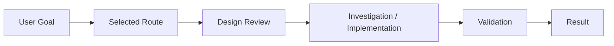

# Design Review

実装・変更へ進む前に、UnityAgentが選択した設計と実行Graphをユーザーへ提示するためのテンプレートです。

## 1. Goal

- 何を作るか:
- 何を解決するか:
- 今回変更しないもの:

## 2. 関連図

実Taskでは、選択Route、SubGraph、主要Node、Human Gate、Runtime境界、Validationまでを具体名で描画します。

## 3. Graph / 設計チェック

| Check | Status | Note |
| --- | --- | --- |
| Goalと設計が一致している | open | |
| Primary Routeは妥当 | open | |
| Task ContractのMutation範囲は妥当 | open | |
| 必要なContext / Skillだけが選択されている | open | |
| 不要なManager / Controller / Interface等を増やしていない | open | |
| Unity Lifecycle / Existing Ownerを先に評価した | open | |
| Public / Serialized Contractへの影響を確認した | open | |
| Validation方法が実際の成功条件を確認できる | open | |
| Stop / Replan条件が明確 | open | |

Task固有の項目を追加し、不要な項目は `not_applicable` とします。

## 4. 最終イメージ仕様書

### Summary

完成後に、ユーザーから見て何ができる状態になるかを自然言語で説明します。

### User-visible behavior

- 

### Major components

- 

### Data / Control Flow

1. 

### Acceptance criteria

- 

### Non-goals

- 

### Unresolved

- なし / 要確認事項を列挙

## 5. Approval

次のいずれかを明示します。

- **Approve** — この設計・Graphで先へ進む
- **Revise** — 指定内容を修正してDesign Reviewを再生成する
- **Reject** — この設計では進めない

Design Reviewが `required` のTaskでは、ApproveされるまでMutationへ進みません。
