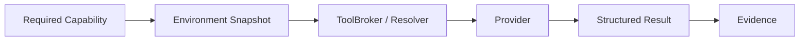
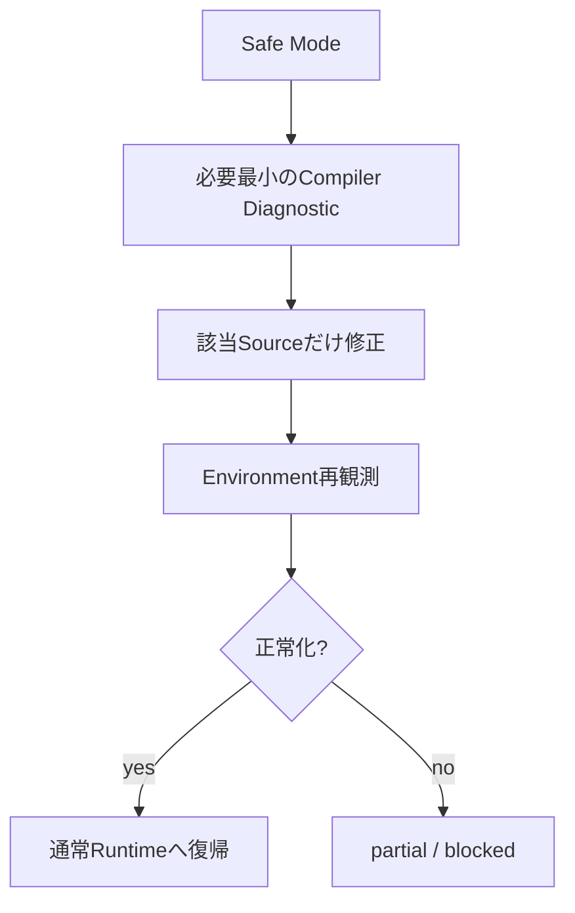

# UnityAgent Development Request

このTemplateは、UnityAgentへローカルUnity開発を依頼するときの標準入力です。

全部を埋める必要はありません。Projectから観測できるFactは空欄でも構いません。

ただし、**Goal / Project Root / Mutation Scope / Acceptance Criteria**は可能な限り明示してください。

---

## 1. Goal

```text
Goal:

```

例:

```text
MainCamera移動時に発生するFrame spikeの原因を特定し、Switch向けに改善する。
```

---

## 2. Target Unity Project

```text
Project Root:
D:\Projects\MyGame\Project
```

`Assets/`だけではなくUnity Project Rootを指定します。

```text
Project/
├─ Assets/
├─ Packages/
└─ ProjectSettings/
```

UnityAgent本体をTarget Projectの`Assets/`配下へコピーしません。

---

## 3. Development Mode

必要なものへチェックします。

- [ ] 調査のみ
- [ ] 設計のみ
- [ ] 設計 + 実装
- [ ] C#局所修正
- [ ] Rendering / Shader
- [ ] Performance調査
- [ ] Editor Tool
- [ ] Portable Package
- [ ] MCP / Tool Runtime
- [ ] Player / Target Device Verification
- [ ] その他

---

## 4. Read Scope

標準:

```text
Read Scope:
Project Root全体
```

Project Fact確認のため、必要に応じて次を読み取ります。

- `Assets/`
- `Packages/`
- `ProjectSettings/`
- asmdef
- Package manifest / lock
- Unity Version
- Render Pipeline設定
- Build / Quality設定

読み取り許可はMutation許可ではありません。

---

## 5. Mutation Scope

```text
Mutation Scope:
Assets/<対象Directory>/**
```

例:

```text
Mutation Scope:
Assets/Rendering/GPUCulling/**
Assets/Shaders/GPUCulling/**
```

必要になるまで、次は含めないことを推奨します。

- `Packages/`
- `ProjectSettings/`
- 他FeatureのDirectory

Scope外変更が必要になった場合:

```text
勝手に変更せず、必要理由・変更先・影響・代替案を提示する。
```

---

## 6. Known Project Conditions

分かっている範囲だけ記載します。

```text
Unity Version:

Render Pipeline:

Target Platform:

Target Device:

Performance Target:

Namespace:

Relevant Packages:

Relevant Existing Systems:

Do Not Change:
```

未記入項目は実Projectから取得できる場合、Project Factを優先します。

推測で固定しません。

---

## 7. User Constraints

```text
Constraints:
- 
- 
- 
```

例:

```text
- Switchを最優先する
- staticを不要に増やさない
- 新Manager追加前にExisting Ownerで解決できないか確認する
- ProjectSettings変更は事前Reviewする
```

---

## 8. Required Capability

Tool製品名ではなく、必要なCapabilityを書けます。

未記入でもGoalから選択可能です。

### Canonical Capability

```text
project.inspect
source.read
source.patch
static.review
git.diff
compile.observe
project.test
project.build
scene.inspect
scene.mutate
profiler.observe
visual.capture
domain.workflow
player.observe
player.mutate
```

例:

```text
Required Capability:
- project.inspect
- source.read
- source.patch
- compile.observe
```

またはRendering調査なら:

```text
Required Capability:
- project.inspect
- scene.inspect
- profiler.observe
- visual.capture
```

### 旧名称は使用しない

```text
source.inspect      ×  -> source.read
project.compile     ×  -> compile.observe
editor.capture      ×  -> visual.capture
performance.capture ×  -> profiler.observe 等へ分解
player.control      ×  -> player.mutate
```

重要:

```text
Capability != Provider
```

---

## 9. Provider Preference

通常は空欄で構いません。

```text
Provider Preference:

```

特定Providerを希望する理由がある場合だけ記載します。

例:

```text
Provider Preference:
Graphics inspectionでMyUnityMCPが安全に利用可能なら優先してよい。
```

ただしPreferenceは次を上書きしません。

- Policy
- Approval
- Project binding
- Mutation Scope
- Required Evidence
- Safety Contract

Providerの最終ResolutionはRuntimeが行います。

---

## 10. Production Runtimeの考え方



依頼側でProviderを固定しなくても、Runtimeが現在のProject環境から解決します。

Provider Registryへ候補が記載されていても、Concrete adapterやlive Tool surfaceが無ければ実行可能扱いしません。

---

## 11. Provider Fallback Rule

標準Rule:

```text
Provider unavailableを理由に、より弱いSafety Contractへ自動Fallbackしない。
```

許可例:

```text
project.test
Unity CLI unavailable
Native Unity Editorで同じEvidenceを満たせる
-> same-capability fallback
```

禁止例:

```text
scene.mutate
MyUnityMCP unavailable
-> raw .unity edit
-> arbitrary eval
```

必要に応じて:

- reconnect
- same-capability fallback
- semantic replan
- Human Review
- partial completion
- block

を選択します。

---

## 12. Design Review

```text
Design Review:
required / conditional / not_required
```

`required`の場合、実装前に最低限次を提示します。

### 関連図

- Existing System
- New / Modified Component
- Capability
- Runtime boundary
- Provider boundary
- Validation / Evidence

### Design Check

- Goal一致
- Existing Owner
- Responsibility
- Source of Truth
- Read Scope
- Mutation Scope
- Capability requirement
- Provider候補
- Approval boundary
- Performance
- Platform依存
- Validation
- Non-goal

### 最終イメージ

- Summary
- User-visible behavior
- Major components
- Data / Control Flow
- Expected files
- Acceptance Criteria
- Non-goal
- Unresolved

Design Reviewが必須ならApprove前にImplementation Mutationへ進みません。

---

## 13. Required Verification

```text
Verification:
- Static Review
- Compile
- EditMode Test
- PlayMode Test
- Direct Editor Validation
- Player Validation
- Target Device Validation
- Performance Observation
- Visual Capture
```

すべて必要とは限りません。

ただし:

```text
Compile PASS
!= Runtime PASS
!= Player PASS
!= Target Device PASS
!= Performance PASS
```

未実施のVerificationをPASS扱いしません。

---

## 14. Live Editor Rule

標準:

```text
live Editorへ安全な構造化接続が可能なら、
Scene / Prefab / Assetのraw serialized mutationよりEditor-aware Providerを優先する。
```

ただし:

```text
Editor reachable
!= Mutation authorized
```

です。

---

## 15. Safe Mode Rule

C# compile error等でSafe Modeの場合:



Safe Mode recoveryをScene Mutation許可へ拡張しません。

---

## 16. Player / Runtime Rule

```text
Player Requirement:

```

例:

```text
Player Requirement:
Switch実機でLOD stateとCamera Far ClipをRead-only観測したい。
```

Player observationは`player.observe`、Runtime controlは`player.mutate`です。

Runtime Mutationは別Approval対象です。

---

## 17. Evidence Requirement

```text
Evidence:
- 
- 
```

例:

```text
- Compile error 0
- Scene before / after observation
- Profiler observation
- Switch実機Frame Time
```

Evidence Sourceを区別します。

```text
source_diff
static_review
compile_observation
test_execution
build_execution
editor_observation
profiler_observation
visual_capture
player_observation
mutation_evidence
```

---

## 18. Required / Optional / Non-goal

```text
Required:
- 

Optional:
- 

Non-goal:
- 
```

Scope creep防止のためNon-goalも重要です。

---

## 19. Acceptance Criteria

```text
Acceptance Criteria:
- 
- 
- 
```

例:

```text
- BGMが意図しないClipへ戻らない
- 新規Managerを追加していない
- Compile Error 0
- 既存の2 BGM同時再生仕様を壊していない
```

---

## 20. Completion Report

完了時には最低限次を報告します。

- Root cause / 実装内容
- 変更File
- Mutation Scope逸脱の有無
- 実際にResolvedされたProvider / Tool経路
- 実施したVerification
- Evidence
- 未観測項目
- Known limitation
- 次に必要なHuman action

---

# 完全版入力例

```text
UnityAgentで以下を設計・実装してください。

Project Root:
D:\Projects\MyGame\Project

Goal:
Unity 6 URP RenderGraph向けにGPU Culling Featureを追加する。

Development Mode:
設計 + 実装

Read Scope:
Project Root全体

Mutation Scope:
Assets/Rendering/GPUCulling/**
Assets/Shaders/GPUCulling/**

Known Conditions:
- Switch最優先
- URP
- SRP Batcher ON

Constraints:
- staticを不要に増やさない
- ProjectSettings変更は事前Review
- Existing Ownerを優先

Required Capability:
- project.inspect
- source.read
- source.patch
- compile.observe
- scene.inspect
- profiler.observe

Design Review:
required

Verification:
- Static Review
- Compile
- Direct Editor Validation
- Performance Observation

Acceptance Criteria:
- 対象RendererのCPU Culling Costを観測可能
- Compile Error 0
- 既存Renderingを破壊しない
- 未実施のSwitch実機検証は未観測として報告する
```

---

# 最小依頼版

```text
UnityAgentで以下を開発してください。

Project Root:
D:\Projects\MyGame\Project

Goal:
<やりたいこと>

Read Scope:
Project Root全体

Mutation Scope:
Assets/<対象>/**

Project Factは実Projectから取得してください。
必要CapabilityはGoalから選択してください。
Providerは固定せず、RuntimeのEnvironment / Safety Contractから解決してください。

指定外Mutationが必要なら理由を先に説明してください。
設計変更を伴う場合はDesign Reviewを先に行ってください。
未観測のVerificationをPASS扱いしないでください。
```

---

# Production Runtimeについて

Capability-driven Tool RuntimeはProduction Architectureです。

人間向け解説:

- `docs/architecture/production-tool-runtime.md`
- `docs/unity-environment-adaptation.md`
- `docs/local-project-development.md`

Canonical Runtime source:

- `Runtime/Contracts/`
- `Runtime/Tooling/provider_registry.yaml`
- `Runtime/Tooling/capability_resolver.py`
- `Runtime/Tooling/tool_broker.py`
- `Runtime/Dispatcher/tool_runtime_dispatcher.py`
- `Runtime/Tooling/Providers/`

`Specs/`は補助仕様であり、Production execution authorityの代替ではありません。
