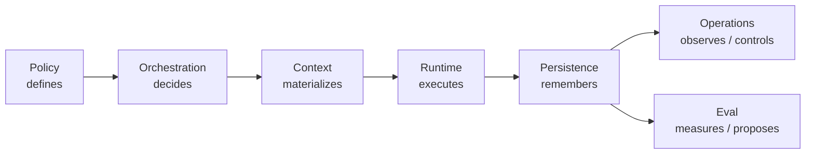
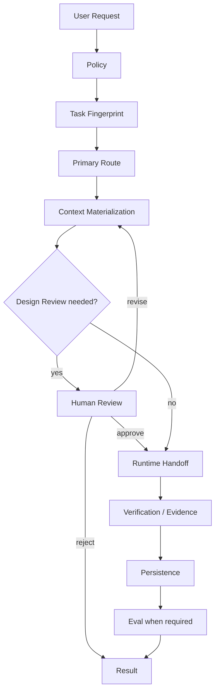
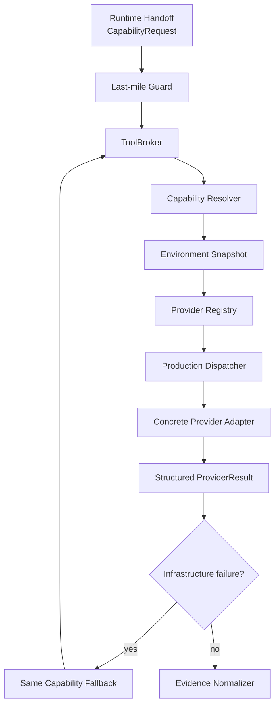
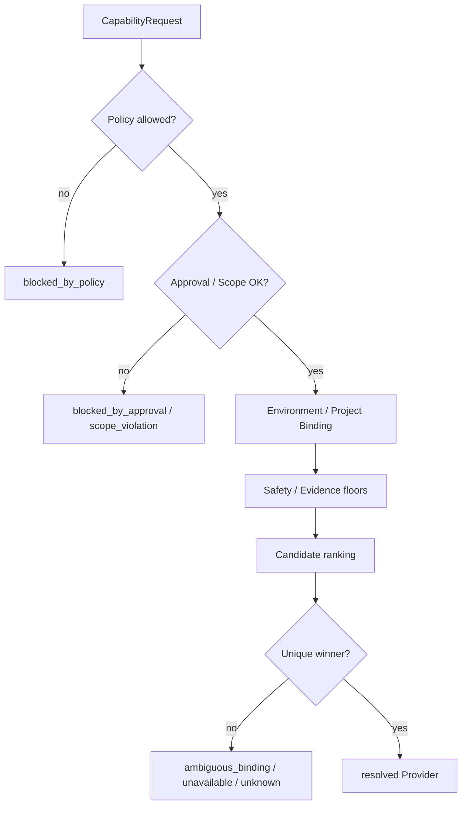
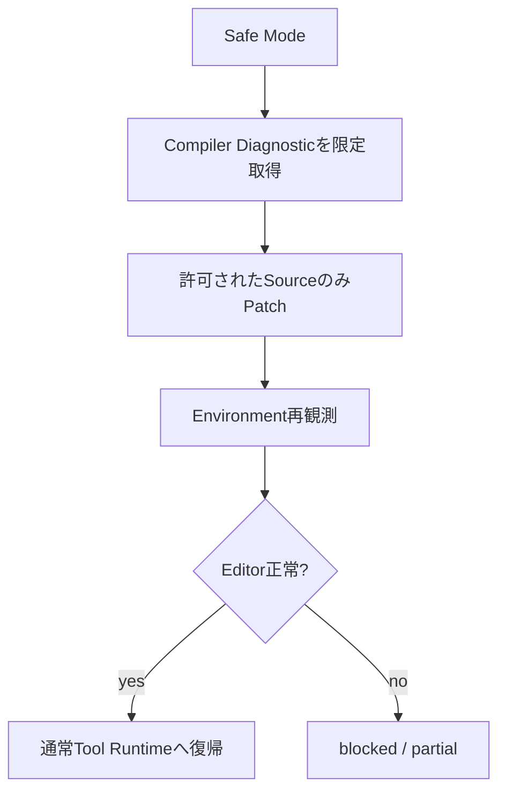

# UnityAgent Architecture

Status: **Canonical Architecture Contract / Production Tool Runtime integrated**

この文書はUnityAgentの**現在Architecture**を人間向けに説明します。

過去のPhase移行記録は `docs/migration/` に残しますが、current Production Authorityとしては使用しません。

---

## 0. 製品境界としての5層（正式契約）

UnityAgentを利用する入口は、必ず次の5層を通ります。機械可読な正本は
`Specs/unityagent-layer-contract.yaml` です。

```text
① Entry Layer
   Unity UI / Codex Plugin
        │ request / approval / presentation
        ▼
② Control Plane
   UnityAgent
        │ run ownership / long-lived state
        ▼
③ Capability & Orchestration
   semantic intent / Graph / Loop / Policy / Resolver
        │ provider-independent CapabilityRequest
        ▼
④ Provider Layer
   Official Unity CLI / UnityArtistCLI / Installer Provider / future Providers
        │ structured ProviderResult
        ▼
⑤ Evidence & State
   Evidence / Run History / Capture / InstallReceipt / Evaluation
```

### Layer ownership

- Entry Layerは入力、表示、明示承認だけを担当する。外部コマンドやProviderを直接実行しない。
- Control PlaneはUnityAgentが担当し、run identity、run lifecycle、長期状態、Entryからの唯一の実行Facadeを所有する。
- Capability & Orchestrationは既存のOrchestration、Policy、Resolverを担当範囲とし、意味解決、Graph、Loop、Routingを所有する。
- Provider Layerは実作業だけを担当する。ProviderはPolicy、semantic replan、durable truthを所有しない。
- Evidence & Stateは既存のRuntime Evidence CaptureとPersistenceが担当し、run state、loop state、ProviderResult、Capture、InstallReceiptを再現可能な形で保存する。

### 許可依存と禁止依存

```text
Entry → Control Plane
Entry → Evidence & State（read only / presentation）
Control Plane → Capability & Orchestration
Control Plane → Evidence & State
Capability & Orchestration → Provider Layer
Capability & Orchestration → Evidence & State
Provider Layer → Evidence & State
```

禁止事項は、EntryからProviderへの直接依存、semantic routeでのProvider選択、ProviderからのPolicy変更、EntryまたはProviderによるdurable stateの直接書込みです。レビューでは変更元Layerと変更先Layerの辺を
`Specs/unityagent-layer-contract.yaml` と照合し、未定義の辺を拒否します。

### Cross-layer contract

- Entry → Control Plane: `Runtime/Contracts/entry-request.schema.yaml`
- CapabilityRequest / Resolution: 既存のRuntime契約
- ProviderResult: 既存Dispatcher契約とProvider adapter
- Toolchain setup: `Runtime/Contracts/toolchain-setup-request.schema.yaml`
- InstallReceipt: `Runtime/Contracts/install-receipt.schema.yaml`
- Durable Evidence: `Persistence/Contracts/evidence-record.schema.yaml`

UI / Codexから実行する場合も、経路は必ず
`Entry → UnityAgent → Capability / Policy / Resolver → Provider → Evidence`
です。UnityAgentは既存のCapability → Provider Registry → Resolver →
Dispatcher → Provider Adapter → Evidenceを再利用し、第二のPlayer Frameworkや
第二のProvider Registryを作りません。

---

## 1. Canonical Repository

```text
UnityAgent/
├─ AGENTS.md
├─ Policy/
├─ Orchestration/
├─ Context/
├─ Runtime/
├─ Persistence/
├─ Operations/
├─ Eval/
├─ .agents/
├─ SkillReferences/
├─ Specs/
├─ Tools/
└─ docs/
```

`DarumaPPAP/UnityAgent` がProduction executionを含むcanonical single-repository authorityです。

`DarumaPPAP/Unity-Graph-Engineering`はProduction execution dependencyではありません。過去Migration provenanceとして参照できても、current bootstrapの正本には戻しません。

---

## 2. Authority Contract



```text
Policy defines
Orchestration decides
Context materializes
Runtime executes
Persistence remembers
Operations observes / controls
Eval measures / proposes
```

近くに実装できることと、そのAreaがAuthorityを持つことは同義ではありません。

### Policy

所有:

- User Policy
- Risk
- Security
- Approval requirement
- Evidence requirement

所有しない:

- Provider selection
- Tool dispatch
- Graph scheduling
- quality grading

### Orchestration

所有:

- Primary Route
- ParentGraph / SubGraph
- semantic Node / Edge / Gate
- semantic continue / replan
- Task Contract
- Runtime handoff
- Design Review placement

所有しない:

- subprocess execution
- Unity CLI / MCP Tool dispatch
- hard timeout / process kill
- durable State write

### Context

所有:

- Context selection
- Context Pack
- Retrieval
- Knowledge
- Context Budget
- current-call Materialization

所有しない:

- Route selection
- Provider selection
- durable Memory / Evidence / Checkpoint

### Runtime

所有:

- process / tool execution
- Environment discovery
- Provider resolution
- Production dispatch
- timeout / cancellation
- bounded infrastructure retry
- Mutation Scope enforcement
- verification / current-run Evidence capture

所有しない:

- semantic replan
- durable Evidence truth
- Agent quality grading

### Persistence

所有:

- ExecutionState
- WorkflowState
- LoopControlState
- Checkpoint / Resume
- Session
- Memory
- durable Evidence

```text
Checkpoint != Memory != Evidence
```

### Operations

所有:

- Observability
- Detection
- Incident / Runbook
- approved Runtime Control
- Change Management / rollout / rollback

### Eval

所有:

- Golden / Behavior Eval
- Attribution
- Historical Replay
- Rebaseline
- Regression comparison
- ChangeProposal

EvalはProduction executionやProduction definitionの直接変更を行いません。

---

## 3. Default Execution Flow

bounded TaskではFast Pathを優先します。



Semantic coordinationが必要な場合だけ `Orchestration/Definitions/development-parent-graph.yaml` を使います。

Local Loopは独立したtop-level control planeではなく、SubGraph内部の限定されたcycleです。

---

## 4. Production Tool Runtime

Production Cutover後、Unity Editor / Build / Test / MCP / Player等の具体的実行先はRuntime Toolingへ集約します。

OrchestrationはProvider固有Tool名ではなくCapabilityを要求します。

```text
Skill      = どう作業するか
Capability = 何を実現したいか
Provider   = 誰が実行できるか
Transport  = どう接続するか
Evidence   = 実際に何を観測したか
```

### Runtime内部



重要:

- Orchestrationは`provider` / `provider_ref`を指定しない。
- ContextはProviderを選ばない。
- Provider RegistryはPotential capabilityを記述する。
- 実行可能性はConcrete adapter + Environment + live discoveryで再確認する。
- executor未登録は`backend_not_implemented`であり成功ではない。
- Fallbackは同一CapabilityかつSafety / Evidenceが同等以上の場合だけ。

詳細は [Production Tool Runtime](production-tool-runtime.md) を参照してください。

---

## 5. Capability Contract

Canonical Capabilityは15個です。

```text
project.inspect
source.read
source.patch
static.review
git.diff
compile.observe
project.test
project.build
scene.inspect
scene.mutate
profiler.observe
visual.capture
domain.workflow
player.observe
player.mutate
```

Capability Request / ResolutionのSchemaは `Runtime/Contracts/` が正本です。

Semantic capability requirementは `Orchestration/ToolRouting/capability-routing.yaml`、説明用Contextは `Context/Selection/tool-capability-catalog.yaml` が担当します。

---

## 6. Provider Resolution Boundary



Provider availabilityはEnvironment Factです。

```text
Unity CLIなし
MCPなし
Playerなし
```

のどれか1つだけでAgent全体を停止しません。

ただし必要Evidenceを取得できない場合は、その不足を明示します。

---

## 7. Safety / Recovery Ownership

```text
Semantic Recovery    -> Orchestration
Execution Recovery   -> Runtime
Operational Recovery -> Operations
```

### Runtime fallbackで変えてはいけないもの

- Capability
- Project Root
- operation kind
- Required Evidence
- Mutation Scope
- Approval provenance

MyUnityMCP Mutationが利用不能でも、raw Scene YAMLやarbitrary `eval`へsilent downgradeしません。

### Safe Mode

Safe ModeではSource recoveryとScene mutationを分離します。



---

## 8. Evidence Contract

Evidence stateは分離します。

```text
Compile
Editor
Test
Player
Target Device
Performance
Visual
```

```text
Compile PASS
!= Runtime PASS
!= Player PASS
!= Performance PASS
```

RuntimeでcaptureしたEvidenceは `Persistence/Evidence/` にappendされて初めてhistorical durable Evidenceになります。

`not_observed`をAgent品質denominatorへ入れません。

---

## 9. DefinitionFingerprint / Regression

比較・Resume・Rebaselineでは少なくとも次を追跡します。

- architecture version
- policy revision
- prompt revision
- context revision
- graph revision
- runtime profile revision
- tool schema revision
- checkpoint schema revision
- evidence schema revision
- eval contract revision

Production Tool Runtime Cutoverでblocking fieldが変わった場合、既存Frozen Baselineとの比較は `REBASELINE_REQUIRED` になるのが正常です。

Baselineを自動更新してdriftを隠しません。

Regression decision:

- `PASS`
- `BLOCK_REGRESSION`
- `BLOCK_INCONCLUSIVE`
- `REBASELINE_REQUIRED`

---

## 10. Canonical Source Map

| Area | Canonical Source |
| --- | --- |
| User Policy | `Policy/User/user-policy.yaml` |
| Capability Policy | `Policy/Security/tool-capability-policy.yaml` |
| Route | `Orchestration/Routing/task-routes.yaml` |
| Capability routing | `Orchestration/ToolRouting/capability-routing.yaml` |
| Context catalog | `Context/Selection/context-catalog.yaml` |
| Capability descriptions | `Context/Selection/tool-capability-catalog.yaml` |
| Runtime contracts | `Runtime/Contracts/` |
| Environment discovery | `Runtime/Tooling/Environment/` |
| Provider Registry | `Runtime/Tooling/provider_registry.yaml` |
| Resolver | `Runtime/Tooling/capability_resolver.py` |
| Tool Broker | `Runtime/Tooling/tool_broker.py` |
| Production Dispatcher | `Runtime/Dispatcher/tool_runtime_dispatcher.py` |
| Runtime Guard | `Runtime/Guardrails/tool_runtime_guard.py` |
| Fallback | `Runtime/Tooling/fallback_policy.py` |
| Providers | `Runtime/Tooling/Providers/` |
| Evidence normalization | `Runtime/EvidenceCapture/provider_evidence.py` |
| Durable Evidence | `Persistence/Evidence/` |
| Regression | `Eval/Regression/` |
| Production Runtime validator | `Tools/ProductionToolRuntime/validate_production_tool_runtime.py` |

---

## 11. Historical Migration

`docs/migration/`はMigration時点の判断・旧Path・削除対象・互換性判断を保存するHistorical recordです。

Historical文書に現れる旧PathやPhase名をcurrent Production contractとして読み替えません。

現在Architectureを理解する場合は次を優先します。

1. `AGENTS.md`
2. Canonical source files
3. この文書
4. `docs/architecture/production-tool-runtime.md`
5. Supporting `Specs/`


## Bootstrap ownership details

責務境界・handoff・移行境界を変更する際に参照する。起動時には全読込しない。

- RouteはTask Fingerprintとsemantic Execution Profileで決め、Technology keywordだけでは決めない。
- 選択Routeの`required_policy_clauses`をPolicy provenanceとして記録する。
- Context Manifestはcurrent-call provenanceでありWorkflowState、Checkpoint、Graph topologyの正本ではない。MemoryはContext側へread-only projectionだけを渡す。
- Orchestration→RuntimeはPolicy revision、Route、Context ID/Fingerprint、Execution Profile、runtime projection、mutation scope、validation requirements、requested Capabilityを渡す。
- OrchestrationはPersistence-compatible state projectionだけを返す。Stateのdurable commitはPersistenceが行う。
- Runtime EvidenceはPersistence append後にdurable truthとなる。Checkpoint restoreはStateだけを復元し、Memory/Evidenceを巻き戻さない。
- ResumeはDefinitionFingerprintでcompatible / migration / replan / Human Reviewを決める。Operationsのcheckpoint replayもこのdecision refを必要とする。
- Operationsのraw control requestはdispatchせず、Policy/Approval済みcommandをauthority別control APIへ渡す。Detection / Incident / Runbookはproduction mutation authorityを持たない。
- EvalはRuntime structured factsを利用し、lossy text/diffから再構築しない。`not_observed`は品質denominatorから除外し、ChangeProposalはnon-applyingとする。
- Capability unavailableだけを理由にSafety Contractを緩和しない。承認付きMyUnityMCP Mutationを接続失敗だけでraw evalへ迂回しない。
- Unity RuntimeのArtifact GraphはAsset dependency graphでありAgent ParentGraph/SubGraphではない。
- Historical migration / Eval provenanceは監査用途のみとし、legacy path fallbackや旧control planeをProductionへ戻さない。
