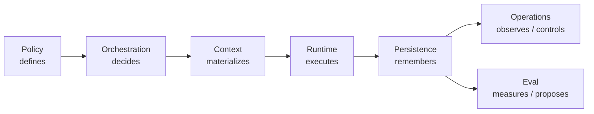
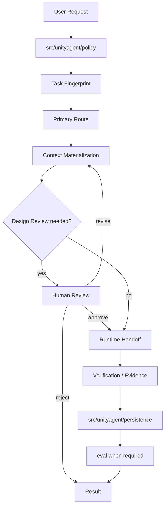
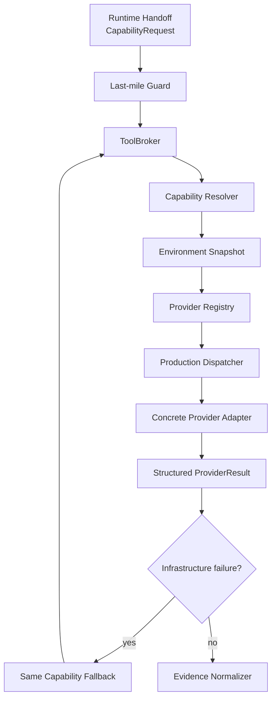
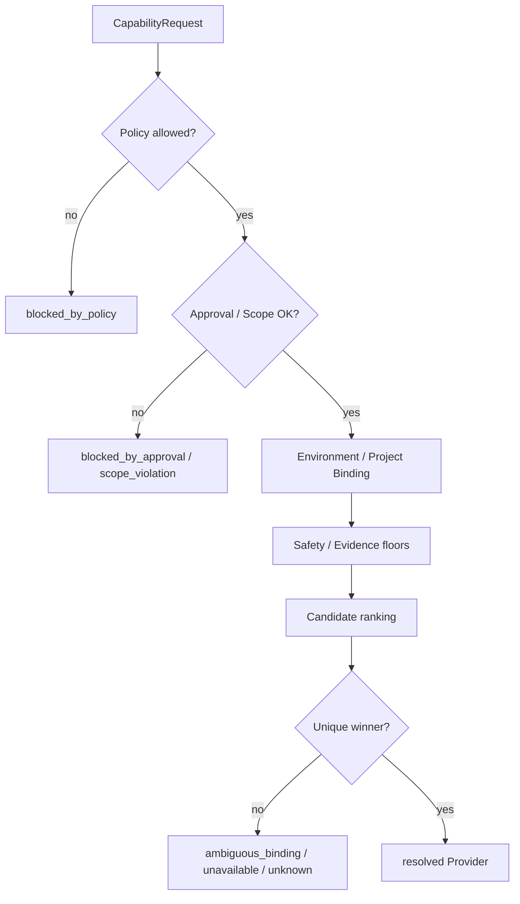
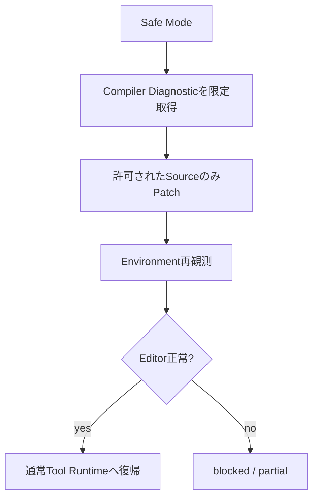

# UnityAgent Architecture

Status: **Canonical Architecture Contract / Production Tool Runtime integrated**

この文書はUnityAgentの**現在Architecture**を人間向けに説明します。

過去のPhase移行記録は `docs/migration/` に残しますが、current Production Authorityとしては使用しません。

---

## 0. 製品境界としての5層（正式契約）

UnityAgentを利用する入口は、必ず次の5層を通ります。機械可読な正本は
`src/unityagent/contracts/unityagent-layer-contract.yaml` です。

```text
① Entry Layer
   Unity UI / Codex Plugin
        │ request / approval / presentation
        ▼
② Control Plane
   UnityAgent
        │ run ownership / long-lived state
        ▼
③ Capability & src/unityagent/orchestration
   semantic intent / Graph / Loop / Policy / Resolver
        │ provider-independent CapabilityRequest
        ▼
④ Provider Layer
   Official Unity CLI / UnityArtistCLI / Installer Provider / future Providers
        │ structured ProviderResult
        ▼
⑤ Evidence & State
   Evidence / Run History / Capture / InstallReceipt / Evaluation
```

### Layer ownership

- Entry Layerは入力、表示、明示承認だけを担当する。外部コマンドやProviderを直接実行しない。
- Control PlaneはUnityAgentが担当し、run identity、run lifecycle、長期状態、Entryからの唯一の実行Facadeを所有する。
- Capability & Orchestrationは既存のOrchestration、Policy、Resolverを担当範囲とし、意味解決、Graph、Loop、Routingを所有する。
- Provider Layerは実作業だけを担当する。ProviderはPolicy、semantic replan、durable truthを所有しない。
- Evidence & Stateは既存のRuntime Evidence CaptureとPersistenceが担当し、run state、loop state、ProviderResult、Capture、InstallReceiptを再現可能な形で保存する。

### 許可依存と禁止依存

```text
Entry → Control Plane
Entry → Evidence & State（read only / presentation）
Control Plane → Capability & src/unityagent/orchestration
Control Plane → Evidence & State
Capability & src/unityagent/orchestration → Provider Layer
Capability & src/unityagent/orchestration → Evidence & State
Provider Layer → Evidence & State
```

禁止事項は、EntryからProviderへの直接依存、semantic routeでのProvider選択、ProviderからのPolicy変更、EntryまたはProviderによるdurable stateの直接書込みです。レビューでは変更元Layerと変更先Layerの辺を
`src/unityagent/contracts/unityagent-layer-contract.yaml` と照合し、未定義の辺を拒否します。

### Cross-layer contract

- Entry → Control Plane: `src/unityagent/runtime/contracts/entry-request.v2.schema.yaml` (production execution)
- Legacy v1: `src/unityagent/runtime/contracts/entry-request.schema.yaml` remains unchanged for validation; its caller supplied Context identity is rejected by `UnityAgentControlPlane.execute`. Migrate callers to v2 by removing Entry-owned Context / Route / Capability / Handoff values and supplying a typed `project_inspection` or `visual_capture` intent. Orchestration projects the Pilot Task Fingerprint deterministically. Orchestration selects the Route, generates provider-independent CapabilityRequests from the canonical routing catalog, and hands the Context Assembly-generated identity to Runtime. The Project access dimension comes from observed binding and src/unityagent/policy, never from Entry.
- CapabilityRequest / Resolution: 既存のRuntime契約
- ProviderResult: 既存Dispatcher契約とProvider adapter
- Toolchain setup: `src/unityagent/runtime/contracts/toolchain-setup-request.schema.yaml`
- InstallReceipt: `src/unityagent/runtime/contracts/install-receipt.schema.yaml`
- Durable Evidence: `src/unityagent/persistence/contracts/evidence-record.schema.yaml`

UI / Codexから実行する場合は、必ずEntryからUnityAgent Control Plane、Orchestration、Context、Runtime、Persistenceを通る。Tool Capabilityは既存のCapability → Provider Registry → Resolver → Dispatcher → Provider Adapter → Evidenceを再利用する。Reasoning Capabilityは下記のCodexRunner経路を使う。第二のPlayer FrameworkやProvider Registryは作らない。

Providerless Specialist reasoningでは同じControl Planeから別のRuntime Actionを選ぶ。`src/unityagent/runtime/contracts/runtime-handoff.schema.yaml`が`capability_dispatch`と`specialist_reasoning`を区別し、後者は既存CodexRunnerでModel reasoningを行う。ToolBroker Providerへの`provider_ref`を付けず、Materialized Contextから構造化Artifactを作り、Schema・意味・Context identity・変更観測を通した後にPersistenceへ記録する。

```text
                  UnityAgent
                      │
           ┌──────────┴──────────┐
           │                     │
 Specialist Reasoning      Tool Capability
           │                     │
       CodexRunner             ToolBroker
           │                     │
 Structured Artifact          Provider
```

Graphics / WorldCreator / PerformanceはConsumer Catalog v3のProduction Reasoning Profileとして登録済みです。Graphicsは`project.inspect` / `source.read`、Performanceは`profiler.observe`の検証済みObservationをReasoning前に要求し、WorldCreatorは`world.plan`のplanning-only Handoffを使います。Reasoning ProfileはTool Providerを持たず、既存CodexRunnerで構造化Artifactを生成します。登録済みであることとLive ProjectでProduction Verifiedであることは別であり、未観測Evidenceを成功へ昇格しません。Policy defines; Orchestration decides; Context materializes; Runtime executes; Persistence remembers; eval measures、という責務境界を維持します。

---

## 1. Canonical Repository

```text
UnityAgent/
├─ AGENTS.md
├─ src/unityagent/policy/
├─ src/unityagent/orchestration/
├─ src/unityagent/context/
├─ src/unityagent/runtime/
├─ src/unityagent/persistence/
├─ src/unityagent/operations/
├─ eval/
├─ .agents/
├─ docs/standards/
├─ docs/architecture/specifications/
├─ tools/
└─ docs/
```

`DarumaPPAP/UnityAgent` がProduction executionを含むcanonical single-repository authorityです。

`DarumaPPAP/Unity-Graph-Engineering`はProduction execution dependencyではありません。過去Migration provenanceとして参照できても、current bootstrapの正本には戻しません。

---

## 2. Authority Contract


```mermaid
flowchart LR
    P[Policy<br/>defines] --> O[Orchestration<br/>decides]
    O --> C[Context<br/>materializes]
    C --> R[Runtime<br/>executes]
    R --> S[Persistence<br/>remembers]
    S --> OP[Operations<br/>observes / controls]
    S --> E[Eval<br/>measures / proposes]
```

```text
Policy defines
Orchestration decides
Context materializes
Runtime executes
Persistence remembers
Operations observes / controls
eval measures / proposes
```

近くに実装できることと、そのAreaがAuthorityを持つことは同義ではありません。

### src/unityagent/policy

所有:

- User src/unityagent/policy
- Risk
- Security
- Approval requirement
- Evidence requirement

所有しない:

- Provider selection
- Tool dispatch
- Graph scheduling
- quality grading

### src/unityagent/orchestration

所有:

- Primary Route
- ParentGraph / SubGraph
- semantic Node / Edge / Gate
- semantic continue / replan
- Task Contract
- Runtime handoff
- Design Review placement

所有しない:

- subprocess execution
- Unity CLI / MCP Tool dispatch
- hard timeout / process kill
- durable State write

### src/unityagent/context

所有:

- Context selection
- Context Pack
- Retrieval
- Knowledge
- Context Budget
- current-call Materialization

所有しない:

- Route selection
- Provider selection
- durable Memory / Evidence / Checkpoint

### src/unityagent/runtime

所有:

- process / tool execution
- Environment discovery
- Provider resolution
- Production dispatch
- timeout / cancellation
- bounded infrastructure retry
- Mutation Scope enforcement
- verification / current-run Evidence capture

所有しない:

- semantic replan
- durable Evidence truth
- Agent quality grading

### src/unityagent/persistence

所有:

- ExecutionState
- WorkflowState
- LoopControlState
- Checkpoint / Resume
- Session
- Memory
- durable Evidence

```text
Checkpoint != Memory != Evidence
```

### src/unityagent/operations

所有:

- Observability
- Detection
- Incident / Runbook
- approved Runtime Control
- Change Management / rollout / rollback

### eval

所有:

- Golden / Behavior eval
- Attribution
- Historical Replay
- Rebaseline
- Regression comparison
- ChangeProposal

EvalはProduction executionやProduction definitionの直接変更を行いません。

---

## 3. Default Execution Flow

bounded TaskではFast Pathを優先します。


```mermaid
flowchart TD
    U[User Request] --> P[src/unityagent/policy]
    P --> T[Task Fingerprint]
    T --> R[Primary Route]
    R --> C[Context Materialization]
    C --> D{Design Review needed?}
    D -->|yes| H[Human Review]
    H -->|approve| X[Runtime Handoff]
    H -->|revise| C
    H -->|reject| O[Result]
    D -->|no| X
    X --> V[Verification / Evidence]
    V --> S[src/unityagent/persistence]
    S --> E[eval when required]
    E --> O
```

Semantic coordinationが必要な場合だけ `src/unityagent/orchestration/definitions/development-parent-graph.yaml` を使います。

Local Loopは独立したtop-level control planeではなく、SubGraph内部の限定されたcycleです。

---

## 4. Production Tool src/unityagent/runtime

Production Cutover後、Unity Editor / Build / Test / MCP / Player等の具体的実行先はRuntime Toolingへ集約します。

OrchestrationはProvider固有Tool名ではなくCapabilityを要求します。

```text
Skill      = どう作業するか
Capability = 何を実現したいか
Provider   = 誰が実行できるか
Transport  = どう接続するか
Evidence   = 実際に何を観測したか
```

### Runtime内部


```mermaid
flowchart TD
    H[Runtime Handoff<br/>CapabilityRequest] --> G[Last-mile Guard]
    G --> B[ToolBroker]
    B --> R[Capability Resolver]
    R --> E[Environment Snapshot]
    E --> PR[Provider Registry]
    PR --> D[Production Dispatcher]
    D --> P[Concrete Provider Adapter]
    P --> X[Structured ProviderResult]
    X --> F{Infrastructure failure?}
    F -->|yes| FB[Same Capability Fallback]
    FB --> B
    F -->|no| N[Evidence Normalizer]
```

重要:

- Orchestrationは`provider` / `provider_ref`を指定しない。
- ContextはProviderを選ばない。
- Provider RegistryはPotential capabilityを記述する。
- 実行可能性はConcrete adapter + Environment + live discoveryで再確認する。
- executor未登録は`backend_not_implemented`であり成功ではない。
- Fallbackは同一CapabilityかつSafety / Evidenceが同等以上の場合だけ。

詳細は [Production Tool src/unityagent/runtime](production-tool-runtime.md) を参照してください。

---

## 5. Capability Contract

Canonical Capabilityは15個です。

```text
project.inspect
source.read
source.patch
static.review
git.diff
compile.observe
project.test
project.build
scene.inspect
scene.mutate
profiler.observe
visual.capture
domain.workflow
player.observe
player.mutate
```

Capability Request / ResolutionのSchemaは `src/unityagent/runtime/contracts/` が正本です。

Semantic capability requirementは `src/unityagent/orchestration/tool_routing/capability-routing.yaml`、説明用Contextは `src/unityagent/context/selection/tool-capability-catalog.yaml` が担当します。

---

## 6. Provider Resolution Boundary


```mermaid
flowchart TD
    A[CapabilityRequest] --> B{Policy allowed?}
    B -->|no| BP[blocked_by_policy]
    B -->|yes| C{Approval / Scope OK?}
    C -->|no| BA[blocked_by_approval / scope_violation]
    C -->|yes| D[Environment / Project Binding]
    D --> E[Safety / Evidence floors]
    E --> F[Candidate ranking]
    F --> G{Unique winner?}
    G -->|no| AM[ambiguous_binding / unavailable / unknown]
    G -->|yes| R[resolved Provider]
```

Provider availabilityはEnvironment Factです。

```text
Unity CLIなし
MCPなし
Playerなし
```

のどれか1つだけでAgent全体を停止しません。

ただし必要Evidenceを取得できない場合は、その不足を明示します。

---

## 7. Safety / Recovery Ownership

```text
Semantic Recovery    -> src/unityagent/orchestration
Execution Recovery   -> src/unityagent/runtime
Operational Recovery -> src/unityagent/operations
```

### Runtime fallbackで変えてはいけないもの

- Capability
- Project Root
- operation kind
- Required Evidence
- Mutation Scope
- Approval provenance

MyUnityMCP Mutationが利用不能でも、raw Scene YAMLやarbitrary `eval`へsilent downgradeしません。

### Safe Mode

Safe ModeではSource recoveryとScene mutationを分離します。


```mermaid
flowchart TD
    S[Safe Mode] --> D[Compiler Diagnosticを限定取得]
    D --> P[許可されたSourceのみPatch]
    P --> R[Environment再観測]
    R --> N{Editor正常?}
    N -->|yes| T[通常Tool Runtimeへ復帰]
    N -->|no| B[blocked / partial]
```

---

## 8. Evidence Contract

Evidence stateは分離します。

```text
Compile
Editor
Test
Player
Target Device
Performance
Visual
```

```text
Compile PASS
!= Runtime PASS
!= Player PASS
!= Performance PASS
```

RuntimeでcaptureしたEvidenceは `src/unityagent/persistence/evidence/` にappendされて初めてhistorical durable Evidenceになります。

`not_observed`をAgent品質denominatorへ入れません。

---

## 9. DefinitionFingerprint / Regression

比較・Resume・Rebaselineでは少なくとも次を追跡します。

- architecture version
- policy revision
- prompt revision
- context revision
- graph revision
- runtime profile revision
- tool schema revision
- checkpoint schema revision
- evidence schema revision
- eval contract revision

Production Tool Runtime Cutoverでblocking fieldが変わった場合、既存Frozen Baselineとの比較は `REBASELINE_REQUIRED` になるのが正常です。

Baselineを自動更新してdriftを隠しません。

Regression decision:

- `PASS`
- `BLOCK_REGRESSION`
- `BLOCK_INCONCLUSIVE`
- `REBASELINE_REQUIRED`

---

## 10. Canonical Source Map

| Area | Canonical Source |
| --- | --- |
| User src/unityagent/policy | `src/unityagent/policy/user/user-policy.yaml` |
| Capability src/unityagent/policy | `src/unityagent/policy/security/tool-capability-policy.yaml` |
| Route | `src/unityagent/orchestration/routing/task-routes.yaml` |
| Capability routing | `src/unityagent/orchestration/tool_routing/capability-routing.yaml` |
| Context catalog | `src/unityagent/context/selection/context-catalog.yaml` |
| Capability descriptions | `src/unityagent/context/selection/tool-capability-catalog.yaml` |
| Runtime contracts | `src/unityagent/runtime/contracts/` |
| Environment discovery | `src/unityagent/runtime/tooling/environment/` |
| Provider Registry | `src/unityagent/runtime/tooling/provider_registry.yaml` |
| Resolver | `src/unityagent/runtime/tooling/capability_resolver.py` |
| Tool Broker | `src/unityagent/runtime/tooling/tool_broker.py` |
| Production Dispatcher | `src/unityagent/runtime/dispatcher/tool_runtime_dispatcher.py` |
| Runtime Guard | `src/unityagent/runtime/guardrails/tool_runtime_guard.py` |
| Fallback | `src/unityagent/runtime/tooling/fallback_policy.py` |
| Providers | `src/unityagent/runtime/tooling/providers/` |
| Evidence normalization | `src/unityagent/runtime/evidence_capture/provider_evidence.py` |
| Durable Evidence | `src/unityagent/persistence/evidence/` |
| Regression | `eval/regression/` |
| Production Runtime validator | `tools/production_tool_runtime/validate_production_tool_runtime.py` |

---

## 11. Historical Migration

`docs/migration/`はMigration時点の判断・旧Path・削除対象・互換性判断を保存するHistorical recordです。

Historical文書に現れる旧PathやPhase名をcurrent Production contractとして読み替えません。

現在Architectureを理解する場合は次を優先します。

1. `AGENTS.md`
2. Canonical source files
3. この文書
4. `docs/architecture/production-tool-runtime.md`
5. Supporting `docs/architecture/specifications/`


## Bootstrap ownership details

責務境界・handoff・移行境界を変更する際に参照する。起動時には全読込しない。

- RouteはTask Fingerprintとsemantic Execution Profileで決め、Technology keywordだけでは決めない。
- 選択Routeの`required_policy_clauses`をPolicy provenanceとして記録する。
- Context Manifestはcurrent-call provenanceでありWorkflowState、Checkpoint、Graph topologyの正本ではない。MemoryはContext側へread-only projectionだけを渡す。
- Orchestration→RuntimeはPolicy revision、Route、Context ID/Fingerprint、Execution Profile、runtime projection、mutation scope、validation requirements、requested Capabilityを渡す。
- OrchestrationはPersistence-compatible state projectionだけを返す。Stateのdurable commitはPersistenceが行う。
- Runtime EvidenceはPersistence append後にdurable truthとなる。Checkpoint restoreはStateだけを復元し、Memory/Evidenceを巻き戻さない。
- ResumeはDefinitionFingerprintでcompatible / migration / replan / Human Reviewを決める。Operationsのcheckpoint replayもこのdecision refを必要とする。
- Operationsのraw control requestはdispatchせず、src/unityagent/policy/approval済みcommandをauthority別control APIへ渡す。Detection / Incident / Runbookはproduction mutation authorityを持たない。
- EvalはRuntime structured factsを利用し、lossy text/diffから再構築しない。`not_observed`は品質denominatorから除外し、ChangeProposalはnon-applyingとする。
- Capability unavailableだけを理由にSafety Contractを緩和しない。承認付きMyUnityMCP Mutationを接続失敗だけでraw evalへ迂回しない。
- Unity RuntimeのArtifact GraphはAsset dependency graphでありAgent ParentGraph/SubGraphではない。
- Historical migration / eval provenanceは監査用途のみとし、legacy path fallbackや旧control planeをProductionへ戻さない。
