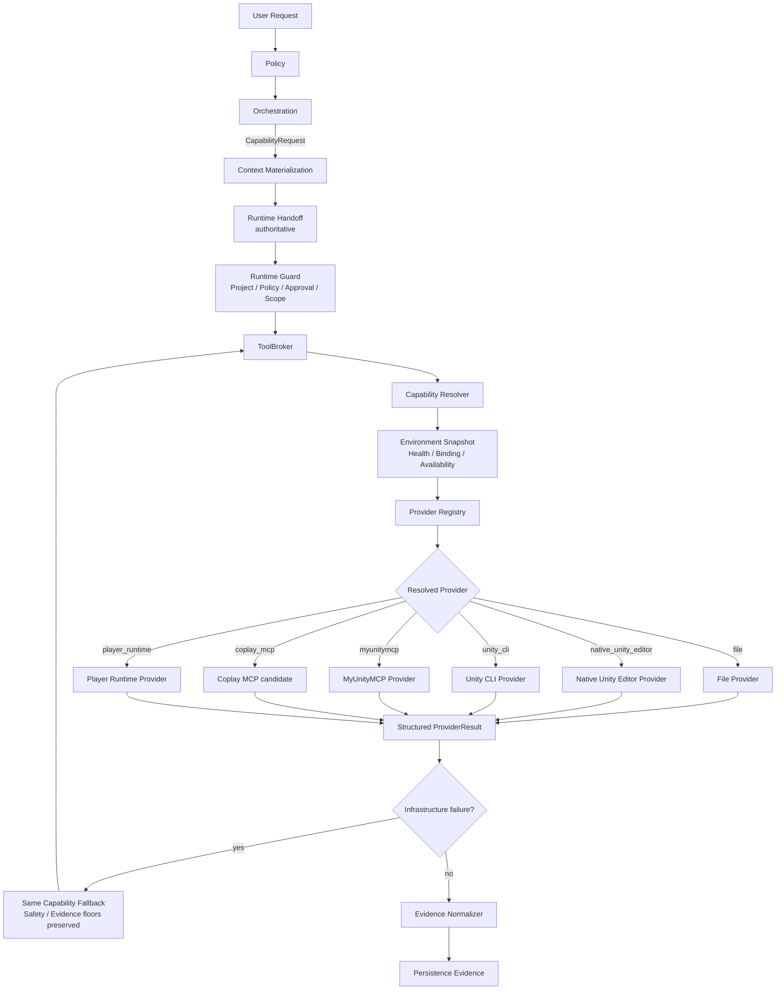
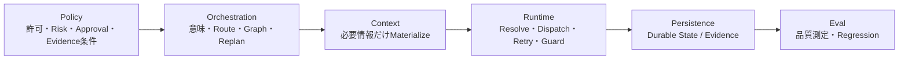
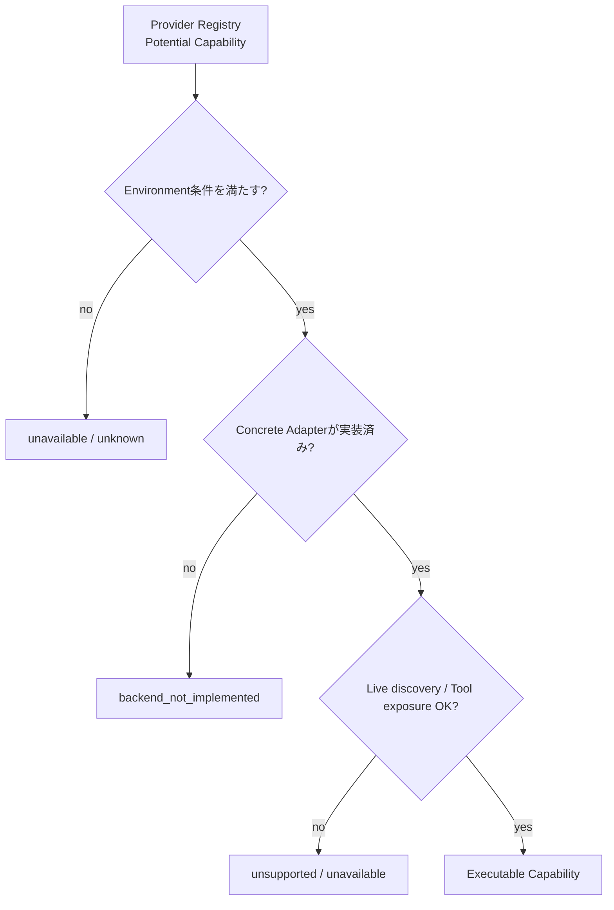
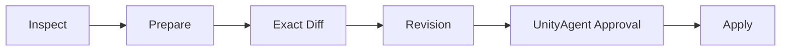
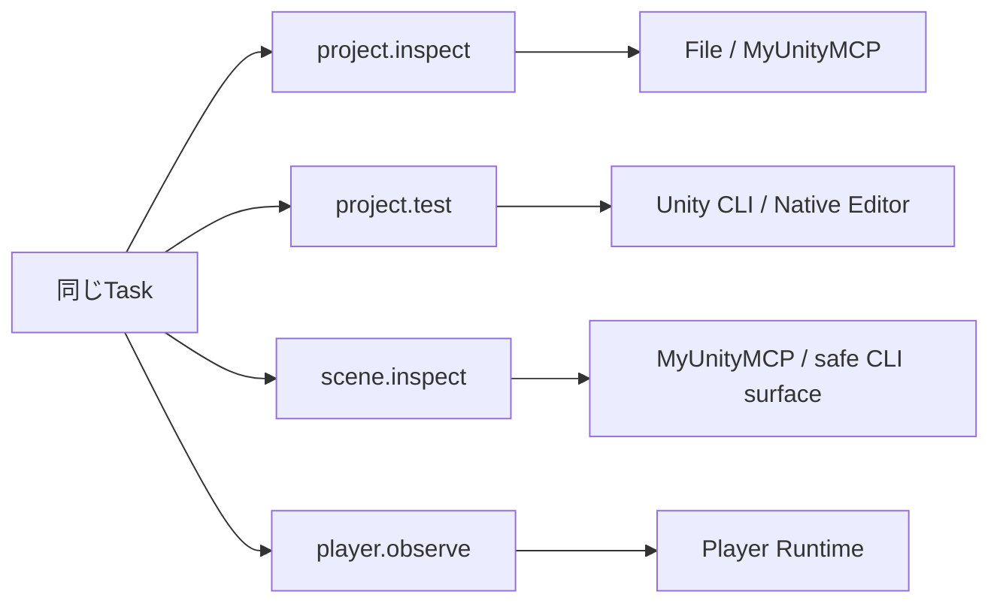
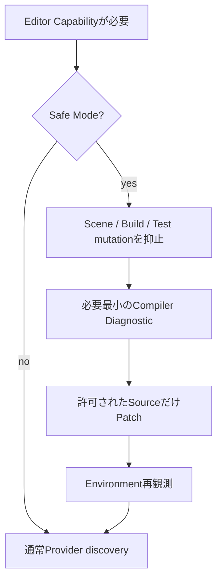

# Production Tool Runtime

> **目的**: UnityAgentが「特定のTool製品を使うAgent」ではなく、Taskが必要とするCapabilityを現在のUnity環境に合わせて安全に実行するProduction Runtimeとして動く仕組みを説明します。
>
> この文書は人間向けのArchitecture Guideです。実行Authorityの正本は `Policy/`、`Orchestration/`、`Runtime/`、`Persistence/`、`Eval/` にあります。

## 1. 一番重要な考え方

UnityAgentでは次を明確に分離します。

```text
Skill      = どう作業するか
Capability = 何を実現したいか
Provider   = 誰がそのCapabilityを実行できるか
Transport  = どうProviderへ接続するか
Evidence   = 実際に何を観測できたか
```

したがってOrchestrationは、通常次のような要求を作ります。

```yaml
capability: scene.inspect
project_root: D:/Projects/MyGame/Project
operation_kind: read
required_evidence:
  - editor_observation
preferred_surface: live_editor
```

次のようなProvider製品指定はSemantic Contractにしません。

```text
× MyUnityMCPを使ってSceneを見る
× Unity CLIでTestする

○ scene.inspect が必要
○ project.test が必要
```

## 2. Production実行フロー



### ポイント

1. **ProviderはOrchestrationが選ばない**。
2. Runtimeは実行直前にProject / Policy / Approval / Mutation Scopeを再確認する。
3. Providerが落ちてもCapabilityの意味は変えない。
4. SafetyまたはEvidenceが弱くなるFallbackはしない。
5. Provider固有のhuman logをQuality truthにしない。

## 3. Authorityの境界



| Area | 所有するもの | 所有しないもの |
| --- | --- | --- |
| Policy | Risk / permission / approval / evidence requirement | Provider選択、Tool実行 |
| Orchestration | semantic route / graph / task contract / replan | subprocess、Provider dispatch |
| Context | current-call materialization | Route authority、Provider selection |
| Runtime | Environment discovery / resolution / dispatch / timeout / fallback / guard | semantic replan、durable truth、Agent採点 |
| Persistence | durable State / Checkpoint / Memory / Evidence | Provider selection |
| Eval | quality / regression / attribution | Production execution |

## 4. Canonical Capability語彙

Production Contractでは次の15 Capabilityを使用します。

| Capability | 意味 |
| --- | --- |
| `project.inspect` | Unity Project Factを観測する |
| `source.read` | Sourceを読み取る |
| `source.patch` | 許可範囲のSourceを変更する |
| `static.review` | 静的Reviewを行う |
| `git.diff` | Git差分を観測する |
| `compile.observe` | Compile状態を観測する |
| `project.test` | Unity Testを実行・観測する |
| `project.build` | Unity Buildを実行・観測する |
| `scene.inspect` | Editor上のScene状態を観測する |
| `scene.mutate` | Approval付きでEditor状態を変更する |
| `profiler.observe` | Profiler Evidenceを観測する |
| `visual.capture` | Visual Evidenceを取得する |
| `domain.workflow` | 強いDomain Contractを持つWorkflowを実行する |
| `player.observe` | Development / QA Playerを観測する |
| `player.mutate` | Approval付きPlayer controlを行う |

旧ドキュメントで使われていた次の語はCanonical Capabilityではありません。

```text
source.inspect       -> source.read
project.compile      -> compile.observe
editor.capture       -> visual.capture
performance.capture  -> profiler.observe などTaskに応じたEvidence Capability
player.control       -> player.mutate
```

## 5. Provider Registryと実行可能性は別物

ここはProduction Cutoverで特に重要です。



**Registryへ記載されていることだけでは「そのCapabilityが実行できる」証明になりません。**

実行可能と扱うには少なくとも次が必要です。

```text
Registry candidate
AND Environment requirement
AND exact Project / Instance binding
AND concrete Provider adapter
AND live/current Tool surface where required
AND Policy / Approval
AND Evidence requirement
```

Production Dispatcherは、Resolverが選んだProviderにexecutorが登録されていない場合、成功扱いせず `backend_not_implemented` として処理します。その後、同一CapabilityかつSafety / Evidenceが同等以上の候補だけをFallbackとして再解決できます。

## 6. Providerの役割

### File Provider

主な用途:

- `project.inspect`
- `source.read`
- `source.patch`
- `static.review`
- `git.diff`

重要な禁止事項:

```text
Provider不足
  ↓
raw .unity / .prefab / serialized .asset mutation
```

を自動解禁しません。

### Native Unity Editor Provider

Unity Editor本体のbounded subprocess実行を利用します。

現在の中心Capability:

- `compile.observe`
- `project.test`
- `project.build`

任意のLLM生成C#を`-executeMethod`で実行する万能経路にはしません。

### Unity CLI Provider

Unity公式CLIが現在利用可能な場合だけ使用します。

Production adapterが現在実行する中心Capability:

- `project.inspect`
- `compile.observe`
- `project.test`
- `project.build`
- `scene.inspect`

CLIのversion / command surfaceは変化し得るため、固定想定ではなくRuntime discoveryで確認します。

### MyUnityMCP Provider

Domain-aware Editor Providerです。

read系では主に:

- `project.inspect`
- `scene.inspect`
- `profiler.observe`
- `visual.capture`

MutationではMyUnityMCP固有の強いContractを維持します。



`scene.mutate`はこのContractを壊してraw mutationへ落としません。

`domain.workflow`はRegistry上のPotential Capabilityですが、canonical pre-approval provenanceを完全に表現できない経路はProduction adapter側でfail-closedにします。

### Coplay MCP

Coplay MCPはProvider / Bridge候補であり、UnityAgentのPolicy / Orchestration Authorityではありません。

Registryへ存在しても、Concrete Production executorと現在Tool surfaceが証明できなければ実行可能扱いしません。

### Player Runtime Provider

Development / QA Build向けのallowlisted Runtime commandだけを扱います。

- `player.observe`
- `player.mutate`

Release Playerへ万能remote shellを常設しません。

## 7. Environment Snapshot

RuntimeはProviderを選ぶ前にEnvironment Factを観測します。

主なFact:

- Project Root / Project identity
- Filesystem read/write
- Git
- Unity Editor install / version / running / Safe Mode / binding
- Unity CLI availability
- Pipeline reachability
- MyUnityMCP / Coplay MCP binding
- Test Framework
- Build target module
- Player Runtime

`true / false / unknown`を区別し、`unknown`を勝手に`false`へ潰しません。

## 8. Environment Profileは説明用

代表Profile:

```text
FULL
CLI_ONLY
MCP_ONLY
NATIVE_EDITOR
FILES_ONLY
SAFE_MODE
NO_EDITOR
PLAYER_UNAVAILABLE
```

Profile名はRouting Authorityではありません。

同じTaskでもCapability単位でProviderが変わります。



## 9. Fallbackの境界

### 許可できるFallback

```text
project.test
Unity CLI unavailable
        ↓
Native Unity Editorが同じtest_execution Evidenceを満たす
        ↓
同じCapabilityとしてFallback
```

### 禁止するFallback

```text
scene.mutate
MyUnityMCP unavailable
        ↓
× raw .unity YAML edit
× arbitrary eval
```

Fallbackは必ず次を維持します。

- same capability
- same Project Root
- same operation kind
- same required evidence
- same Mutation Scope
- same Approval provenance
- Safety strength equal or stronger
- Evidence strength equal or stronger

## 10. Safe Mode

Safe Modeは「何もできない状態」ではありません。



Source recoveryは可能でも、Safe Mode中にScene Mutationが許可されるわけではありません。

## 11. Evidenceと完了判定

```text
Compile PASS
!= Editor PASS
!= Player PASS
!= Target Device PASS
!= Performance PASS
!= Visual PASS
```

Provider Resultはcanonical Evidenceへ正規化した後、Persistenceへappendされて初めてdurable Evidenceになります。

代表的なCompletion:

- `verified`
- `partial_verified`
- `implemented_unverified`
- `blocked_by_environment`
- `not_applicable`

Provider unavailableをAgent品質Regressionへ自動変換しません。

## 12. DefinitionFingerprintとRegression

Production Tool Runtime CutoverではRuntime / Tool / Evidence定義が変わります。

そのためFrozen BaselineとFingerprintが一致しない場合、Comparatorは正常に:

```text
REBASELINE_REQUIRED
```

を返します。

Baselineを自動更新して差を隠すことは禁止です。

## 13. Canonical Source Map

| 内容 | Canonical Source |
| --- | --- |
| Capability Request / Resolution schema | `Runtime/Contracts/` |
| Capability Policy | `Policy/Security/tool-capability-policy.yaml` |
| Semantic Capability routing | `Orchestration/ToolRouting/capability-routing.yaml` |
| Context capability descriptions | `Context/Selection/tool-capability-catalog.yaml` |
| Environment Snapshot | `Runtime/Contracts/environment-snapshot.schema.yaml` + `Runtime/Tooling/Environment/` |
| Provider Registry | `Runtime/Tooling/provider_registry.yaml` |
| Provider Resolution | `Runtime/Tooling/capability_resolver.py` |
| Production Dispatch | `Runtime/Dispatcher/tool_runtime_dispatcher.py` |
| Last-mile Guard | `Runtime/Guardrails/tool_runtime_guard.py` |
| Infrastructure fallback | `Runtime/Tooling/fallback_policy.py` |
| Provider adapters | `Runtime/Tooling/Providers/` |
| Evidence normalization | `Runtime/EvidenceCapture/provider_evidence.py` |
| Environment Regression Matrix | `Eval/Datasets/Behavior/production-tool-runtime-environment-matrix.yaml` |
| Production validation | `Tools/ProductionToolRuntime/validate_production_tool_runtime.py` |

## 14. Anti-regression Checklist

Production Cutover後に次が復活したらRegressionです。

- `capability_contract_mode: shadow`
- Orchestrationから`provider` / `provider_ref`を指定する
- ContextがProviderを選択する
- `Context/Selection/mcp-selection.yaml`をcurrent authorityとして復活する
- 存在しないRoot `Catalog/*.yaml`をcurrent Contextから参照する
- Provider unavailableを理由にMutation Scopeを広げる
- Required Evidenceを弱めてFallbackする
- raw Scene / Prefab serialized mutationへ自動Fallbackする
- arbitrary `eval`を通常Mutation経路にする
- 未観測のEditor / Player / PerformanceをPASS扱いする
- Registry記載だけでCapabilityを「実装済み」と宣言する
- Frozen Baselineを自動更新する

## 15. 関連文書

- [UnityAgent Architecture](architecture.md)
- [Unity環境への適応](../unity-environment-adaptation.md)
- [ローカルUnity Project開発](../local-project-development.md)
- [Unity Tool Runtime Supporting Spec](../../Specs/UnityToolRuntime.md)
- [Environment Adaptation Supporting Spec](../../Specs/UnityToolRuntimeEnvironmentAdaptation.md)
- [Development Request Template](../../Templates/DevelopmentRequest.md)
