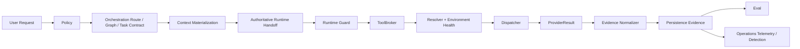
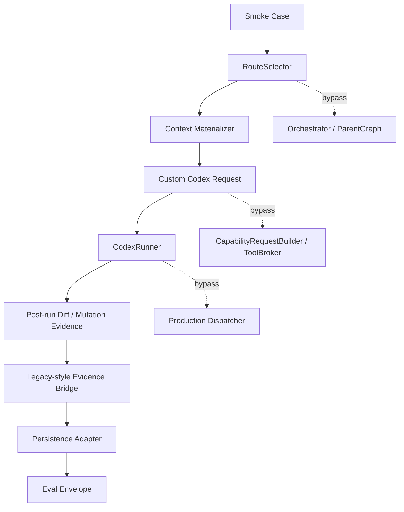
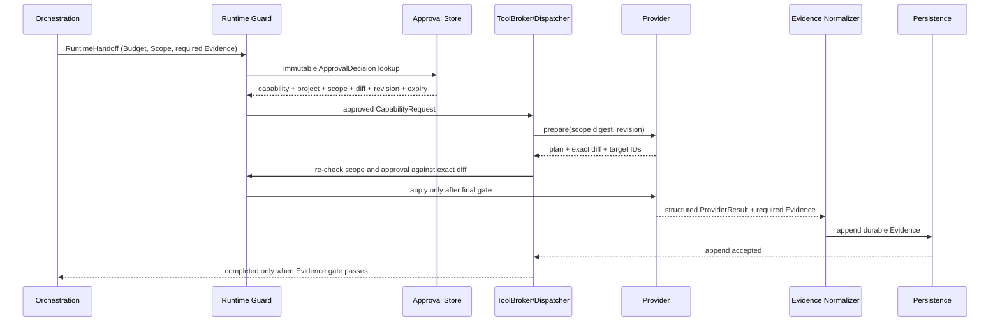
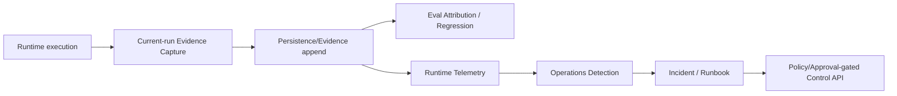

# 実行フローと安全Gate

> Review snapshot / non-authoritative。図はレビュー対象の構成を説明するもので、実行経路を新設する契約ではありません。

## 1. Canonicalとして宣言されたフロー

この構成では、OrchestrationはCapabilityを要求し、ProviderとTransportの選択はRuntimeへ委譲します。Runtimeは実行直前にもPolicy、Project、Approval、Mutation Scopeを再確認し、Providerの人間向けログを品質Truthにしません。

## 2. 今回確認したProduction Smokeの経路

これは、Smokeが動作していることの証拠ではあっても、Canonical Production Tool Runtimeが全ケースを通過している証明ではありません。`CodexRunner` は `workspace-write` で起動した後に差分を検査するため、違反変更が発生してから失敗を記録し得ます。

## 3. Mutationを許可する目標シーケンス

`unmeasured` Budget、空の必須Evidence、Scope外のExact Diff、期限切れ・対象不一致のApprovalは、完了ではなく停止または失敗として扱う必要があります。

## 4. 証拠・観測フロー

現状はEvidenceの個別部品とEvalのデータセットは存在しますが、Production実行から永続Evidence、Eval、Operationsまでをライブに確認できるRun ID・Artifact Digest付きの証跡が不足しています。
