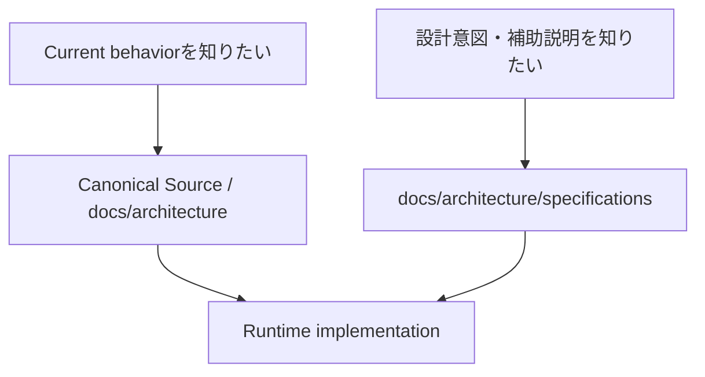

# Specifications Index

`docs/architecture/specifications/`はUnityAgentの**supporting specification**を置く領域です。

重要:

```text
docs/architecture/specifications != Production execution authority
```

Production Authorityは `Policy / Orchestration / Context / Runtime / Persistence / Operations / eval` のcanonical sourceにあります。

`docs/architecture/specifications/`は設計意図、Environment説明、Project fallback、Feature補助仕様を人間向けに整理します。

---

## Production Tool Runtime関連

| Spec | Status | 役割 |
| --- | --- | --- |
| [UnityToolRuntime.md](UnityToolRuntime.md) | Active supporting spec | Capability / Provider / Transport / Evidence分離とProduction Runtimeの設計意図 |
| [UnityToolRuntimeEnvironmentAdaptation.md](UnityToolRuntimeEnvironmentAdaptation.md) | Active supporting spec | CLI / MCP / Editor / Playerの有無に応じたRuntime適応 |
| [UnityEnvironmentCapabilityMatrix.yaml](../../../src/unityagent/contracts/UnityEnvironmentCapabilityMatrix.yaml) | Active supporting matrix | Environment ProfileとCapability候補の説明。Routing Authorityではない |

Production Runtimeの人間向けCanonical Guideは次です。

- `docs/architecture/production-tool-runtime.md`
- `docs/unity-environment-adaptation.md`
- `docs/local-project-development.md`

実装の正本:

- `src/unityagent/runtime/contracts/`
- `src/unityagent/runtime/tooling/provider_registry.yaml`
- `src/unityagent/runtime/tooling/capability_resolver.py`
- `src/unityagent/runtime/tooling/tool_broker.py`
- `src/unityagent/runtime/dispatcher/tool_runtime_dispatcher.py`
- `src/unityagent/runtime/tooling/providers/`

---

## Project / Environment

- [Project Profile](ProjectProfile.md) — Project Factを直接確認できない場合だけ使用するFallback
- [Platform and Environment Fallback src/unityagent/policy](PlatformAndEnvironmentFallbackPolicy.md) — Platform target / Performance class / missing environmentの補助方針

---

## Features

| Feature | Status | Spec |
| --- | --- | --- |
| Shader Performance Agent System | Active supporting spec | [spec.md](ShaderPerformanceAgentSystem/spec.md) |

---

## 読み方



存在しないFeature directoryや削除済みspecをIndexへ残しません。
