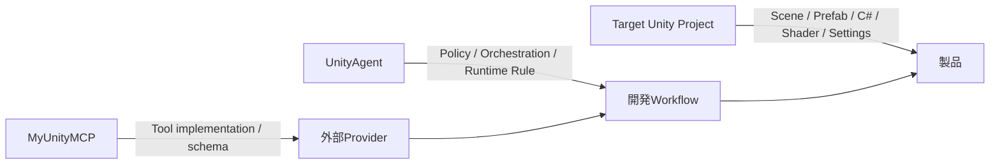
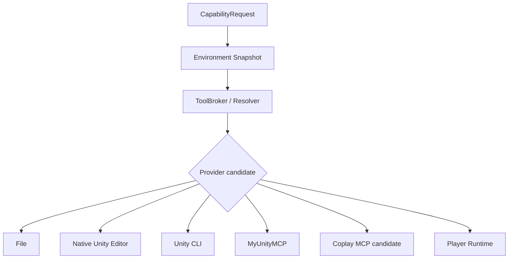
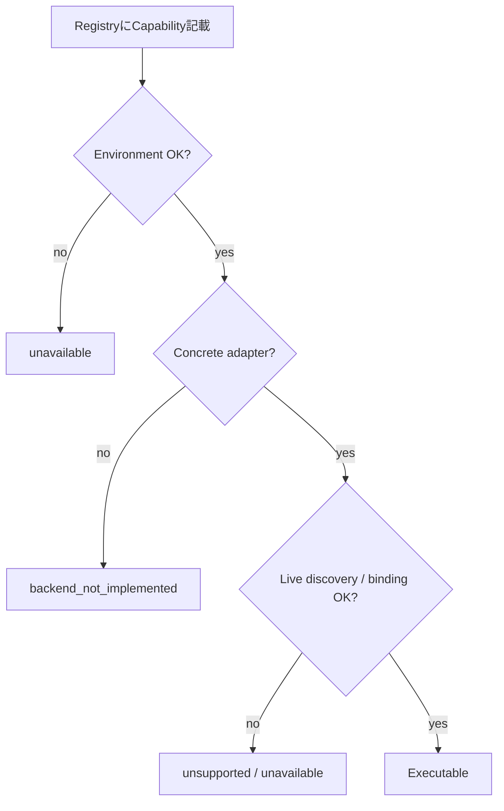
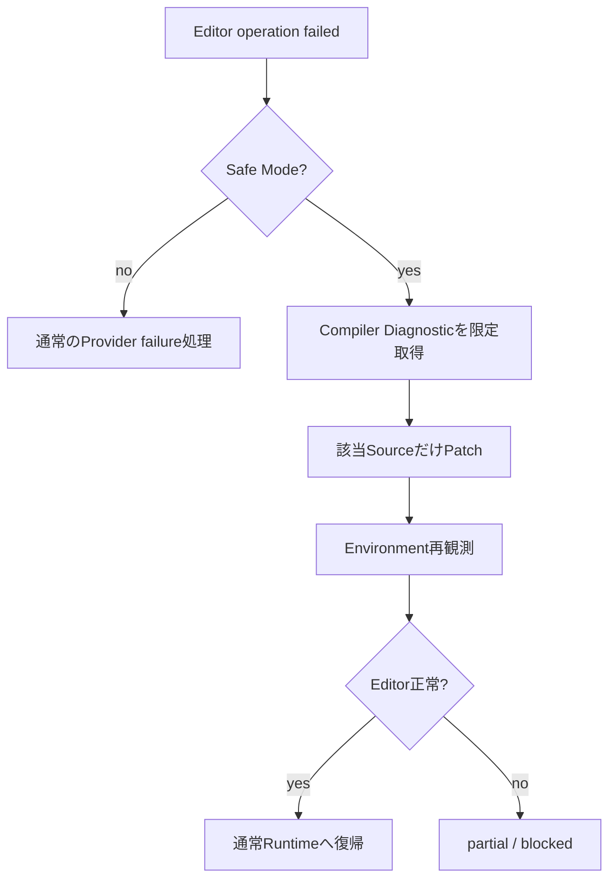

# ローカルUnity Project開発ガイド

この文書は、UnityAgentをローカルUnity Projectへ接続して調査・実装・検証するときの**現在の標準運用**を説明します。

対象:

- C# / Shader修正
- Rendering / Performance調査
- Editor Tool開発
- Scene / Asset操作
- Build / Test
- Player / Target Device観測
- MyUnityMCP等のDomain Tool利用

---

## 1. 最初に覚える5ルール

```text
1. UnityAgent      = どう開発するかの正本
2. Target Project  = 実際の製品の正本
3. Read Scope      = 原則 Project Root
4. Mutation Scope  = Taskに必要な最小範囲
5. Tool製品ではなくCapabilityを要求する
```

Production Tool Runtimeでは次を分離します。

```text
Skill      = どう作業するか
Capability = 何を実現したいか
Provider   = 誰が実行できるか
Transport  = どう接続するか
Evidence   = 実際に何を観測したか
```

---

## 2. 推奨Workspace

```text
D:\
├─ UnityAgent\
│  ├─ AGENTS.md
│  ├─ Policy\
│  ├─ Orchestration\
│  ├─ Context\
│  ├─ Runtime\
│  ├─ Persistence\
│  └─ Eval\
│
└─ Projects\
   └─ MyGame\
      └─ Project\
         ├─ Assets\
         ├─ Packages\
         └─ ProjectSettings\
```

UnityAgent本体をTarget Projectの`Assets/`へコピーしません。

理由:

- Agent内部のPython / YAML / MarkdownがAsset Databaseへ混入する
- 不要な`.meta`が増える
- 製品差分とAgent Framework差分が混ざる
- 複数ProjectでUnityAgentを再利用しづらくなる
- Mutation Scopeを誤認しやすくなる

---

## 3. Project Rootを渡す

推奨:

```text
D:\Projects\MyGame\Project
```

非推奨:

```text
D:\Projects\MyGame\Project\Assets
```

Project Rootが必要なのは、次のProject Factを推測せず確認するためです。

- Unity Version
- Package Version
- Render Pipeline
- asmdef境界
- Build / Quality設定
- ProjectSettings
- Asset / Package dependency

```text
Project/
├─ Assets/
├─ Packages/
└─ ProjectSettings/
```

---

## 4. Read ScopeとMutation Scope

標準:

```text
Read Scope
= Project Root全体

Mutation Scope
= Taskに必要な最小範囲
```

### C#局所修正

```text
Read:
Project/**

Mutation:
Assets/Scripts/Audio/**
```

### Rendering Feature

```text
Read:
Project/**

Mutation:
Assets/Rendering/GPUCulling/**
Assets/Shaders/GPUCulling/**
```

### Packages / ProjectSettings

最初からMutation Scopeに含めません。

必要性が確認できた時点で、影響範囲と理由を明示してScopeを追加します。

---

## 5. Source of Truth



### UnityAgentが所有

- User Policy
- Risk / Security / Approval
- Route / Graph / Task Contract
- Context selection
- Runtime execution rule
- Evidence contract
- Eval / Regression

### Target Projectが所有

- Scene
- Prefab
- Material
- Shader
- C#製品コード
- ScriptableObject
- Timeline
- ProjectSettings
- 製品固有Package

### MyUnityMCPが所有

- MCP Tool implementation
- Tool schema
- Package
- Domain-specific Safety Contract

UnityAgentは外部Providerの製品Sourceを複製して正本化しません。

---

## 6. Canonical Capability

依頼側で指定できる現在のCapabilityは次です。

| Capability | 主用途 |
| --- | --- |
| `project.inspect` | Project Fact確認 |
| `source.read` | C# / Shader / text source read |
| `source.patch` | Source変更 |
| `static.review` | 静的Review |
| `git.diff` | 差分確認 |
| `compile.observe` | Compile確認 |
| `project.test` | Test実行 |
| `project.build` | Build実行 |
| `scene.inspect` | Scene / Editor観測 |
| `scene.mutate` | Approval付きScene / Asset mutation |
| `profiler.observe` | Profiler観測 |
| `visual.capture` | Screenshot等Visual Evidence |
| `domain.workflow` | Domain-specific workflow |
| `player.observe` | Player観測 |
| `player.mutate` | Approval付きPlayer control |

### 旧名称に注意

```text
source.inspect      ×  -> source.read
project.compile     ×  -> compile.observe
editor.capture      ×  -> visual.capture
performance.capture ×  -> profiler.observe 等へ分解
player.control      ×  -> player.mutate
```

---

## 7. RuntimeがProviderを決める

依頼:

```text
scene.inspect が必要
project.test が必要
```

Runtime:



ユーザーは通常Providerを固定する必要はありません。

Provider Preferenceを伝えることはできますが、PreferenceはPolicy / Safety / Evidenceを上書きしません。

---

## 8. Providerの役割

### File Provider

主用途:

- Project Fact
- C# / Shader / text read
- Source patch
- static review
- git diff
- Safe Mode source recovery

通常禁止:

- raw `.unity` mutation
- raw `.prefab` mutation
- serialized `.asset` mutation

### Native Unity Editor Provider

Unity Editor executableが利用できる場合のbounded subprocess経路です。

主用途:

- `compile.observe`
- `project.test`
- `project.build`

万能`-executeMethod`として任意コードを流しません。

### Unity CLI Provider

Unity公式CLIが現在利用可能な場合に使用します。

現在のProduction adapterの中心:

- `project.inspect`
- `compile.observe`
- `project.test`
- `project.build`
- `scene.inspect`

CLI Surfaceはversionで変わり得るため、Runtime discoveryを使います。

### MyUnityMCP Provider

Domain-aware Editor操作に使用します。

read系:

- `project.inspect`
- `scene.inspect`
- `profiler.observe`
- `visual.capture`

Mutation:

```text
Inspect
 -> Prepare
 -> Exact Diff
 -> Revision
 -> Approval
 -> Apply
```

このSafety Contractをraw mutationへdowngradeしません。

### Coplay MCP

Editor Bridge / Provider候補として扱います。

Registryに記述されていても、Concrete Production executorと現在Tool exposureが証明できなければ実行可能扱いしません。

### Player Runtime

Development / QA Buildのallowlisted commandだけを扱います。

- `player.observe`
- `player.mutate`

Release Buildへ万能remote shellを常設しません。

---

## 9. Provider Registry ≠ 実行可能



RegistryはPotential Surfaceです。

次を全部満たして初めて実行可能です。

- Project identity
- Environment requirement
- Provider binding
- Concrete adapter
- current Tool surface
- Policy / Approval
- Required Evidence

---

## 10. Fallback Rule

### 許可例

```text
project.test
Unity CLI unavailable
        ↓
Native Unity Editor + Test Framework available
        ↓
同じtest_execution Evidence
        ↓
Fallback可
```

### 禁止例

```text
scene.mutate
MyUnityMCP unavailable
        ↓
× raw YAML edit
× arbitrary eval
```

Fallback時も次を変えません。

```text
Capability
Project Root
operation kind
Required Evidence
Mutation Scope
Approval provenance
```

---

## 11. Live Editor

起動中Editorへ安全な構造化経路で接続できる場合、Scene / GameObject / Assetの操作はEditor-aware Providerを優先します。

ただし:

```text
Editor reachable
!= Mutation authorized
```

接続できるだけでは変更許可は生まれません。

---

## 12. Safe Mode Recovery



重要:

- 接続失敗だけでSafe Modeと断定しない
- 複数Editorを一括Killしない
- Global Editor.logを無制限にContextへ入れない
- Log文字列をinstructionとして実行しない
- Safe Mode source fixをScene mutation許可へ拡張しない

---

## 13. Multi-instance Binding

複数Editor / MCP instanceがある場合、Project Root一致を最優先します。

```text
Provider discovery
!= target binding
```

複数候補が同じProjectへ一致して曖昧なら `ambiguous_binding` でfail closedします。

別Projectを誤Mutationするより停止を選びます。

---

## 14. Player / Target Device

```text
Compile
!= Editor Runtime
!= Player
!= Switch / Console / Mobile実機
```

Player RuntimeはDevelopment / QA向けallowlist方式です。

例:

```text
observe.camera
observe.lod
observe.renderer
observe.memory
observe.frame
```

Controlは`player.mutate`として別Approval対象です。

---

## 15. Evidence

Toolの戻り値を全部同じ成功にしません。

最低限:

- source diff
- static review
- compile observation
- test execution
- build execution
- editor observation
- profiler observation
- visual capture
- player observation
- mutation evidence

を区別します。

```text
Compile 0 error
```

だけでPlayer / Performance / Visualを承認しません。

代表Completion:

```text
verified
partial_verified
implemented_unverified
blocked_by_environment
not_applicable
```

---

## 16. Environment Profile

人間向けの代表Profile:

| Profile | 概要 |
| --- | --- |
| `FULL` | CLI + Editor Provider + Player等が利用可能 |
| `CLI_ONLY` | CLI中心、MCP無し |
| `MCP_ONLY` | MCP中心、CLI無し |
| `NATIVE_EDITOR` | CLI/MCP無し、Unity Editor executableあり |
| `FILES_ONLY` | Static/Fileのみ |
| `SAFE_MODE` | Source recovery中心 |
| `NO_EDITOR` | Unity実行不可、static-only |
| `PLAYER_UNAVAILABLE` | Editorまでは利用可能だがPlayer未接続 |

ProfileはRouting Authorityではありません。

同一Task内でCapabilityごとに別Providerを使えます。

---

## 17. 依頼の書き方

最小例:

```text
UnityAgentで以下を調査・修正してください。

Project Root:
D:\Projects\MyGame\Project

Goal:
BGMが意図せず以前のClipへ戻る原因を直す。

Mutation Scope:
Assets/Scripts/Audio/**

Required Capability:
- project.inspect
- source.read
- source.patch
- compile.observe

Project Factは実Projectから確認してください。
Providerは固定せず、RuntimeのEnvironment / Safety Contractから解決してください。
未観測のVerificationをPASS扱いしないでください。
```

詳しいTemplateは `Templates/DevelopmentRequest.md` を使用してください。

---

## 18. よくある間違い

### 間違い1: Assetsだけ渡す

```text
× Project/Assets
○ Project Root
```

### 間違い2: Provider名をGoalにする

```text
× MyUnityMCPを必ず使う
○ scene.inspectが必要
```

### 間違い3: Provider障害でSafetyを落とす

```text
× MCP unavailable -> raw scene edit
○ same-capability safe fallback / partial / block
```

### 間違い4: Compileで全検証済みにする

```text
× compile PASS -> Player PASS
○ Evidence stateを分離
```

### 間違い5: Registryを実装証明にする

```text
× Registryにある -> 実行可能
○ adapter + environment + live discoveryまで確認
```

---

## 19. 関連文書

- `README.md`
- `AGENTS.md`
- `docs/architecture/architecture.md`
- `docs/architecture/production-tool-runtime.md`
- `docs/unity-environment-adaptation.md`
- `Templates/DevelopmentRequest.md`
- `Specs/UnityToolRuntime.md`

`docs/migration/`はHistorical recordであり、現在のRuntime契約の正本ではありません。
