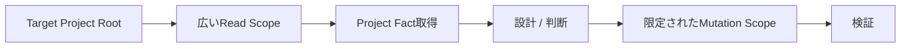

# UnityAgent ローカルUnity Project開発ガイド

この文書は、UnityAgentを使ってローカルのUnity Projectを設計・調査・実装・検証するときの**推奨Workspace構成、Projectの渡し方、権限境界、正本の分離、依頼方法**を説明します。

UnityAgentを最大限活用するために重要なのは、UnityAgentとUnity Projectを同じものとして扱わないことです。

- **UnityAgent**: 「どう開発するか」を管理するAI開発基盤の正本
- **Target Unity Project**: Scene、Prefab、Material、Shader、C#、Project Settingsなど「実際に作ったもの」の正本
- **Portable Package / Tool Repository**: 再利用可能な製品コードの正本
- **MyUnityMCP**: MCP Tool、Manifest、Tool Schema、Package実装の正本

UnityAgentをUnity Projectへコピーして使うのではなく、**独立したUnityAgentから対象Unity Project Rootへ接続する**のが基本です。

---

## 1. 推奨構成

最も推奨するローカル構成は次です。

```text
D:\
├─ UnityAgent\
│  ├─ Policy\
│  ├─ Orchestration\
│  ├─ Context\
│  ├─ Runtime\
│  ├─ Persistence\
│  ├─ Operations\
│  ├─ Eval\
│  ├─ .agents\
│  └─ ...
│
└─ Projects\
   └─ MyGame\
      └─ Project\
         ├─ Assets\
         ├─ Packages\
         ├─ ProjectSettings\
         └─ ...
```

UnityAgentへ渡す対象は通常、次のProject Rootです。

```text
D:\Projects\MyGame\Project
```

次のように `Assets` だけを渡すことは基本的に推奨しません。

```text
D:\Projects\MyGame\Project\Assets
```

### なぜProject Rootを渡すのか

UnityAgentが正確に設計・実装するには、C#やAssetだけでなくProject全体の事実が必要になるためです。

Project Rootを参照できれば、必要に応じて次を確認できます。

```text
Project/
├─ Assets/
│  ├─ Scripts/
│  ├─ Shaders/
│  ├─ Settings/
│  ├─ asmdef
│  └─ Project固有Asset
├─ Packages/
│  ├─ manifest.json
│  └─ packages-lock.json
└─ ProjectSettings/
   ├─ ProjectVersion.txt
   ├─ GraphicsSettings
   ├─ QualitySettings
   └─ その他Project設定
```

これによって、例えば次のProject Factを推測ではなく実Projectから確認できます。

- Unity Version
- Render Pipeline
- RenderGraphの前提
- Package Version
- Cinemachine等の依存Package
- asmdef / Assembly boundary
- namespace
- Graphics / Quality設定
- Build Targetに関係する設定
- Scene / Prefab / Material / Shaderの実際の構成
- 既存Owner / Controller / Manager / Service

`Specs/ProjectProfile.md` はこれらを直接確認できないときのFallbackであり、実Projectから取得できる事実より優先しません。

---

## 2. UnityAgentを `Assets/` 配下へ置かない

次の構成は非推奨です。

```text
Project/
└─ Assets/
   └─ UnityAgent/
      ├─ Policy/
      ├─ Context/
      ├─ Runtime/
      ├─ Eval/
      └─ ...
```

UnityAgentはUnity AssetでもUnity Packageでもありません。

`Assets/` 配下へ置くと、次の問題が発生します。

- UnityAgent内部のMarkdown、YAML、Python、Eval Fixture等がUnity Projectへ混入する
- `.meta` が大量に生成される
- Unity Asset DatabaseとAgent内部Dataの境界が崩れる
- UnityAgentの更新だけでTarget ProjectのGit差分が増える
- UnityAgentと特定ProjectのVersionが不要に結合される
- 複数Projectで同じUnityAgentを再利用しにくくなる
- AgentのPolicy / Eval / Runtimeと製品Sourceが同じRepository境界に混ざる
- Mutation Scopeの誤認が起きやすくなる
- UnityAgent自身のValidationとProject側のCompile/Testの責務が混ざる

UnityAgentは独立Repositoryとして保ち、Target Projectを外部Workspaceとして参照してください。

### 同じ親Directoryに置くことは問題ない

次のようにSiblingとして置く構成は問題ありません。

```text
D:\Workspace\
├─ UnityAgent\
└─ MyGame\
   └─ Project\
```

重要なのは、**UnityAgentをUnity Project Rootや `Assets/` の内側へ入れないこと**です。

---

## 3. Read ScopeとMutation Scopeを分ける

UnityAgentにProject Root全体を見せることと、Project Root全体の変更を許可することは別です。

推奨方針は次です。

```text
Read Scope     = Project Root
Mutation Scope = Taskに必要な最小範囲
```

### 例: C# Feature追加

```text
Read:
D:\Projects\MyGame\Project\**

Write:
D:\Projects\MyGame\Project\Assets\Scripts\MyFeature\**
```

### 例: Shader / Rendering変更

```text
Read:
D:\Projects\MyGame\Project\**

Write:
Assets\Shaders\**
Assets\Rendering\**
```

### 例: Package変更が必要なTask

最初から `Packages/` の変更を許可する必要はありません。

調査でPackage変更が必要だと分かった場合に限り、Mutation Scopeを拡張します。

```text
Assets/...     -> 許可済み
Packages/...   -> 追加承認後に許可
```

### `ProjectSettings/` は特に慎重に扱う

`ProjectSettings/` はProject全体の挙動を変更するため、通常の局所C#修正と同じMutation Scopeで扱いません。

ProjectSettings変更が必要になった場合は、次を確認します。

1. なぜAsset側だけでは解決できないか
2. どのProject Settingを変更するか
3. 既存Platform / Graphics / Quality設定への影響
4. Rollback方法
5. 変更後に必要なValidation

設計変更を伴う場合はDesign Reviewへ戻してから変更します。

---

## 4. 「全部読める」と「何でも変更できる」を混同しない

Project RootのRead Accessを広く取る理由は、**正確なProject Factを取得するため**です。

変更権限を広く取るためではありません。



この分離によって、次を両立できます。

- Project全体を理解した上で設計する
- 既存Ownerや依存関係を確認する
- Package / ProjectSettings等を必要なく変更しない
- Task外のFileを巻き込まない
- Mutation Evidenceを明確にする

---

## 5. Project Factの優先順位

UnityAgentはProject固有情報を次の順で扱います。

```text
対象Unity Projectから検出した事実
    ↓
今回ユーザーが明示・確認したProject Fact
    ↓
Project固有Context
    ↓
Specs/ProjectProfile.md のFallback
    ↓
UnityAgentの既定Preference
```

Projectから検出できる情報を、古いメモやFallback Profileで上書きしてはいけません。

例えばProjectが実際にCinemachine 2.xを使っているなら、一般論や別Projectの情報を理由にCinemachine 3.x前提で実装しません。

不明な情報は、可能ならProjectから検出します。検出不能な場合は「未確認」として扱い、推測値をProject Factへ昇格させません。

---

## 6. UnityAgentとTarget Projectの正本境界

UnityAgentを「正本」と呼ぶ場合、何の正本かを明確にする必要があります。

### UnityAgentが正本になるもの

- User Policy
- Risk / Security / Approval / Evidence Rule
- Routing
- Parent Graph / SubGraph
- Task Contract
- Context Selection / Budget / Materialization
- Runtime execution rule / Guardrail
- Persistence contract
- Eval / Regression contract
- Unity開発Skill / Supporting Reference

つまり、**AIがどう考え、どう進め、どこまで実行し、どう検証するか**の正本です。

### Target Unity Projectが正本になるもの

- Project固有C#
- Scene
- Prefab
- Material
- Shader
- Texture / Mesh / Animation等のAsset
- ScriptableObject instance
- Timeline
- Volume Profile
- ProjectSettings
- Project固有Packages構成

つまり、**実際にゲームやApplicationとして成立する成果物**の正本です。

### UnityAgentへ製品コードを蓄積しない

「UnityAgentが生成したからUnityAgent Repositoryへ保存する」という判断はしません。

生成物のOwnerは成果物の種類で決めます。

| 成果物 | 正本 |
| --- | --- |
| 特定ゲーム専用Feature | Target Unity Project |
| Scene / Prefab / Material | Target Unity Project |
| 再利用可能なUnity Package | Package / Product Repository |
| 汎用Editor Tool | Product RepositoryまたはPackage Repository |
| MyUnityMCP Capability / Tool | MyUnityMCP |
| Agent Policy / Skill / Graph / Eval | UnityAgent |

---

## 7. 開発対象を渡す基本形

依頼するときは、最低限次を渡すのを推奨します。

```text
Project Root:
D:\Projects\MyGame\Project

やりたいこと:
<作りたいもの / 直したいもの>

開発モード:
<設計のみ / 調査 / 設計+実装 / バグ修正 / Performance改善 等>

Read Scope:
Project Root全体

Mutation Scope:
<変更を許可するDirectory>
```

毎回Unity VersionやPackage Versionを手入力する必要はありません。

Projectから検出可能なら、UnityAgentが検出済みProject Factを優先します。

ただし、次のような「コードからは分からない意図」は明示する方が安全です。

- 最優先Platform
- 変更してはいけないSystem
- Performance Budget
- 互換性を維持する必要がある既存API
- UI / UX上の意図
- 特定のArchitecture方針
- 既存の設計を維持する必要があるか

実際に使用する依頼書は `Templates/DevelopmentRequest.md` を利用できます。

---

## 8. Design Reviewを使う場合

Architecture、Feature System、Portable Tool、MCP、Rendering Systemなど、設計自体が重要なTaskでは実装前にDesign Reviewを行います。

Design Reviewでは最低限次を確認します。

### 関連図

Mermaidで、必要に応じて次を可視化します。

- System構成
- Component関係
- Data Flow
- Control Flow
- Existing Systemとの接続
- Runtime Boundary
- Validation Flow

### チェック項目

- 要求との一致
- Existing Owner
- Responsibility
- Ownership / Lifetime
- Read Scope
- Mutation Scope
- Dependencies
- Platform依存
- Performance Budget
- Validation方法
- Stop / Replan条件
- Non-goal
- 未解決事項

### 最終イメージ仕様書

「技術的に何を実装するか」だけでなく、完成後の姿を自然言語で固定します。

- 何ができるようになるか
- ユーザーからどう見えるか
- 主要Component
- Data / Control Flow
- 想定File構成
- Acceptance Criteria
- Non-goal
- 未解決事項

Design Reviewが必須のTaskでは、承認前にImplementation Mutationへ進みません。

調査後に前提が崩れた場合は、最初の承認を理由にそのまま実装せず、Design Reviewへ戻して設計を更新します。

---

## 9. 実装中にMutation Scope外の変更が必要になった場合

実装を開始した後に、指定外Directoryの変更が必要になる場合があります。

例:

```text
許可済み:
Assets/Scripts/MyFeature/**

新たに必要:
Packages/manifest.json
```

この場合、推奨動作は次です。

```text
必要性を発見
    ↓
理由と影響を説明
    ↓
必要ならDesign Review更新
    ↓
Mutation Scope拡張を承認
    ↓
変更
    ↓
追加Validation
```

勝手にMutation Scopeを拡張しません。

---

## 10. Verificationの考え方

完了条件はTaskによって異なります。

静的Reviewだけで完了できるTaskもあれば、実機まで必要なTaskもあります。

代表的なValidation Layerは次です。

```text
Static Review
    ↓
Compile
    ↓
EditMode Test
    ↓
PlayMode Test
    ↓
Editor Runtime確認
    ↓
Player Build / Runtime
    ↓
Target Platform
    ↓
実機 / Performance / Visual Evidence
```

重要なのは、上位Validationを常に全部実行することではなく、**実施していないValidationを成功扱いしないこと**です。

例えばCompile成功だけで、次を主張してはいけません。

- Runtimeで正常動作した
- Scene上で意図どおり表示された
- Player Buildで動作した
- Switch等のTarget Platformで性能目標を満たした

未確認項目は明示します。

---

## 11. Portable Package / 汎用Toolを作る場合

再利用可能なFeatureを作る場合でも、UnityAgent Repositoryへ製品コードを直接蓄積するのは基本方針ではありません。

推奨構成は次です。

```text
Workspace/
├─ UnityAgent/
├─ MyReusableTool/
│  ├─ Packages/
│  ├─ Tests/
│  └─ Docs/
└─ ValidationProject/
   ├─ Assets/
   ├─ Packages/
   └─ ProjectSettings/
```

- UnityAgent: 開発方法・Policy・Graph・Eval
- MyReusableTool: 製品の正本
- ValidationProject: Unity上での導入・Compile・Runtime検証

この分離によって、Tool本体とValidation用Unity Projectを独立して管理できます。

---

## 12. MyUnityMCPを開発する場合

MyUnityMCPのTool、Capability、Manifest、Tool Schema、Package実装は `DarumaPPAP/MyUnityMCP` が正本です。

UnityAgent側へ同じ製品実装を複製しません。

UnityAgentは次を担当します。

- どのMCP Capabilityを選ぶか
- Policy上利用可能か
- Contextへ何を含めるか
- RuntimeでどのTool Groupを公開するか
- Mutation Scopeをどう制御するか
- Result / Evidenceをどう扱うか

実際のMCP製品実装はMyUnityMCP側へ置きます。

---

## 13. 推奨構成と非推奨構成

| 構成 | 評価 | 理由 |
| --- | --- | --- |
| UnityAgentを `Assets/` にコピー | 非推奨 | Agent基盤とUnity Assetが混在する |
| UnityAgentをTarget Project Root内へ配置 | 非推奨 | Repository / Mutation / Version境界が崩れる |
| `Assets/` だけを読ませる | 条件付き | Package / Unity Version / ProjectSettings等のFactが不足しやすい |
| UnityAgent独立 + Project Root読取 + Project全体Write | 改善余地あり | 理解はできるがMutation Scopeが広すぎる |
| **UnityAgent独立 + Project Root読取 + Task単位Mutation Scope** | **推奨** | Project理解と安全なMutationを両立できる |

---

## 14. 典型的な依頼例

### 新Featureを設計・実装する

```text
UnityAgentで以下を開発してください。

Project Root:
D:\Projects\MyGame\Project

やりたいこと:
大量のStage Meshを対象にGPU Culling Systemを設計・実装したい。

開発モード:
設計 + 実装

Read Scope:
Project Root全体

Mutation Scope:
Assets/Rendering/GPUCulling/**

他の場所への変更が必要なら、変更前に理由を示してDesign Reviewへ戻してください。

Project FactはProjectから直接取得し、未確認事項を推測しないでください。

実装前に以下を提示してください。
- Mermaid関連図
- 設計チェック項目
- 最終イメージ仕様書
- 想定File構成
```

### 局所的なC#バグを修正する

```text
Project Root:
D:\Projects\MyGame\Project

対象:
Assets/Scripts/Audio/BGMList.cs

症状:
<再現条件と問題を記載>

Read Scope:
Project Root全体

Mutation Scope:
Assets/Scripts/Audio/**

既存Architectureを変更する必要がなければDesign Reviewは不要です。
原因を確認して最小修正を行い、Compile可能性と未検証事項を報告してください。
```

### Rendering / Performanceを調査する

```text
Project Root:
D:\Projects\MyGame\Project

目的:
Switch相当のPerformance ClassでCamera / Rendering負荷を調査する。

最初はRead / Analysisのみ。
Mutationはまだ許可しません。

Project Settings、URP設定、Camera構成、Package VersionをProjectから確認してください。
原因候補とEvidenceを整理した後、変更が必要ならDesign Reviewを提示してください。
```

---

## 15. 最小依頼で開始してもよい

毎回詳細Templateをすべて埋める必要はありません。

最低限、次があれば開始できます。

```text
Project Root: <path>
やりたいこと: <goal>
Mutation Scope: <allowed path>
```

不足情報のうちProjectから確認できるものはProject Factとして取得します。

ただし、ユーザーの意図、優先順位、変更禁止事項などProjectから検出できない情報は、必要に応じて依頼へ含めてください。

---

## 16. 完了時に確認すること

Task完了時には少なくとも次を確認します。

- 要求を満たしたか
- 実際に変更したFileは何か
- Mutation Scopeを逸脱していないか
- Design Reviewから重要な設計変更があったか
- どのValidationを実行したか
- どのValidationを実行できなかったか
- Project Factとして何を確認したか
- 推測で補った情報がないか
- 不要なManager / Singleton / static / Controller / Profile等を増やしていないか
- Target Projectが所有すべき成果物をUnityAgent側へ誤配置していないか

---

## 17. 要点

最も推奨する運用は次です。

```text
UnityAgentを独立Repositoryとして維持
    ↓
Target Unity Project Rootを渡す
    ↓
Project Root全体をRead可能にする
    ↓
Task単位でMutation Scopeを限定する
    ↓
Project Factを実Projectから取得する
    ↓
必要なTaskだけDesign Review
    ↓
承認された範囲を実装
    ↓
Taskに必要なValidation
    ↓
Evidenceと未検証事項を報告
```

UnityAgentを `Assets/` に入れるのではなく、**UnityAgentは開発方法の正本、Target Projectは製品の正本**として分離してください。
