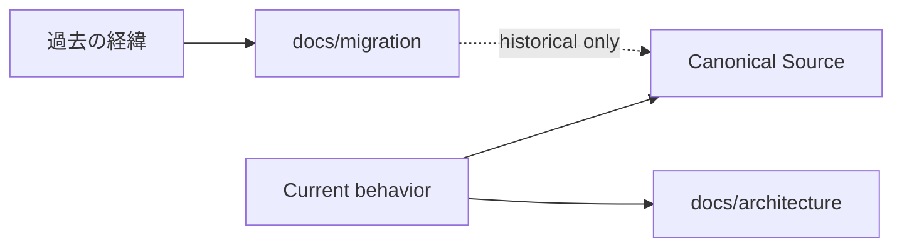

# Migration History

このDirectoryは、UnityAgentの**過去のArchitecture移行・Cutover・Baseline更新・Compatibility削除判断を監査できるように残すHistorical Record**です。

> **ここに置かれた文書は現在のProduction Authorityではありません。**
>
> 旧Path、削除済みContract、旧Phase名が本文に残っている場合、それは「当時そうだった」というEvidenceです。現在も有効という意味ではありません。

---

## Current Productionを知りたい場合

次を優先してください。

1. `AGENTS.md`
2. `Policy / Orchestration / Context / Runtime / Persistence / Operations / Eval` のcanonical source
3. `docs/architecture/architecture.md`
4. `docs/architecture/production-tool-runtime.md`
5. `docs/unity-environment-adaptation.md`
6. Supporting `Specs/`



---

## 現在のCanonical Authority

- Policy: `Policy/`
- Context: `Context/`
- Orchestration: `Orchestration/`
- Runtime: `Runtime/`
- Persistence: `Persistence/`
- Operations: `Operations/`
- Eval: `Eval/`

通常のUnityAgent実行、Routing、Context Materialization、Runtime Execution、Policy判断では、このDirectoryをCurrent Stateとして解決しません。

---

## このDirectoryを残す理由

- 過去にどのAuthorityをどこへ移したか確認する
- Cutover時に何を削除したか確認する
- Historical Replay / Baselineの由来を追跡する
- 現在のContractがどのMigration判断から生まれたか監査する
- 過去の判断をGit履歴だけに依存せず、人間が読みやすい形で保持する

---

## 主なMigration Record

- `canonical-contracts.md`
- `policy-context.md`
- `runtime-harness.md`
- `orchestration.md`
- `persistence.md`
- `eval-consolidation.md`
- `operations.md`
- `cutover.md`
- `production-rebaseline.md`
- `baseline-comparator.md`
- `production-tool-runtime-cutover.md`

---

## 削除済みPathの例

Historical文書には、当時実在した次のようなPathが出ることがあります。

```text
.ai/**
Context/Selection/mcp-selection.yaml
Context/Compatibility/**
compatibility://...
```

これらをcurrent authorityとして復活させません。

特にProduction Tool Runtime Cutoverでは、ContextがProviderを選ぶ旧`mcp-selection.yaml`はcurrent pathから削除され、Capability descriptionは `Context/Selection/tool-capability-catalog.yaml`、Provider resolutionは `Runtime/Tooling/`へ分離されています。

---

## 命名規約

Migration文書のファイル名は、開発段階番号ではなく、その文書が表す意味・責務で命名します。

推奨:

- `canonical-contracts.md`
- `runtime-harness.md`
- `orchestration.md`
- `cutover.md`
- `production-rebaseline.md`
- `baseline-comparator.md`
- `production-tool-runtime-cutover.md`

禁止:

- `phase1-...`
- `phase8-...`
- `phase10-...`

Historical Identifierとして本文中にPhase番号や過去Branch名を残すことは許可します。

---

## Historical Literalの扱い

過去に実際に存在した:

- Branch名
- Run ID
- Artifact名
- Baseline ID
- old path
- old contract name

は監査証跡として残せます。

改名してしまうと過去Evidenceとの対応が壊れるためです。

---

## 利用時の注意

Migration文書を使うのは主に次です。

1. 過去のArchitecture判断理由を確認したい
2. 削除済みCompatibilityの由来を確認したい
3. Replay / Baseline / Cutoverの監査証跡を確認したい
4. 現在のContractへ至った経緯を追跡したい

Migration文書とCurrent Canonical Sourceが競合する場合は、**Current Canonical Sourceを優先**します。
