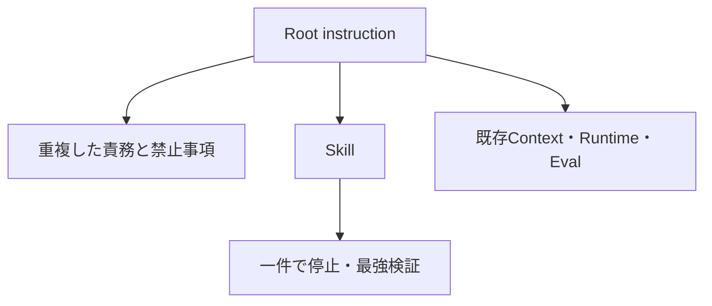
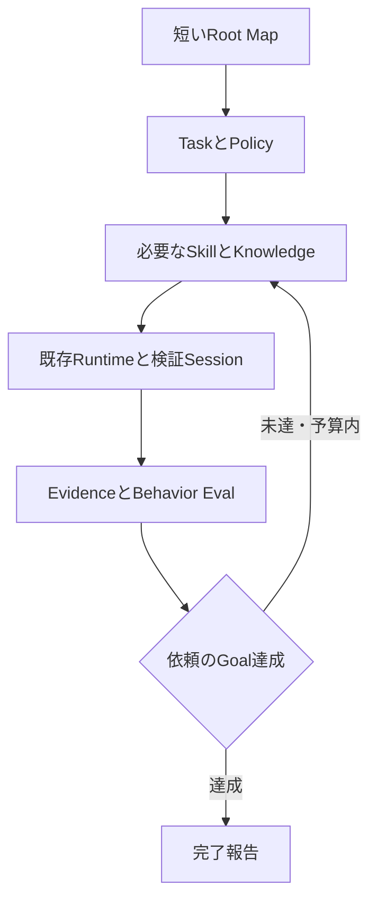

# Instruction / Harness Calibration — 2026-09-07

対象: DarumaPPAP/UnityAgent。基点: `e1ecd31a8532c09ae0bdb73af4245da276e5b41d`。
添付依頼に基づくモデル非依存の改善。モデル固有の挙動や速度向上を実測した報告ではない。

## Audit summary

| Severity | Finding | 対応 |
|---|---|---|
| Critical | 今回確認した範囲では確定なし | 全Repositoryの意味的競合ゼロを保証するものではない |
| High | unity-implementの一件で停止する規定と複数段階のユーザー依頼が競合する余地 | 現在の依頼全体まで継続し、依頼外には進まないと明確化 |
| High | Skillの一般手順と現在のユーザー要求の優先順位が不明確 | PolicyのpriorityにTask-specific instructionとApplicable Skillを追加。プラットフォーム権限は上書きしない |
| Medium | 最強の利用可能検証という表現が低Risk変更にも広い検証を誘発し得る | 既存R0〜R4へvalidation_scopesを追加。必須Gateは維持 |
| Medium | Rootの責務説明、cutover、anti-regressionが重複 | RootはMapと短いinvariantに整理。必要なhandoff詳細は既存architecture文書へ移動 |
| Medium | Namingの詳細リスト、Diff review、Checklist間の重複 | Naming正本への参照と短い完了チェックへ整理 |
| Medium | 不要確認、Skill停止、継続性、過剰検証の専用観測契約が不足 | 7ケースのworkflow regressionとobserver evidenceを受け取るEval adapter拡張 |
| Low | 既存Skill validatorに25件のadvisory warning | 後述。今回の変更で警告を理由に規則を追加しない |

`inventory.csv` は基点のtracked MD/YAML/Python 486ファイルを対象としたファイル単位の一次分類。A〜Iは主責務をpathから分類した索引であり、全行の意味解析結果ではない。J Duplicate / K Conflictは上記および下表で人手評価した。未追跡ファイル・binaryは含まない。

## Before / After

新たなParentGraph、モデル専用Manager、PolicyEngineは追加していない。既存の責務境界とFast Pathを維持する。

## Removed / moved instructions

| Before | After | 保持した意味 |
|---|---|---|
| AGENTSのbootstrap / responsibility / cutover / handoff / anti-regression詳細 | docs/architecture/architecture.mdの既存本文と短い補足 | semantic authority、durable evidence、resume、provider safety |
| AGENTSの重複したAuthority順位 | Policy/User/user-policy.yamlへの参照 | 現在の明示要求、固有Policy、Project Policyの保護 |
| unity-implementのNaming詳細列挙 | SkillReferences/TYPE_NAMING_STANDARDS.mdへの参照 | 新規Type / 明示Rename時のみ適用、既存API保持 |
| unity-implementの重複Checklist | Workflowを参照する4項目 | 範囲、Policy参照、検証状態、全体完了 |
| 最強検証を一律に求める文章 | Policy/Riskのscopes + Runtime validation session | 必須Gateを下げず過剰・重複検証を抑える |

Shader / RenderGraphのKnowledgeは元からRootに存在しないため、空のKnowledgeディレクトリを新設しない。Naming Contract本体、コメントPolicy、Shader分岐Policy、Context Budget、Retrieval Budget、Compressionの保護契約は保持する。

## Conflicts / duplicates / legacy

- Autonomy: 「次Taskへ進まない」を現在の依頼の境界で解釈する。調査だけの依頼を実装へ拡張しない。
- Approval: 既存承認は範囲内で有効。Read/Search/Reviewと依頼済み可逆Source変更の再確認を不要とする一方、R2〜R4、tool revision、exact diff、bake等の既存承認契約を保持する。広い依頼から破壊的操作の承認を推定しない。
- Testing: 小変更はTargeted、R2は関連Regression、R3/R4は関連Integration/Behavior。Full Suiteには必須Gateまたは具体的なRisk理由が必要。
- Architecture: 全面刷新を促す確定競合は今回の適用箇所では見つからず。既存preserve_existing_structureを保持する。
- Skill priority: 現在の要求をSkill一般則でsilent overrideしない。Skill path / instruction / effect / resolution / evidenceを追跡できる受入口を追加する。
- Duplicates: Root責務・禁止事項の再列挙と実装SkillのNaming / Checklist重複を整理。全領域の意味重複をゼロと主張しない。Policyの短いinvariant、正本詳細、Eval assertionはそれぞれ別責務で維持する。
- Legacy: Context stale-path validatorとactive documentation validatorを実行。migration履歴はProduction authorityにしない。未検出Project Factを固定Unity Versionで上書きする変更は行っていない。全Unity APIのVersion適合性監査ではない。

## Harness / Eval changes and limits

`Runtime/Harnesses/validation_session.py` を既存 `run_command_harness` のoptional sessionとして利用できる。入力と環境が同じPASSのみ再利用し、変更fingerprint、新Risk、失敗後は再実行する。低RiskのFull Suiteは理由なしではdispatchしない。必須Gateは理由付きで実行できる。

Fingerprintは未commitのSource、依存、環境、設定、fixtureを含めて呼出元が供給する。HEAD SHAだけを使わない。完全なFingerprintを作れない場合や不安定な性能測定ではreuse sessionを使わず通常harnessを使う。Sessionはtask内の一時状態で、Persistenceの代替ではない。既存の全callerを自動移行したものではない。

`Eval/Behavior/workflow_observation.py` はRuntime / Orchestrationのtrusted observerが作った構造化factを評価する。`runtime_adapter.py` のoptional引数で既存Evalに接続し、必須観測が欠けた場合は品質denominatorから除外する。Runtime timeout等をAgent品質の失敗に付け替えない。

7ケース: Autonomous fix / Skill conflict / Small change testing / Complex change testing / Retrieval budget / User override / Long-horizon completion。

各ケースのPASS、各必須factのFAIL、欠測を評価器テストで検証した。これはモデルがその挙動を実行した証明ではない。新しい自由文parserやAgent自己申告をtrusted observerとして追加していない。callerでevidenceのproducer・run・revisionとのbindingを行う必要がある。

## Context cost and protected knowledge

- Always-loaded: Root Mapとcanonical User Policy。
- Task-loaded: 選択Skill / Context Pack / Task Contract。
- Retrieved: target source、direct dependency、関連Knowledge。
- Transient: tool output、attempt途中の結果。永続Stateとは区別する。

これは既存rolesの説明上の分類であり、新しいContext schemaへの移行ではない。既存budgetはselected artifactsを測り、System/tool overhead等は測らないという契約を維持する。Rootのバイト削減を総token課金や応答速度削減と同一視しない。

Compressionでは既存のprotected full-only rolesを保持。User Requirement / Architecture / Platform / Known Failure / Current Decision / Unresolved Issueを削るための閾値変更はしていない。

## Validation

- 初回: jsonschema未導入によりimport failure。環境へ依存を導入して解消。
- `Tools/validate_all.py`: 既存validator群と327 unit testsを実行。unit testsは全PASS。Naming Production gateがRootのprovenance記載不足を検出したため記載を復元し、当該gateのPASSを再確認。
- 最終変更後: RuntimeとEvalの関連suite、Documentation validator、Skill validator、変更Skillのquick_validateを再実行。最終件数はPR本文に記録。
- Skill validator: 0 errors / 25 advisory warnings。説明形式・推奨見出し不足と、read-only監査への言及をmutating toolとの矛盾と扱う粗いヒューリスティックを含む。不要な見出しや規則を足してwarningだけを消す対応はしていない。
- Context Budget Golden: 6 cases / 3 boundary pairs PASS。Naming Golden、Behavior契約、Mutation Production、Production smoke契約、Parent Graph整合を維持。
- Codex CLI不在のため実モデルProduction Smokeは未実行。Unity Editor / Player / 実機の検証も対象環境不在につき未実行。

## Remaining risks / next actions

1. 実モデルのRouting / Retrieval / Goal completion改善率は未測定。認証済みCodex CLI環境で既存 `Tools/run_regression_gate.py` を実行し、baselineと比較する。
2. 新7ケースの実挙動にはtrusted observerのfactが必要。既存Production Smokeのcase setを実行するだけでは新7ケースの実測にはならない。新caseのfixtureと観測producerを接続し、source/run binding付きで評価する。
3. Validation sessionはoptional。既存callerが採用していない範囲に重複テスト抑止が効いたとは主張しない。
4. このPRはInstruction整理とHarness/Eval受入口の実装まで。添付仕様の全実挙動受入条件達成は未確認のためDraftで提出する。

## Measured instruction size

| File | Before bytes | After bytes | Reduction |
|---|---:|---:|---:|
| AGENTS.md | 13447 | 4268 | 68.3% |
| .agents/skills/unity-implement/SKILL.md | 12464 | 11953 | 4.1% |
