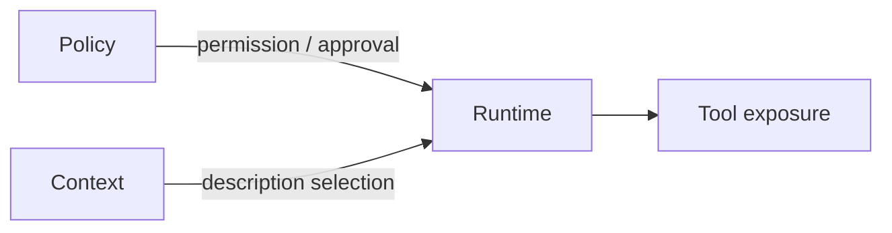
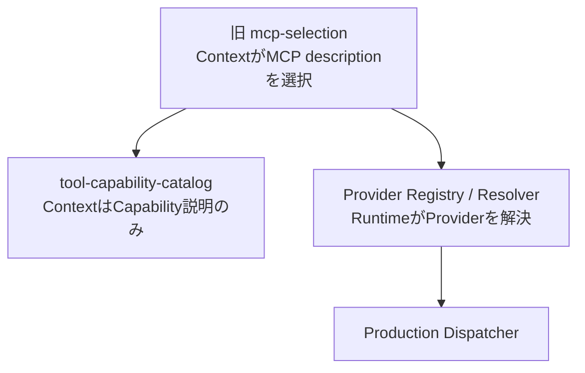

# Policy + Context Migration

> **Historical Record**
>
> この文書は旧Architecture移行時点の記録です。本文に現れる `Context/Selection/mcp-selection.yaml`、`Context/Compatibility/`、`compatibility://` 等は当時の構造を示しており、現在のProduction Authorityではありません。
>
> Production Tool Runtime Cutover後、`Context/Selection/mcp-selection.yaml` は削除済みです。現在は:
>
> - Capability description -> `Context/Selection/tool-capability-catalog.yaml`
> - Provider resolution -> `Runtime/Tooling/provider_registry.yaml` + `Runtime/Tooling/capability_resolver.py`
> - Production dispatch -> `Runtime/Dispatcher/tool_runtime_dispatcher.py`
>
> を使用します。

Status at the time: implemented on `refactor/architecture-phase2-policy-context`

Base at the time: Phase 1 merge `e141bcf5c13d98f8caa7a203046670a73d28dbf9`

---

## 当時のAuthority分離



当時はMCP activationを次のように分割しました。

- context description/catalog loading -> `Context/Selection/mcp-selection.yaml`
- permission/trust/approval requirements -> `Policy/`
- actual tool exposure -> `Runtime/Permissions/mcp-activation.yaml`

このうち`mcp-selection.yaml`は後のProduction Tool Runtime Cutoverで役割を終えています。

---

## Policy migration

当時行った内容:

- `.ai/user-policy.yaml` を `Policy/User/user-policy.yaml` へlossless移行。
- `.ai/harness/risk-levels.yaml` を `Policy/Risk/risk-levels.yaml` へlossless移行。
- repository / ownership factを `Policy/Contracts/repository-ownership.yaml` へ分離。
- permission / trust / approvalをPolicy Authorityへ移行。
- legacy sourceは当時まだCompatibilityのため残した。

現在はlegacy `.ai` authorityをProduction bootstrapへ戻しません。

---

## Context migration

当時行った内容:

- Context Packsを `Context/Packs/` へ移行。
- Knowledgeを `Context/Retrieval/Knowledge/` へ移行。
- Context Budgetを `Context/Budget/context-budget.yaml` へ集約。
- Prompt templatesを `Context/Prompt/Templates/` へ移行。
- `Context/Selection/context-catalog.yaml` をmaterialization-only catalogとして整理。
- `MaterializedContextView` / `ContextFingerprint` / `MemoryProjection`をfirst-class Context contract化。
- `Context/Assembly/materialize_context.py` がexplicit Route IDからbounded current-call viewを生成する構造へ移行。

Contextは当時から:

- WorkflowState
- Checkpoint
- durable Memory
- durable Evidence

のAuthorityを持たない方針でした。

---

## 当時のCompatibility Boundary

当時は `Context/Compatibility/legacy-path-map.yaml` がread-only compatibility authorityでした。

```text
legacy ref
  -> compatibility resolver
  -> canonical path
```

write fallbackはfail-closedでした。

その後のdestructive cutoverでこのCompatibility layerはcurrent Production pathから除去されています。

現在はlegacy URI/path fallbackを使用しません。

---

## Context Manifest split

旧monolithic Context Manifestは次を混在させていました。

- Context materialization
- execution evidence
- graph projection
- retry status
- harness facts

このMigrationではContext-only manifestへ分離しました。

```text
Context
= current-call materialized context
+ context budget
+ unresolved bindings
+ attempt provenance
```

Execution EvidenceはRuntime / Persistence、Graph stateはOrchestrationへ分離しました。

このAuthority分離自体は現在も維持されています。

---

## 当時のGuards

- User Policy equivalence検証
- stale legacy path検出
- legacy write禁止
- destructive cutover前のlegacy read-only保持

現在はさらにProduction Tool Runtime側で:

- Provider-independent CapabilityRequest
- Project binding
- Approval
- Mutation Scope
- Evidence strength
- safe fallback

をRuntime boundaryで再検証します。

---

## 現在との対応



現在の詳細:

- `docs/architecture/production-tool-runtime.md`
- `docs/architecture/architecture.md`
- `docs/unity-environment-adaptation.md`

Historical recordとCurrent Production Contractを混同しないでください。
