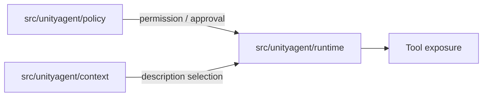
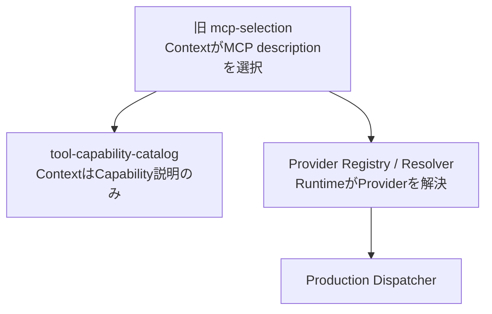

# src/unityagent/policy + Context Migration

> **Historical Record**
>
> この文書は旧Architecture移行時点の記録です。本文に現れる `src/unityagent/context/selection/mcp-selection.yaml`、`src/unityagent/context/compatibility/`、`compatibility://` 等は当時の構造を示しており、現在のProduction Authorityではありません。
>
> Production Tool Runtime Cutover後、`src/unityagent/context/selection/mcp-selection.yaml` は削除済みです。現在は:
>
> - Capability description -> `src/unityagent/context/selection/tool-capability-catalog.yaml`
> - Provider resolution -> `src/unityagent/runtime/tooling/provider_registry.yaml` + `src/unityagent/runtime/tooling/capability_resolver.py`
> - Production dispatch -> `src/unityagent/runtime/dispatcher/tool_runtime_dispatcher.py`
>
> を使用します。

Status at the time: implemented on `refactor/architecture-phase2-policy-context`

Base at the time: Phase 1 merge `e141bcf5c13d98f8caa7a203046670a73d28dbf9`

---

## 当時のAuthority分離


```mermaid
flowchart LR
    P[src/unityagent/policy] -->|permission / approval| R[src/unityagent/runtime]
    C[src/unityagent/context] -->|description selection| R
    R --> T[Tool exposure]
```

当時はMCP activationを次のように分割しました。

- context description/catalog loading -> `src/unityagent/context/selection/mcp-selection.yaml`
- permission/trust/approval requirements -> `src/unityagent/policy/`
- actual tool exposure -> `src/unityagent/runtime/permissions/mcp-activation.yaml`

このうち`mcp-selection.yaml`は後のProduction Tool Runtime Cutoverで役割を終えています。

---

## Policy migration

当時行った内容:

- `.ai/user-policy.yaml` を `src/unityagent/policy/user/user-policy.yaml` へlossless移行。
- `.ai/harness/risk-levels.yaml` を `src/unityagent/policy/risk/risk-levels.yaml` へlossless移行。
- repository / ownership factを `src/unityagent/policy/contracts/repository-ownership.yaml` へ分離。
- permission / trust / approvalをPolicy Authorityへ移行。
- legacy sourceは当時まだCompatibilityのため残した。

現在はlegacy `.ai` authorityをProduction bootstrapへ戻しません。

---

## Context migration

当時行った内容:

- Context Packsを `src/unityagent/context/packs/` へ移行。
- Knowledgeを `src/unityagent/context/retrieval/knowledge/` へ移行。
- Context Budgetを `src/unityagent/context/budget/context-budget.yaml` へ集約。
- src/unityagent/context/prompt/templates templatesを `src/unityagent/context/prompt/templates/` へ移行。
- `src/unityagent/context/selection/context-catalog.yaml` をmaterialization-only catalogとして整理。
- `MaterializedContextView` / `ContextFingerprint` / `MemoryProjection`をfirst-class Context contract化。
- `src/unityagent/context/assembly/materialize_context.py` がexplicit Route IDからbounded current-call viewを生成する構造へ移行。

Contextは当時から:

- WorkflowState
- Checkpoint
- durable Memory
- durable Evidence

のAuthorityを持たない方針でした。

---

## 当時のCompatibility Boundary

当時は `src/unityagent/context/compatibility/legacy-path-map.yaml` がread-only compatibility authorityでした。

```text
legacy ref
  -> compatibility resolver
  -> canonical path
```

write fallbackはfail-closedでした。

その後のdestructive cutoverでこのCompatibility layerはcurrent Production pathから除去されています。

現在はlegacy URI/path fallbackを使用しません。

---

## Context Manifest split

旧monolithic Context Manifestは次を混在させていました。

- Context materialization
- execution evidence
- graph projection
- retry status
- harness facts

このMigrationではContext-only manifestへ分離しました。

```text
src/unityagent/context
= current-call materialized context
+ context budget
+ unresolved bindings
+ attempt provenance
```

Execution EvidenceはRuntime / Persistence、Graph stateはOrchestrationへ分離しました。

このAuthority分離自体は現在も維持されています。

---

## 当時のGuards

- User Policy equivalence検証
- stale legacy path検出
- legacy write禁止
- destructive cutover前のlegacy read-only保持

現在はさらにProduction Tool Runtime側で:

- Provider-independent CapabilityRequest
- Project binding
- Approval
- Mutation Scope
- Evidence strength
- safe fallback

をRuntime boundaryで再検証します。

---

## 現在との対応


```mermaid
flowchart TD
    OLD[旧 mcp-selection<br/>ContextがMCP descriptionを選択] --> NEWC[tool-capability-catalog<br/>ContextはCapability説明のみ]
    OLD --> NEWR[Provider Registry / Resolver<br/>RuntimeがProviderを解決]
    NEWR --> DISP[Production Dispatcher]
```

現在の詳細:

- `docs/architecture/production-tool-runtime.md`
- `docs/architecture/architecture.md`
- `docs/unity-environment-adaptation.md`

Historical recordとCurrent Production Contractを混同しないでください。
