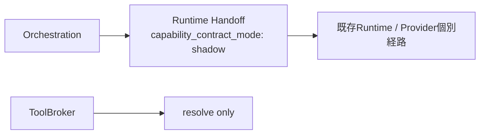
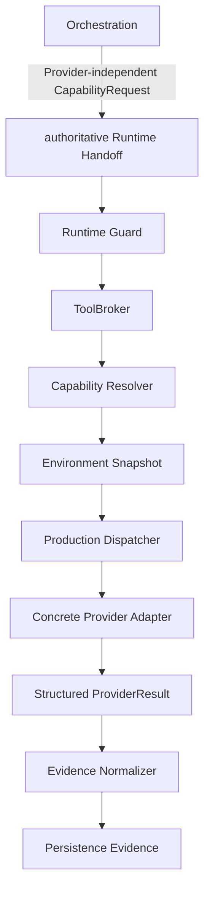
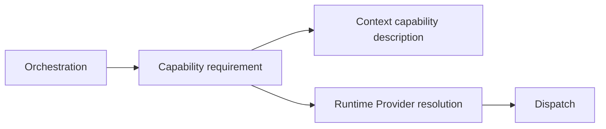

# Production Tool Runtime Cutover

> **Migration Record**
>
> この文書はCapability-driven Tool RuntimeをProduction execution pathへ切り替えたCutoverの監査記録です。Current Architectureの説明は `docs/architecture/production-tool-runtime.md` を参照してください。

---

## 1. Cutover Goal

Cutover前はCapability ContractとProvider Resolutionが整備されていても、Orchestration handoffはshadow状態で、Tool Brokerはresolve-onlyでした。

Cutoverの目的:

```text
Capability Contract
Environment Discovery
Provider Registry / Resolver
Concrete Providers
Safety / Recovery
Player Runtime
Evidence Integration
        ↓
Production execution pathへ統合
```

---

## 2. Before / After

### Before



問題:

- Capability handoffがshadowだった
- ToolBrokerがProduction dispatch ownerではなかった
- Context側に旧MCP selection artifactが残っていた
- Environment MatrixがProduction regression gateとして固定されていなかった

### After



---

## 3. Authority Changes

### Orchestration

Before:

```text
capability_contract_mode: shadow
```

After:

```text
capability_contract_mode: authoritative
```

さらにRuntime handoffに`provider` / `provider_ref`が混入した場合は拒否します。

### Context

Before:

```text
Context/Selection/mcp-selection.yaml
```

がMCP selection artifactとして残っていました。

After:

```text
Context/Selection/tool-capability-catalog.yaml
```

でCapability descriptionだけを扱います。

Provider resolutionはRuntime Authorityへ移します。

### Runtime

Before:

```text
ToolBroker = resolve only
```

After:

```text
ToolBroker
 + Capability Resolver
 + Production Dispatcher
 + Runtime Guard
 + Fallback Policy
```

でProduction execution boundaryを構成します。

---

## 4. Production Dispatcher Safety

Production Dispatcherはcaller-selected Providerを受け取りません。

実行順:

```text
CapabilityRequest validation
-> Runtime Guard
-> ToolBroker resolution
-> last-mile Guard
-> resolved Provider executor
-> structured ProviderResult validation
-> infrastructure-only fallback when allowed
```

executor未登録:

```text
backend_not_implemented
```

として扱い、成功にしません。

---

## 5. Legacy MCP Context Removal

削除:

```text
Context/Selection/mcp-selection.yaml
```

現在の分離:



ContextはProviderを選びません。

Historical migration文書に旧Pathが残る場合はHistorical literalとして扱います。

---

## 6. Environment Regression Matrix

Production Dataset:

`Eval/Datasets/Behavior/production-tool-runtime-environment-matrix.yaml`

Profile:

- `FULL`
- `CLI_ONLY`
- `MCP_ONLY`
- `NATIVE_EDITOR`
- `FILES_ONLY`
- `SAFE_MODE`
- `NO_EDITOR`
- `PLAYER_UNAVAILABLE`

目的:

```text
Providerが追加 / 削除 / unavailableになっても
Capability resolutionとSafety Contractが壊れないことを検証する
```

Profile名自体はRouting Authorityではありません。

---

## 7. Safety Regression Cases

最低限検証するnegative case:

- Provider identityをOrchestrationから指定できない
- Resolver-selected ProviderとProviderResult identityが違えば拒否
- Provider executor未登録を成功扱いしない
- MyUnityMCP mutation unavailable時にraw mutationへ落ちない
- FallbackでRequired Evidenceを弱めない
- FallbackでMutation Scopeを変えない
- FallbackでApproval provenanceを変えない
- Safe ModeでScene mutationを進めない
- Player unavailableをAgent全体failureへ拡大しない

---

## 8. DefinitionFingerprint

Production Tool Runtime Cutoverはruntime / tool / evidence definitionを変更します。

そのためFrozen Baselineとのblocking driftが発生する場合:

```text
REBASELINE_REQUIRED
```

が正しい判定です。

禁止:

```text
Cutover差分を隠すためにBaselineを自動更新する
```

---

## 9. Documentation Cutover

Current Architecture / User Guideとして更新した文書:

- `AGENTS.md`
- `README.md`
- `docs/architecture/architecture.md`
- `docs/architecture/production-tool-runtime.md`
- `docs/architecture/unityagent-flow.mmd`
- `docs/local-project-development.md`
- `docs/unity-environment-adaptation.md`
- `Templates/DevelopmentRequest.md`

Production Runtimeのsupporting specとして整合させた文書:

- `Specs/INDEX.md`
- `Specs/UnityToolRuntime.md`
- `Specs/UnityToolRuntimeEnvironmentAdaptation.md`
- `Specs/UnityEnvironmentCapabilityMatrix.yaml`
- `Specs/ProjectProfile.md`
- `Specs/PlatformAndEnvironmentFallbackPolicy.md`

Historical扱いを明確化した文書:

- `docs/migration/README.md`
- `docs/migration/policy-context.md`
- `docs/migration/production-tool-runtime-cutover.md`

Documentation regression guardとして更新した実装:

- `Tools/DocumentationValidator/validate_documentation.py`

このValidatorはactive docs / Bootstrap / DevelopmentRequest / supporting specsについて、少なくとも次を再検出します。

- 旧Capability名のcurrent use
- Production Tool Runtimeを未実装Target Architectureとして説明する表現
- 削除済み`Context/Selection/mcp-selection.yaml`のcurrent authority参照
- legacy compatibility pathのcurrent use
- broken local Markdown link

`docs/migration/`はHistorical Recordなので、旧Pathを当時の事実として保持できます。

---

## 10. Anti-regression

Cutover後に次を復活させない:

```text
capability_contract_mode: shadow
Context provider selection
Context/Selection/mcp-selection.yaml current authority
Root Catalog万能正本
Orchestration provider selection
silent weaker fallback
raw Scene / Prefab auto mutation fallback
arbitrary eval default mutation
unobserved verification = PASS
Registry potential = executable proof
Baseline auto-update
```

---

## 11. Current Sources

- `Runtime/Dispatcher/tool_runtime_dispatcher.py`
- `Runtime/Tooling/tool_broker.py`
- `Runtime/Tooling/capability_resolver.py`
- `Runtime/Tooling/provider_registry.yaml`
- `Runtime/Guardrails/tool_runtime_guard.py`
- `Runtime/Tooling/fallback_policy.py`
- `Runtime/EvidenceCapture/provider_evidence.py`
- `Eval/Datasets/Behavior/production-tool-runtime-environment-matrix.yaml`
- `Tools/ProductionToolRuntime/validate_production_tool_runtime.py`
- `Tools/DocumentationValidator/validate_documentation.py`
