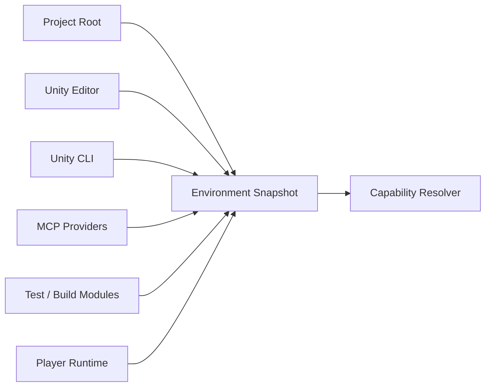
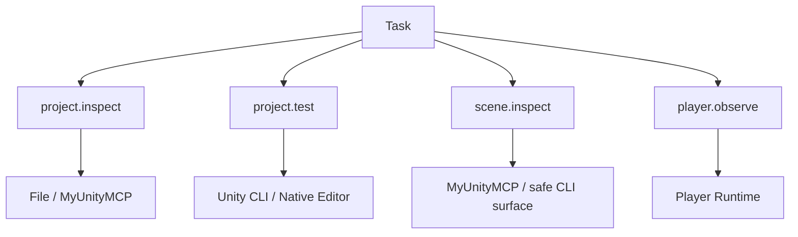
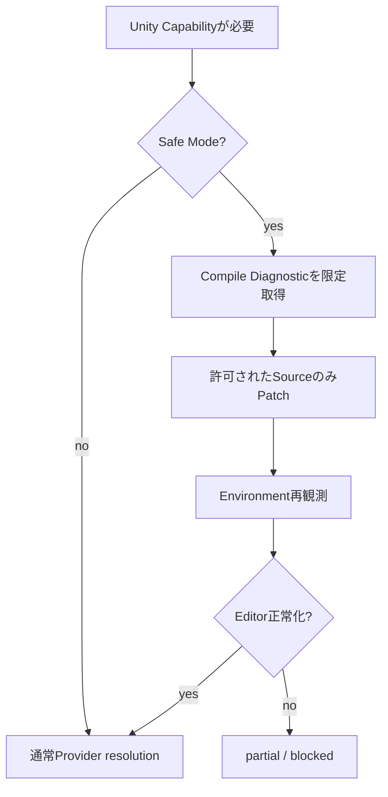
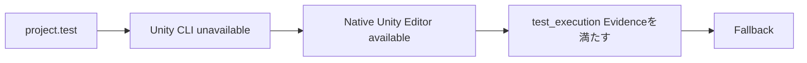
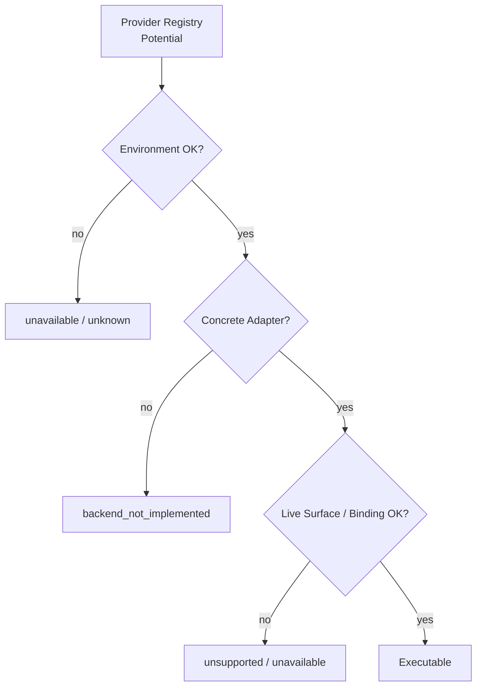

# Unity環境に応じたProduction Runtime適応

UnityAgentはUnity CLIやMCPを必須依存にしません。

**必要なCapabilityを先に決め、現在のEnvironment Snapshotから実行可能なProviderをRuntimeが解決します。**

---

## 1. Environmentは「モード」ではなくFact

```text
Unity CLIあり / なし
MyUnityMCPあり / なし
Coplay MCPあり / なし
Unity Editorあり / なし
Safe Mode
Test Frameworkあり / なし
Build Moduleあり / なし
Player接続あり / なし
```

はすべてEnvironment Factです。



どれか1つが無いだけでUnityAgent全体を停止しません。

一方で、利用できない検証を「成功した」とは扱いません。

---

## 2. tri-stateを維持する

Environment Factは必要に応じて次を区別します。

```text
true
false
unknown
```

`unknown`を勝手に`false`へ潰しません。

例:

```text
Player reachability = unknown
```

は:

```text
Player unavailable = false
```

と同じ意味ではありません。

---

## 3. Environment Snapshotで観測するもの

主なFact:

- Target Project Root
- Project identity
- File read/write availability
- Git availability / repository binding
- Unity Editor install / version / executable path
- Unity Editor running / Safe Mode / Project binding
- Unity CLI availability / version
- Pipeline installed / reachable
- MyUnityMCP availability / Project binding / instance
- Coplay MCP availability / Project binding / instance
- Test Framework availability
- requested Build Target / Build Module availability
- Player Runtime reachability / instance
- Environment profile hint
- binding fingerprint

Canonical Schema:

`Runtime/Contracts/environment-snapshot.schema.yaml`

---

## 4. Profileは説明用でRouting Authorityではない

人間向けには代表Profileを表示します。

| Profile | 代表状態 |
| --- | --- |
| `FULL` | CLI / MCP / Editor / Player等が利用可能 |
| `CLI_ONLY` | CLIあり、MCPなし |
| `MCP_ONLY` | MCPあり、CLIなし |
| `NATIVE_EDITOR` | CLI / MCPなし、Unity Editor executableあり |
| `FILES_ONLY` | File / Git中心 |
| `SAFE_MODE` | Editor Safe Mode |
| `NO_EDITOR` | Unity Editor unavailable |
| `PLAYER_UNAVAILABLE` | Editor系は使えるがPlayer未接続 |

ただしRuntimeはProfile名でProviderを固定しません。



同じTask内でCapabilityごとにProviderが変わります。

---

## 5. FULL

代表例:

```text
project.inspect -> MyUnityMCP / File
project.test    -> Unity CLI
scene.inspect   -> MyUnityMCP
player.observe  -> Player Runtime
```

「全部あるから全部MCP」のようなGlobal Modeにはしません。

---

## 6. CLI_ONLY

```text
File Provider
+
Unity CLI
+
Pipeline when reachable
```

例:

```text
source.read      -> File
source.patch     -> File
compile.observe  -> Unity CLI
project.test     -> Unity CLI
project.build    -> Unity CLI
scene.inspect    -> safe Pipeline commandがあればUnity CLI
player.observe   -> Player Providerが無ければunavailable
```

Scene Mutation用の安全なCommand Surfaceが無い場合、raw YAMLへ落としません。

---

## 7. MCP_ONLY

```text
File Provider
+
MyUnityMCP / available MCP Provider
```

例:

```text
source.read      -> File
scene.inspect    -> MyUnityMCP
profiler.observe -> MyUnityMCP
visual.capture   -> MyUnityMCP
project.test     -> MCPに実行可能Capabilityが証明できなければunavailable
```

**Registryに候補があることだけでは実行可能とは判定しません。**

Concrete adapterとlive Tool exposureが必要です。

---

## 8. NATIVE_EDITOR

Unity CLI / MCPが無くてもUnity Editor executableがあれば、相当範囲を実行できます。

```text
source.read      -> File
source.patch     -> File
compile.observe  -> Native Unity Editor
project.test     -> Native Unity Editor + Test Framework
project.build    -> Native Unity Editor + Build Module
scene.inspect    -> safe Editor-aware backendが無ければunavailable
```

UnityAgentはCLI/MCP導入を自動的な前提条件にしません。

---

## 9. FILES_ONLY / NO_EDITOR

Static-onlyで安全に進めます。

可能:

- `project.inspect`
- `source.read`
- `source.patch`
- `static.review`
- `git.diff`

不可能なUnity実行Evidenceは正確に未観測として残します。

```text
compile.observe = unavailable / not_observed
scene.inspect   = unavailable
player.observe  = unavailable
```

---

## 10. SAFE_MODE

Safe Modeは特別なEnvironment Stateです。



Safe Modeで許可されるSource recoveryを、Scene / Prefab mutationへ拡張しません。

---

## 11. PLAYER_UNAVAILABLE

Playerが無いことはEditor Task全体の失敗ではありません。

例:

```text
source patch       = completed
compile observation = observed
scene inspection    = observed
player observation  = unavailable
```

この場合、Player Evidenceを必要としないTaskなら他の部分は継続できます。

Player EvidenceがAcceptance CriteriaならCompletionを過大評価しません。

---

## 12. Provider absence時のFallback

### 安全にFallbackできる例



### 禁止例

```text
scene.mutate
MyUnityMCP unavailable
        ↓
× raw .unity edit
× raw .prefab edit
× arbitrary eval
```

Fallback時にも次を維持します。

- same Capability
- same Project Root
- same operation kind
- same Required Evidence
- same Mutation Scope
- same Approval provenance
- Safety equal or stronger
- Evidence equal or stronger

---

## 13. Provider RegistryとConcrete Adapter



これはProduction Runtimeで重要な区別です。

```text
Registryに書いてある
!= 実装済み
!= 接続済み
!= 今このProjectで実行可能
```

---

## 14. Partial Completion

環境制約があっても安全にできる範囲までは進められます。

```text
C# patch            completed
Static Review       completed
Compile             not_observed
Player Verification unavailable
```

Completionは状況に応じて:

- `verified`
- `partial_verified`
- `implemented_unverified`
- `blocked_by_environment`
- `not_applicable`

を使い分けます。

---

## 15. Environment Regression Matrix

Production Cutoverでは代表EnvironmentをRegression Gateとして固定します。

Canonical Dataset:

`Eval/Datasets/Behavior/production-tool-runtime-environment-matrix.yaml`

最低限確認するProfile:

```text
FULL
CLI_ONLY
MCP_ONLY
NATIVE_EDITOR
FILES_ONLY
SAFE_MODE
NO_EDITOR
PLAYER_UNAVAILABLE
```

このMatrixは「Profile名でRoutingするため」ではなく、**Providerが増減してもCapability resolutionとSafety Contractが壊れないことを確認するため**にあります。

---

## 16. 最終原則

```text
UnityAgentはUnity CLIを要求しない。
UnityAgentはMCPを要求しない。
UnityAgentはCapabilityを要求する。

RuntimeがEnvironmentを観測し、
現在安全に実行できるProviderだけを使う。

不足したEvidenceは不足したまま報告する。
Provider不足でSafety Contractを弱めない。
```

関連:

- `docs/architecture/production-tool-runtime.md`
- `docs/local-project-development.md`
- `Specs/UnityToolRuntimeEnvironmentAdaptation.md`
- `Specs/UnityEnvironmentCapabilityMatrix.yaml`
